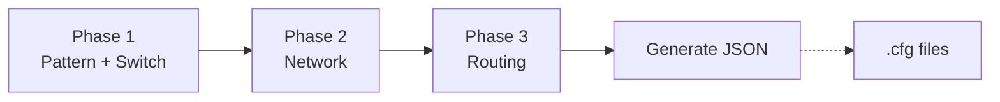

# Azure Local Network Configuration Tool — Design Document

**Version:** 3.2  
**Date:** February 2, 2026  
**Status:** Ready for Implementation

---

## Core Principle: Reference Only

> [!IMPORTANT]
> **This tool provides REFERENCE configurations only.**
> 
> - Generated configs are **starting points**, not production-ready solutions
> - Customers are **fully responsible** for validating and testing in their environment
> - This repository provides **no production support or liability**
> - All configurations must be reviewed and adapted for specific deployment requirements

---

## Table of Contents

1. [Overview](#overview)
2. [Repository Structure](#repository-structure)
3. [Deployment Patterns](#deployment-patterns)
4. [Wizard Workflow](#wizard-workflow)
5. [JSON Schema](#json-schema)
6. [Validation Rules](#validation-rules)
7. [Examples](#examples)
8. [Appendix](#appendix)

---

## Overview

### Purpose

This tool generates **reference** vendor-specific switch configurations for Azure Local deployments. Users fill a web wizard → tool outputs Standard JSON → backend renders vendor `.cfg` files.

**Important:** Generated configurations require customer validation before production use.

### Scope

| In Scope | Out of Scope |
|----------|--------------|
| VLANs, interfaces, port-channels | ACLs, NTP/Syslog/SNMP |
| BGP routing, static routes | AAA/RADIUS |
| MLAG/vPC, QoS for RDMA | VXLAN/EVPN |
| Cisco NXOS, Dell OS10 | Server/cluster config |

### Responsibility

| This Repo Provides | Customer Responsible For |
|--------------------|--------------------------|
| Reference configurations | Validating for their environment |
| Azure Local pattern guidance | Testing before production |
| Community-driven templates | Compliance with their policies |
| Best-effort support | All production deployment issues |

### Design Principles

| Principle | How |
|-----------|-----|
| **Pattern-first** | User selects deployment pattern → drives all defaults |
| **90% coverage** | Minimal required fields cover most scenarios |
| **Vendor neutral** | Same JSON works for Cisco, Dell, etc. |
| **Fail early** | Validate before generating |
| **Reference only** | Customer validates and tests all configs |

---

## Repository Structure

```
Azure_Local_Physical_Network_Config_Tool/
│
├── .github/
│   ├── docs/                        # Project documentation
│   │   ├── AzureLocal_Physical_Network_Config_Tool_Design_Doc.md
│   │   └── Project_Roadmap.md
│   └── workflows/                   # CI/CD pipelines
│       └── pages.yml
│
├── backend/                         # Python CLI (self-contained)
│   ├── src/
│   │   ├── cli.py                   # Entry point
│   │   ├── validator.py             # JSON Schema validation
│   │   ├── transformer.py           # Data enrichment
│   │   ├── context.py               # Template context
│   │   └── renderer.py              # Jinja2 rendering
│   ├── schema/
│   │   └── standard.json            # JSON Schema (source of truth)
│   ├── templates/
│   │   ├── cisco/nxos/*.j2          # Cisco NXOS templates
│   │   └── dellemc/os10/*.j2        # Dell OS10 templates
│   ├── tests/
│   └── pyproject.toml
│
├── frontend/                        # TypeScript wizard (self-contained)
│   ├── src/
│   │   ├── main.ts                  # Entry point
│   │   ├── app.ts                   # Wizard logic
│   │   ├── types.ts                 # TypeScript interfaces
│   │   ├── state.ts                 # State management
│   │   ├── validator.ts             # Client-side validation
│   │   └── utils.ts                 # Helpers
│   ├── examples/                    # Sample configs (by pattern)
│   │   ├── switchless/
│   │   │   └── sample-tor1.json
│   │   ├── switched/
│   │   │   └── sample-tor1.json
│   │   └── fully-converged/
│   │       └── sample-tor1.json
│   ├── media/                       # Topology images
│   │   └── pattern-*.png
│   ├── index.html
│   ├── style.css
│   ├── package.json
│   ├── tsconfig.json
│   └── vite.config.ts
│
├── tests/                           # E2E tests (Playwright)
│   ├── *.spec.ts                    # Test specs
│   └── fixtures/                    # Test data
│       └── */                       # Sample switch configs
│
├── archive/                         # Legacy code reference
├── README.md
├── LICENSE
├── SECURITY.md
├── CODE_OF_CONDUCT.md
├── package.json                     # Monorepo scripts
└── playwright.config.ts
```

### Naming Conventions

| Element | Convention | Example |
|---------|------------|---------|
| Folders | `kebab-case` | `fully-converged/` |
| TypeScript | `camelCase` | `validateConfig()` |
| JSON files | `kebab-case` | `sample-tor1.json` |
| Documents | `PascalCase_Underscores` | `Project_Roadmap.md` |

### Monorepo Commands

```bash
npm run dev          # Start frontend dev server
npm run build        # Build frontend for production
npm run test         # Run Playwright E2E tests
npm run test:ui      # Run tests with UI
npm run backend:test # Run Python backend tests
```

---

## Deployment Patterns

**The foundation of every configuration.** Pattern selection determines VLANs, port assignments, and validation rules.

📚 **Reference:** [Azure Local Deployment Patterns](https://github.com/Azure/AzureLocal-Supportability/blob/main/TSG/Networking/Top-Of-Rack-Switch/Overview-Azure-Local-Deployment-Pattern.md)

### Pattern Comparison

| Aspect | 🔌 Switchless | 💾 Switched | 🔄 Fully Converged |
|--------|--------------|-------------|--------------------|
| **Use Case** | Edge, cost-sensitive | Enterprise, isolation | General purpose ★ |
| **Storage Traffic** | Direct host-to-host | On switch (dedicated ports) | On switch (shared ports) |
| **VLANs on Switch** | M, C only | M, C, S1 or S2 | M, C, S1, S2 |
| **Storage per ToR** | None | S1→ToR1, S2→ToR2 | Both on both |
| **Host Port VLANs** | `7,201` | M+C: `7,201` / Storage: `711` or `712` | `7,201,711,712` |

### Pattern Topology Images

| Pattern | Image URL |
|---------|-----------|
| Switchless | `https://raw.githubusercontent.com/Azure/AzureLocal-Supportability/.../AzureLocalPhysicalNetworkDiagram_Switchless.png` |
| Switched | `https://raw.githubusercontent.com/Azure/AzureLocal-Supportability/.../AzureLocalPhysicalNetworkDiagram_Switched.png` |
| Fully Converged | `https://raw.githubusercontent.com/Azure/AzureLocal-Supportability/.../AzureLocalPhysicalNetworkDiagram_FullyConverged.png` |

### Critical Rule

> **Storage VLANs are NEVER on the peer-link** — in any pattern. This prevents storage traffic from crossing between switches.

---

## Wizard Workflow

### Flow Overview



### What User Provides vs Auto-Generated

| Phase | User Provides | Auto-Generated |
|-------|---------------|----------------|
| **1. Pattern & Switch** | Pattern (visual), vendor, model, role, hostname | Firmware, port ranges |
| **2. Network** | VLAN IDs/IPs, keepalive IPs | VLAN names, HSRP, peer-link |
| **3. Routing** | ASN, neighbor IPs (or static routes) | Router-ID, prefix lists |

---

### Phase 1: Pattern & Switch

**Goal:** Select deployment pattern visually, then hardware.

#### Steps
1. **Select Pattern** — Click visual card (Switchless / Switched / Fully Converged)
2. **Select Hardware** — Vendor dropdown → Model dropdown
3. **Select Role** — TOR1 or TOR2
4. **Review Hostname** — Auto-filled, user can modify

#### Output: `switch{}`

```json
{
  "switch": {
    "vendor": "cisco",
    "model": "93180YC-FX3",
    "firmware": "nxos",
    "hostname": "sample-tor1",
    "role": "TOR1",
    "deployment_pattern": "fully_converged"
  }
}
```

---

### Phase 2: Network

**Goal:** Define VLANs, assign to ports, configure redundancy.

Phase 2 has 4 sub-steps:

| Step | Purpose | User Provides | Auto-Generated |
|------|---------|---------------|----------------|
| **2.1 VLANs** | Define networks | VLAN IDs, IPs, gateways | Names, HSRP config |
| **2.2 Host Ports** | Assign VLANs to ports | Confirm port range, select VLANs | QoS settings |
| **2.3 Redundancy** | vPC peer-link | Keepalive IPs | Port-channel, domain |
| **2.4 Uplinks** | Border connectivity | Uplink IPs, Loopback IP | — |

#### Output: `vlans[]`, `interfaces[]`, `port_channels[]`, `mlag{}`

```json
{
  "vlans": [
    { "vlan_id": 7, "name": "Mgmt_7", "purpose": "management", 
      "interface": { "ip": "192.168.7.2", "cidr": 24, 
        "redundancy": { "type": "hsrp", "priority": 150, "virtual_ip": "192.168.7.1" }}},
    { "vlan_id": 201, "name": "Compute_201", "purpose": "compute" },
    { "vlan_id": 711, "name": "Storage1_711", "purpose": "storage_1" },
    { "vlan_id": 712, "name": "Storage2_712", "purpose": "storage_2" }
  ],
  "interfaces": [
    { "name": "Host_Facing", "type": "Trunk", "start_intf": "1/1", "end_intf": "1/16",
      "native_vlan": "7", "tagged_vlans": "7,201,711,712", "qos": true },
    { "name": "Loopback0", "type": "L3", "intf": "loopback0", "ipv4": "10.255.255.1/32" },
    { "name": "Uplink", "type": "L3", "intf": "1/49", "ipv4": "10.0.0.2/30" }
  ],
  "port_channels": [
    { "id": 10, "description": "vPC_Peer_Link", "type": "Trunk",
      "tagged_vlans": "7,201", "vpc_peer_link": true, "members": ["1/53", "1/54"] }
  ],
  "mlag": {
    "domain_id": 1,
    "peer_keepalive": { "source_ip": "10.255.255.1", "destination_ip": "10.255.255.2", "vrf": "management" }
  }
}
```

---

### Phase 3: Routing

**Goal:** Configure BGP (recommended) or static routes.

#### Option A: BGP (Production)

| User Provides | Auto-Generated |
|---------------|----------------|
| Local ASN | Router-ID (from Loopback) |
| Neighbor IPs + Remote ASNs | Networks to advertise |
| — | Prefix lists |

#### Option B: Static Routes (Lab/Simple)

| User Provides |
|---------------|
| Destination networks |
| Next-hop IPs |

#### Output: `bgp{}` OR `static_routes[]`

```json
{
  "bgp": {
    "asn": 65001,
    "router_id": "10.255.255.1",
    "networks": ["10.255.255.1/32", "10.0.0.0/30"],
    "neighbors": [
      { "ip": "10.0.0.1", "remote_as": 65000, "description": "TO_Border" },
      { "ip": "10.255.255.2", "remote_as": 65001, "description": "iBGP_TOR2" }
    ]
  }
}
```

---

### Persistent Pattern Reference (UI Feature)

**Problem:** Users need to reference the topology diagram while filling forms.

**Solution:** Sticky sidebar showing selected pattern + thumbnail. Click to expand full image.

| Component | Behavior |
|-----------|----------|
| **Thumbnail** | 150×100px, always visible in sidebar |
| **Expand** | Click opens lightbox with full resolution |
| **Key Info** | Shows pattern name + storage rule reminder |
| **Change** | Returns to Phase 1 (with confirmation) |

---

## JSON Schema

### Structure Overview

```json
{
  "switch": { },           // Phase 1
  "vlans": [ ],            // Phase 2.1
  "interfaces": [ ],       // Phase 2.2, 2.4
  "port_channels": [ ],    // Phase 2.3
  "mlag": { },             // Phase 2.3
  "bgp": { },              // Phase 3 (if BGP)
  "static_routes": [ ],    // Phase 3 (if static)
  "prefix_lists": { }      // Phase 3 (BGP only)
}
```

### Processing Order

```
switch → vlans → interfaces → port_channels → mlag → bgp
```

Each section depends on the previous for validation.

---

### Field Reference

#### `switch` (Required)

| Field | Required | Type | Description |
|-------|:--------:|------|-------------|
| `vendor` | ✅ | string | `"cisco"` or `"dellemc"` |
| `model` | ✅ | string | e.g., `"93180YC-FX3"` |
| `firmware` | Auto | string | `"nxos"` or `"os10"` |
| `hostname` | ✅ | string | Switch hostname |
| `role` | ✅ | enum | `"TOR1"` or `"TOR2"` |
| `deployment_pattern` | ✅ | enum | `"switchless"`, `"switched"`, `"fully_converged"` |

#### `vlans[]`

| Field | Required | Type | Description |
|-------|:--------:|------|-------------|
| `vlan_id` | ✅ | int | 2-4094 |
| `name` | ✅ | string | Max 32 chars |
| `purpose` | ❌ | enum | `"management"`, `"compute"`, `"storage_1"`, `"storage_2"` |
| `shutdown` | ❌ | bool | Default: `false` |
| `interface.ip` | ⚠️ | string | Required for L3 VLANs |
| `interface.cidr` | ⚠️ | int | Required for L3 VLANs |
| `redundancy.type` | ❌ | enum | `"hsrp"` (Cisco) or `"vrrp"` (Dell) |
| `redundancy.virtual_ip` | ⚠️ | string | Gateway IP |
| `redundancy.priority` | ❌ | int | TOR1=150, TOR2=100 |

#### `interfaces[]`

| Field | Required | Type | Description |
|-------|:--------:|------|-------------|
| `name` | ✅ | string | Description |
| `type` | ✅ | enum | `"Access"`, `"Trunk"`, `"L3"` |
| `intf` | ⚠️ | string | Single port (e.g., `"1/49"`) |
| `start_intf` / `end_intf` | ⚠️ | string | Port range |
| `native_vlan` | ⚠️ | string | For Trunk type |
| `tagged_vlans` | ⚠️ | string | For Trunk type |
| `ipv4` | ⚠️ | string | For L3 type (CIDR) |
| `qos` | ❌ | bool | Enable RDMA QoS |

#### `port_channels[]`

| Field | Required | Type | Description |
|-------|:--------:|------|-------------|
| `id` | ✅ | int | Port-channel ID |
| `description` | ✅ | string | Purpose |
| `type` | ✅ | enum | `"Trunk"` or `"L3"` |
| `members` | ✅ | array | Physical ports |
| `vpc_peer_link` | ❌ | bool | `true` for peer-link |
| `tagged_vlans` | ⚠️ | string | For Trunk type |

#### `mlag{}`

| Field | Required | Type | Description |
|-------|:--------:|------|-------------|
| `domain_id` | ❌ | int | Default: 1 |
| `peer_keepalive.source_ip` | ✅ | string | This switch |
| `peer_keepalive.destination_ip` | ✅ | string | Peer switch |
| `peer_keepalive.vrf` | ❌ | string | Default: `"management"` |

#### `bgp{}`

| Field | Required | Type | Description |
|-------|:--------:|------|-------------|
| `asn` | ✅ | int | Local AS number |
| `router_id` | ✅ | string | Must match Loopback0 IP |
| `networks` | ❌ | array | Networks to advertise |
| `neighbors[].ip` | ✅ | string | Peer IP |
| `neighbors[].remote_as` | ✅ | int | Peer ASN |
| `neighbors[].description` | ❌ | string | Peer name |

#### `static_routes[]`

| Field | Required | Type | Description |
|-------|:--------:|------|-------------|
| `destination` | ✅ | string | CIDR (e.g., `"0.0.0.0/0"`) |
| `next_hop` | ✅ | string | Gateway IP |
| `name` | ❌ | string | Route description |

---

## Validation Rules

### Pattern-Specific Rules

| Pattern | Storage VLANs | Host Port VLANs | Peer-link VLANs |
|---------|---------------|-----------------|-----------------|
| **Switchless** | ❌ None | `7,201` only | `7,201` |
| **Switched TOR1** | S1 only | M+C: `7,201`, Storage: `711` | `7,201` |
| **Switched TOR2** | S2 only | M+C: `7,201`, Storage: `712` | `7,201` |
| **Fully Converged** | S1 + S2 | `7,201,711,712` | `7,201` |

### Cross-Reference Rules

| From | To | Rule |
|------|----|------|
| `interfaces.tagged_vlans` | `vlans[].vlan_id` | All VLANs must exist |
| `port_channels.members` | `interfaces` | Ports must exist |
| `bgp.router_id` | `interfaces[loopback].ipv4` | Must match |
| `mlag` | `port_channels` | One must have `vpc_peer_link: true` |

### Business Rules

| Rule | Description |
|------|-------------|
| No VLAN 1 | Reserved, don't use |
| Parking VLAN | VLAN 2 with `shutdown: true` |
| Routing exclusive | Use BGP OR static_routes, not both |
| **Peer-link no storage** | Storage VLANs never on peer-link |

---

## Examples

### Example File Structure

```
frontend/examples/
├── switchless/sample-tor1.json
├── switched/sample-tor1.json
└── fully-converged/sample-tor1.json
```

### Fully Converged (TOR1) — Complete Example

```json
{
  "switch": {
    "vendor": "cisco",
    "model": "93180YC-FX3",
    "firmware": "nxos",
    "hostname": "sample-tor1-fconv",
    "role": "TOR1",
    "deployment_pattern": "fully_converged"
  },
  "vlans": [
    { "vlan_id": 2, "name": "UNUSED", "purpose": "parking", "shutdown": true },
    { "vlan_id": 7, "name": "Mgmt_7", "purpose": "management",
      "interface": { "ip": "192.168.7.2", "cidr": 24,
        "redundancy": { "type": "hsrp", "priority": 150, "virtual_ip": "192.168.7.1" }}},
    { "vlan_id": 201, "name": "Compute_201", "purpose": "compute",
      "interface": { "ip": "192.168.201.2", "cidr": 24,
        "redundancy": { "type": "hsrp", "priority": 150, "virtual_ip": "192.168.201.1" }}},
    { "vlan_id": 711, "name": "Storage1_711", "purpose": "storage_1" },
    { "vlan_id": 712, "name": "Storage2_712", "purpose": "storage_2" }
  ],
  "interfaces": [
    { "name": "Host_Facing", "type": "Trunk", "intf_type": "Ethernet",
      "start_intf": "1/1", "end_intf": "1/16",
      "native_vlan": "7", "tagged_vlans": "7,201,711,712", "qos": true },
    { "name": "Loopback0", "type": "L3", "intf_type": "loopback",
      "intf": "loopback0", "ipv4": "10.255.255.1/32" },
    { "name": "Uplink_Border1", "type": "L3", "intf_type": "Ethernet",
      "intf": "1/49", "ipv4": "10.0.0.2/30" }
  ],
  "port_channels": [
    { "id": 10, "description": "vPC_Peer_Link_To_TOR2", "type": "Trunk",
      "native_vlan": "99", "tagged_vlans": "7,201",
      "vpc_peer_link": true, "members": ["1/53", "1/54"] }
  ],
  "mlag": {
    "domain_id": 1,
    "peer_keepalive": {
      "source_ip": "10.255.255.1",
      "destination_ip": "10.255.255.2",
      "vrf": "management"
    }
  },
  "prefix_lists": {
    "DefaultRoute": [
      { "seq": 10, "action": "permit", "prefix": "0.0.0.0/0" }
    ]
  },
  "bgp": {
    "asn": 65001,
    "router_id": "10.255.255.1",
    "networks": ["10.255.255.1/32", "10.0.0.0/30"],
    "neighbors": [
      { "ip": "10.0.0.1", "description": "TO_Border1", "remote_as": 65000,
        "af_ipv4_unicast": { "prefix_list_in": "DefaultRoute" }},
      { "ip": "10.255.255.2", "description": "iBGP_To_TOR2", "remote_as": 65001,
        "af_ipv4_unicast": {} }
    ]
  }
}
```

**Key Points:**
- `tagged_vlans` on host ports: `7,201,711,712` (all VLANs)
- `tagged_vlans` on peer-link: `7,201` (NO storage)
- Cisco uses HSRP, port format `1/1`

### Pattern Comparison Table

| JSON Path | Switchless | Switched (TOR1) | Fully Converged |
|-----------|------------|-----------------|-----------------|
| `vlans[]` storage | None | S1 only | S1 + S2 |
| Host `tagged_vlans` | `7,201` | `7,201` + `711` | `7,201,711,712` |
| Peer-link `tagged_vlans` | `7,201` | `7,201` | `7,201` |
| Separate storage ports | No | Yes | No |

---

## Appendix

### Derived Values (Auto-calculated from Role)

| Value | TOR1 | TOR2 |
|-------|------|------|
| HSRP priority | 150 | 100 |
| vPC role priority | 1 | 32667 |
| MST priority | 8192 | 16384 |

### Technology Stack

| Component | Technology |
|-----------|------------|
| Frontend | TypeScript + Vite |
| Backend | Python + Jinja2 |
| Validation | jsonschema |

### Template File Structure

```
backend/templates/
├── cisco/nxos/*.j2
└── dellemc/os10/*.j2
```

### Data Relationships

```
switch.deployment_pattern
    ↓ determines
vlans[] (which storage VLANs)
    ↓ referenced by
interfaces[].tagged_vlans
    ↓ ports used by
port_channels[].members
    ↓ peer-link for
mlag{}
```

```
interfaces[loopback].ipv4
    ↓ must equal
bgp.router_id
    ↓ references
prefix_lists{}
```

---

**Document End**
