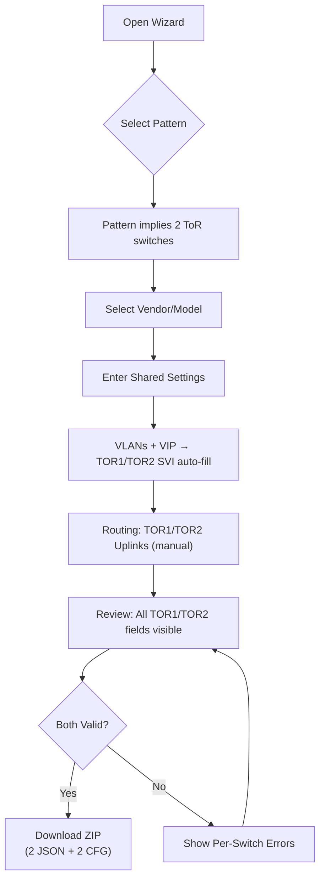
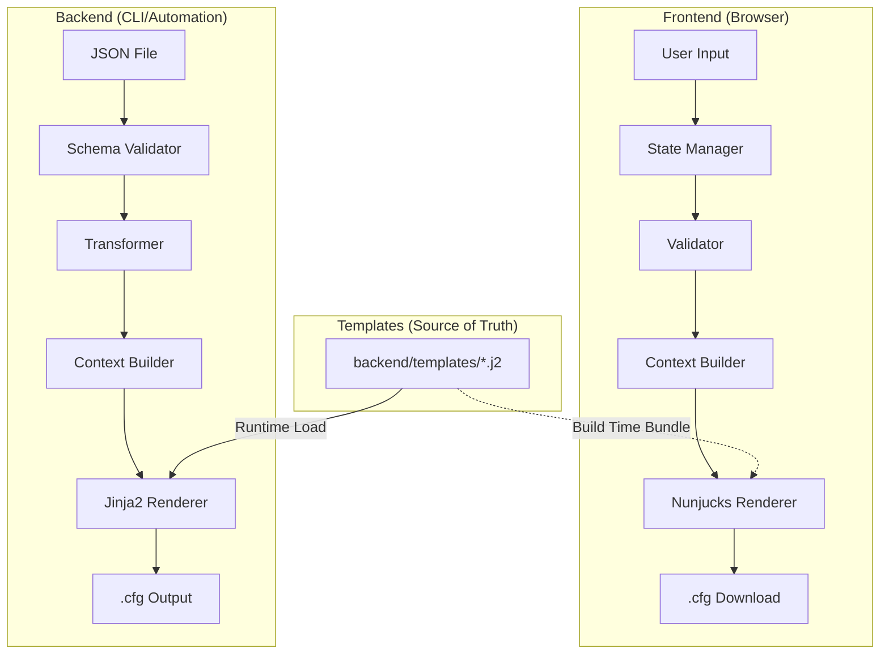
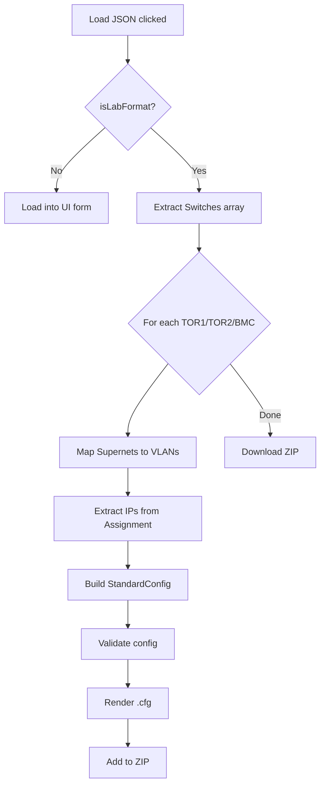

# Azure Local Network Configuration Tool — Design Document

**Version:** 9.0  
**Date:** February 4, 2026  
**Status:** v1 Implementation — Phase 13.5 (TOR Pair UI Refinement)  
**Roadmap:** [Project_Roadmap.md](Project_Roadmap.md)

---

## Core Principle: Reference Only

> [!IMPORTANT]
> **This tool provides REFERENCE configurations only.**
> 
> - Generated configs are **starting points**, not production-ready solutions
> - Customers are **fully responsible** for validating and testing
> - This repository provides **no production support or liability**

---

## Table of Contents

1. [Overview](#overview)
2. [Repository Structure](#repository-structure)
3. [Deployment Patterns](#deployment-patterns)
4. [TOR Pair Generation](#tor-pair-generation)
5. [Smart Defaults UI Pattern](#smart-defaults-ui-pattern) — **NEW**
6. [JSON Schema](#json-schema)
7. [Validation Rules](#validation-rules)
8. [Technology Stack](#technology-stack)
9. [Internal Lab Format Support](#internal-lab-format-support) — *Separate from production*

---

## Overview

### Purpose

Generate **reference** vendor-specific switch configurations for Azure Local deployments:

```
User fills wizard → TOR1 JSON + TOR2 JSON → TOR1.cfg + TOR2.cfg (ZIP download)
```

> **GitHub Pages Compatible:** All generation happens client-side in the browser. No backend server required.

### Design Philosophy: Smart Defaults, Full Visibility, Always Editable

The wizard follows a principle where users enter values once, auto-derivation populates related fields, but **all fields remain visible and editable**:

```
┌─────────────────────────────────────────────────────────────────────────────────┐
│  🎯 "Smart Defaults, Full Visibility, Always Editable"                          │
├─────────────────────────────────────────────────────────────────────────────────┤
│  1. User enters ONE value (e.g., VIP, Loopback)                                 │
│  2. TOR1 and TOR2 values AUTO-POPULATE (visible in UI)                          │
│  3. ALL fields VISIBLE and EDITABLE — user can override any auto-derived value  │
│  4. Uplinks are FULLY CONFIGURABLE — no hardcoded offsets                       │
└─────────────────────────────────────────────────────────────────────────────────┘
```

### User Workflow (v1 Target: TOR Pair Generation)



> **Key Design Decision:** Deployment pattern drives the number of switches (currently all patterns = 2 ToRs).
> Users enter shared settings once, auto-derivation fills TOR1/TOR2 values, user can override any value.

### System Workflow



### Submission Processing Workflow (Copilot-Assisted)

```mermaid
flowchart LR
    subgraph "Submit"
        A[User opens Issue] --> B[Fills template form]
    end
    
    subgraph "Review & Process"
        B --> C[Maintainer reviews]
        C --> D["Clicks 'Code with agent mode'"]
        D --> E[Copilot validates metadata]
        E --> F[Copilot analyzes config]
        F --> G[Copilot creates PR (fixtures + metadata)]
    end
    
    subgraph "Merge"
        G --> H[Maintainer reviews PR]
        H --> I[Merge to main]
    end
```

> **Why Copilot?** Human-in-loop for safety, no custom GitHub Actions to maintain, leverages existing validation scripts.

> [!NOTE]
> This repo prioritizes reliability over day-to-day usage volume.
> Sanitized configs are stored as **versioned test fixtures** so every change is exercised by CI.

### Scope

| In Scope | Out of Scope |
|----------|--------------|
| VLANs, interfaces, port-channels | ACLs, NTP/Syslog/SNMP |
| BGP routing, static routes | AAA/RADIUS |
| MLAG/vPC, QoS for RDMA | VXLAN/EVPN |
| Cisco NX-OS, Dell OS10 | Server/cluster config |

### Design Principles

| Principle | Implementation |
|-----------|----------------|
| **Pattern-first** | Deployment pattern → drives switch count + all defaults |
| **TOR pair by default** | All Azure Local patterns use 2 ToRs; wizard outputs both configs |
| **Smart defaults** | Auto-derive TOR2 from TOR1 where logical (SVI, loopback, keepalive) |
| **Full visibility** | All TOR1/TOR2 fields shown in UI (no hidden auto-derivation) |
| **Always editable** | User can override any auto-derived value |
| **90% coverage** | Minimal fields cover most scenarios |
| **Vendor neutral** | Same JSON structure works for any vendor |
| **Fail early** | Validate both TOR configs before generating |
| **GitHub Pages compatible** | Client-side generation only; no backend server |
| **Community-driven** | New vendors welcome via **reference submissions** |

---

## Repository Structure

```
Azure_Local_Physical_Network_Config_Tool/
├── .github/
│   ├── docs/                           # Documentation
│   │   ├── AzureLocal_Physical_Network_Config_Tool_Design_Doc.md
│   │   └── Project_Roadmap.md
│   ├── instructions/                   # AI/Copilot instructions
│   │   └── process-submission.instructions.md  # Copilot submission guide
│   ├── ISSUE_TEMPLATE/                 # GitHub Issue forms
│   │   └── config-submission.yml       # Config submission form
│   └── workflows/                      # CI/CD pipelines
│
├── backend/                            # Python CLI + Processing
│   ├── src/
│   │   ├── cli.py                      # CLI entry point
│   │   ├── validator.py                # JSON Schema validation
│   │   ├── transformer.py              # Data enrichment
│   │   ├── context.py                  # Template context builder
│   │   ├── renderer.py                 # Jinja2 rendering
│   │   ├── metadata_validator.py       # Submission validation
│   │   ├── vendor_detector.py          # Auto-detect vendor
│   │   ├── config_sectioner.py         # Config sectioning
│   │   └── submission_processor.py     # Orchestrate processing
│   ├── schema/
│   │   └── standard.json               # JSON Schema (source of truth)
│   ├── templates/
│   │   ├── cisco/nxos/*.j2             # Cisco NX-OS (10 templates)
│   │   └── dellemc/os10/*.j2           # Dell OS10 (10 templates)
│   └── tests/                          # pytest tests
│       └── fixtures/                   # Backend test data
│
├── frontend/                           # TypeScript Wizard
│   ├── src/
│   │   ├── main.ts                     # Entry point
│   │   ├── app.ts                      # Wizard logic
│   │   ├── types.ts                    # TypeScript interfaces
│   │   ├── state.ts                    # State management
│   │   ├── validator.ts                # Client-side validation
│   │   ├── context-builder.ts          # Template context (JS port)
│   │   ├── renderer.ts                 # Nunjucks rendering
│   │   └── templates.ts                # Bundled templates (auto-generated)
│   ├── tests/                          # E2E tests (Playwright)
│   │   └── e2e/
│   │       └── wizard-e2e.spec.ts
│   ├── examples/                       # Sample configs by pattern
│   │   ├── fully-converged/
│   │   ├── switched/
│   │   └── switchless/
│   └── index.html
│
├── CONTRIBUTING.md                     # How to submit configs
└── playwright.config.ts                # E2E test configuration
```

> [!NOTE]
> `lab/` is a local workflow sandbox for development/testing and is planned to be removed later.
> `archive/` contains historical prototypes and is not part of the current runtime path.

### Naming Conventions

| Element | Convention | Example |
|---------|------------|---------|
| Folders | `kebab-case` | `fully-converged/` |
| TypeScript | `camelCase` | `validateConfig()` |
| Python | `snake_case` | `validate_config()` |
| JSON files | `kebab-case` | `sample-tor1.json` |
| Documents | `PascalCase_Underscores` | `Project_Roadmap.md` |

---

## Deployment Patterns

**Foundation of every configuration.** Pattern selection determines VLANs, port assignments, and validation rules.

📚 **Single Source of Truth (Deployment Patterns):**
https://github.com/Azure/AzureLocal-Supportability/blob/main/TSG/Networking/Top-Of-Rack-Switch/Overview-Azure-Local-Deployment-Pattern.md

> [!IMPORTANT]
> This repository treats the AzureLocal-Supportability link above as the authoritative reference for **deployment-pattern VLAN distribution** (switchless/switched/fully-converged).
> It does **not** define ToR peer-link (vPC/MLAG/VLT) VLAN allowlists.

📚 **Peer-link VLAN guidance (HSRP peer-link reference):**
https://github.com/Azure/AzureLocal-Supportability/blob/main/TSG/Networking/Top-Of-Rack-Switch/Reference-TOR-Disaggregated-Switched-Storage.md#hsrp-peer-link

### Pattern Comparison

| Aspect | 🔌 Switchless | 💾 Switched | 🔄 Fully Converged |
|--------|--------------|-------------|--------------------|
| **Use Case** | Edge, cost-sensitive | Enterprise, isolation | General purpose ★ |
| **Switch Count** | 2 ToRs | 2 ToRs | 2 ToRs |
| **Storage Traffic** | Direct host-to-host | On switch (dedicated) | On switch (shared) |
| **Storage VLANs** | None on switch | S1→TOR1, S2→TOR2 | Both on both |
| **Host Port VLANs** | `7,201` | M+C: `7,201` / S: `711`or`712` | `7,201,711,712` |

### Notes

- **All current Azure Local patterns require 2 ToR switches.** The wizard reflects this by always generating a TOR pair.
- Peer-link (vPC/MLAG/VLT) VLAN allowlists are vendor-specific, but the AzureLocal-Supportability HSRP peer-link reference shows the peer-link carrying **management/compute VLANs only**.
- **Guidance:** Do **not** allow storage VLANs on the ToR peer-link; storage intent traffic is not expected to traverse between ToRs.
- This tool focuses on deployment-pattern VLAN distribution and config generation as reference outputs.

---

## TOR Pair Generation

### Shared vs Per-Switch Inputs

| Category | User Enters Once (Shared) | User Enters Per Switch | Auto-Derived |
|----------|---------------------------|------------------------|--------------|
| **Pattern & Hardware** | pattern, vendor, model | — | firmware (from vendor) |
| **VLANs** | VLAN IDs/names/purpose, cidr, **gateway VIP** | **TOR1 SVI IP**, **TOR2 SVI IP** | TOR1=VIP+1, TOR2=VIP+2 (visible, editable) |
| **Ports** | trunk ranges, QoS flags, peer-link members | — | host trunk allowlists (from VLANs + pattern) |
| **Redundancy** | MLAG domain ID, peer-link PC ID | **TOR1 keepalive src/dst** | TOR2 keepalive = swapped (visible, editable) |
| **Routing** | BGP ASN, neighbors, static routes | **TOR1 loopback**, **TOR2 loopback**, **TOR1/TOR2 uplinks** | TOR2 loopback = TOR1+1 (visible, editable) |
| **Identity** | base hostname | — | TOR1=base-tor1, TOR2=base-tor2 (editable) |

> **Key Change:** TOR1 and TOR2 fields are now **visible in UI** with auto-derivation. User can override any value.

### Auto-Derivation Rules

Reference: [main branch test_cases](https://github.com/microsoft/Azure_Local_Physical_Network_Config_Tool/tree/main/tests/test_cases)

| # | Rule | Description | Editable? |
|---|------|-------------|-----------|
| 1 | **Hostname convention** | If user provides base name, append `-tor1` / `-tor2` | ✅ Yes |
| 2 | **SVI IP derivation** | TOR1 = VIP + 1, TOR2 = VIP + 2 (per VLAN) | ✅ Yes |
| 3 | **Loopback derivation** | TOR2 loopback = TOR1 loopback + 1 | ✅ Yes |
| 4 | **HSRP/VRRP priority** | TOR1 = 150 (Active), TOR2 = 140 (Standby) | ❌ Hardcoded |
| 5 | **VLT/vPC priority** | Dell OS10: TOR1 = 1, TOR2 = 2 | ❌ Hardcoded |
| 6 | **Keepalive swap** | TOR2 keepalive = `{ src: TOR1.dst, dst: TOR1.src }` | ✅ Yes |
| 7 | **Uplink IPs** | No auto-derivation — user enters all 4 values | N/A (manual) |
| 8 | **iBGP PC IP** | No auto-derivation — user enters both values | N/A (manual) |
| 9 | **Switched storage split** | TOR1 includes only `S1` VLAN (711); TOR2 only `S2` (712) | ❌ Pattern-driven |
| 10 | **Fully-converged storage** | Both ToRs include both storage VLANs | ❌ Pattern-driven |
| 11 | **Peer-link VLAN allowlist** | Exclude storage VLANs (per HSRP peer-link reference) | ❌ Pattern-driven |
| 12 | **BGP router-id** | Derived from each switch's loopback IP | ✅ (via loopback) |
| 13 | **BGP networks** | Per-switch: include that switch's loopback + uplink connected networks | Auto |
| 14 | **Port-channel descriptions** | Contextual: "To_TOR2" on TOR1 config, "To_TOR1" on TOR2 config | Auto |
| 15 | **Redundancy type** | Cisco = HSRP, Dell = VRRP — vendor-driven selection | ❌ Vendor-driven |

### ZIP Download Format

**Naming:** `{base_hostname}_{deployment_pattern}_{timestamp}.zip`

**Example:** `azl-rack01_fully_converged_2026-02-04T1430.zip`

**Contents:**
```
azl-rack01_fully_converged_2026-02-04T1430.zip
├── azl-rack01-tor1-config.json
├── azl-rack01-tor2-config.json
├── azl-rack01-tor1.cfg
└── azl-rack01-tor2.cfg
```

> **Why deployment pattern in filename?** More informative than static "tor-pair" and future-proof for when single-ToR patterns may be supported.

---

## Smart Defaults UI Pattern

This section documents the UI layout and auto-derivation behavior in detail for implementation continuity.

### Design Principle

```
┌─────────────────────────────────────────────────────────────────────────────────┐
│  PRINCIPLE: "Think about one, see both, edit any"                               │
├─────────────────────────────────────────────────────────────────────────────────┤
│  • User enters a single value (e.g., VIP address)                               │
│  • System auto-populates TOR1 and TOR2 values                                   │
│  • Both TOR1 and TOR2 fields are VISIBLE in UI                                  │
│  • User can EDIT any auto-populated value                                       │
│  • Uplinks have NO auto-derivation — fully manual                               │
└─────────────────────────────────────────────────────────────────────────────────┘
```

### Field Categories

#### Category A: Truly Shared (No TOR1/TOR2 Split)

These fields are identical for both switches and shown once:

| Section | Fields |
|---------|--------|
| Pattern & Hardware | `deployment_pattern`, `vendor`, `model`, `firmware` |
| VLAN Definition | `vlan_id`, `vlan_name`, `purpose`, `cidr` |
| Ports | `trunk_ranges`, `qos_enabled`, `peer_link_members` |
| MLAG | `domain_id`, `peer_link_pc_id` |
| BGP | `asn`, `external_neighbors[]` |
| Static Routes | All routes |

#### Category B: Per-TOR with Auto-Derivation

These fields show TOR1 + TOR2 side by side. TOR2 auto-populates from TOR1:

| Field | TOR1 | TOR2 | Auto-Derivation Rule |
|-------|------|------|---------------------|
| Hostname | `{base}-tor1` | `{base}-tor2` | Append suffix |
| Loopback IP | User enters | Auto = TOR1 + 1 | Increment last octet |
| SVI IP (per VLAN) | Auto = VIP + 1 | Auto = VIP + 2 | VIP-relative |
| Keepalive src | User enters | Auto = TOR1's dst | Swap endpoints |
| Keepalive dst | User enters | Auto = TOR1's src | Swap endpoints |
| BGP Router ID | = Loopback | = Loopback | From loopback |
| iBGP Peer IP | = TOR2 loopback | = TOR1 loopback | Cross-reference |

#### Category C: Per-TOR Fully Manual

These fields show TOR1 + TOR2 side by side with NO auto-derivation:

| Field | TOR1 | TOR2 | Notes |
|-------|------|------|-------|
| Uplink 1 IP | User enters | User enters | Different /30 subnets typical |
| Uplink 2 IP | User enters | User enters | May be empty if single uplink |
| iBGP PC IP | User enters | User enters | Point-to-point link |

#### Category D: Hardcoded per Role

These values are set by the system and NOT shown in UI:

| Field | TOR1 | TOR2 | Source |
|-------|------|------|--------|
| HSRP/VRRP Priority | 150 | 140 | `TOR_PAIR_DEFAULTS` |
| VLT Priority | 1 | 2 | `TOR_PAIR_DEFAULTS` |
| MST Priority | 4096 | 8192 | `TOR_PAIR_DEFAULTS` |
| Storage VLANs (Switched) | S1 only | S2 only | Pattern logic |
| Redundancy Type | HSRP (Cisco) / VRRP (Dell) | Same | Vendor logic |

### UI Layout Specifications

#### VLAN Section: SVI IPs

For each VLAN with an SVI (management, compute, storage), show 3 fields:

```
┌─────────────────────────────────────────────────────────────────────────────────┐
│  VLAN 7 - Management                                              CIDR: /24     │
├─────────────────────────────────────────────────────────────────────────────────┤
│  Gateway VIP             TOR1 SVI (Auto: VIP+1)    TOR2 SVI (Auto: VIP+2)       │
│  ┌───────────────┐       ┌───────────────┐         ┌───────────────┐            │
│  │ 10.0.7.1      │       │ 10.0.7.2      │         │ 10.0.7.3      │            │
│  └───────────────┘       └───────────────┘         └───────────────┘            │
└─────────────────────────────────────────────────────────────────────────────────┘
```

**HTML Element IDs:**
- `vlan-{id}-vip` — Gateway VIP input
- `vlan-{id}-tor1-svi` — TOR1 SVI IP input
- `vlan-{id}-tor2-svi` — TOR2 SVI IP input

**Event Handler:** `onVipChange(vlanId: number)`

```typescript
/**
 * Auto-populate TOR1 and TOR2 SVI IPs when VIP changes.
 * Rule: TOR1 = VIP + 1, TOR2 = VIP + 2 (last octet)
 */
function onVipChange(vlanId: number): void {
  const vipInput = document.getElementById(`vlan-${vlanId}-vip`) as HTMLInputElement;
  const tor1Input = document.getElementById(`vlan-${vlanId}-tor1-svi`) as HTMLInputElement;
  const tor2Input = document.getElementById(`vlan-${vlanId}-tor2-svi`) as HTMLInputElement;
  
  const vip = vipInput.value.trim();
  if (!vip) return;
  
  const parts = vip.split('.');
  if (parts.length !== 4) return;
  
  const lastOctet = parseInt(parts[3], 10);
  if (isNaN(lastOctet) || lastOctet > 253) return; // Leave room for +2
  
  const prefix = `${parts[0]}.${parts[1]}.${parts[2]}`;
  
  // Only auto-fill if fields are empty or match previous auto-fill pattern
  if (!tor1Input.dataset.userEdited) {
    tor1Input.value = `${prefix}.${lastOctet + 1}`;
  }
  if (!tor2Input.dataset.userEdited) {
    tor2Input.value = `${prefix}.${lastOctet + 2}`;
  }
}

/**
 * Mark field as user-edited to prevent auto-fill override.
 */
function onSviManualEdit(vlanId: number, tor: 'tor1' | 'tor2'): void {
  const input = document.getElementById(`vlan-${vlanId}-${tor}-svi`) as HTMLInputElement;
  input.dataset.userEdited = 'true';
}
```

#### Routing Section: Loopback IPs

```
┌─────────────────────────────────────────────────────────────────────────────────┐
│  Loopback IPs (Router ID)                                                       │
├─────────────────────────────────────────────────────────────────────────────────┤
│  TOR1 Loopback                          TOR2 Loopback (Auto: TOR1+1)            │
│  ┌──────────────────────────┐           ┌──────────────────────────┐            │
│  │ 10.255.0.1/32            │           │ 10.255.0.2/32            │            │
│  └──────────────────────────┘           └──────────────────────────┘            │
└─────────────────────────────────────────────────────────────────────────────────┘
```

**HTML Element IDs:**
- `tor1-loopback-ip` — TOR1 loopback input
- `tor2-loopback-ip` — TOR2 loopback input

**Event Handler:** `onTor1LoopbackChange()`

```typescript
/**
 * Auto-populate TOR2 loopback when TOR1 loopback changes.
 * Rule: TOR2 = TOR1 + 1 (last octet)
 */
function onTor1LoopbackChange(): void {
  const tor1Input = document.getElementById('tor1-loopback-ip') as HTMLInputElement;
  const tor2Input = document.getElementById('tor2-loopback-ip') as HTMLInputElement;
  
  const tor1Value = tor1Input.value.trim();
  if (!tor1Value) return;
  
  // Handle /32 suffix
  const [ip, cidr] = tor1Value.includes('/') ? tor1Value.split('/') : [tor1Value, '32'];
  const parts = ip.split('.');
  if (parts.length !== 4) return;
  
  const lastOctet = parseInt(parts[3], 10);
  if (isNaN(lastOctet) || lastOctet > 254) return;
  
  const prefix = `${parts[0]}.${parts[1]}.${parts[2]}`;
  
  if (!tor2Input.dataset.userEdited) {
    tor2Input.value = `${prefix}.${lastOctet + 1}/${cidr}`;
  }
}
```

#### Routing Section: Uplinks (No Auto-Derivation)

```
┌─────────────────────────────────────────────────────────────────────────────────┐
│  Uplink 1                                                                       │
├─────────────────────────────────────────────────────────────────────────────────┤
│  TOR1 Uplink 1 IP                     TOR2 Uplink 1 IP                          │
│  ┌───────────────────────────┐        ┌───────────────────────────┐             │
│  │ 10.100.0.1/30             │        │ 10.100.0.5/30             │             │
│  └───────────────────────────┘        └───────────────────────────┘             │
├─────────────────────────────────────────────────────────────────────────────────┤
│  Uplink 2 (optional)                                                            │
├─────────────────────────────────────────────────────────────────────────────────┤
│  TOR1 Uplink 2 IP                     TOR2 Uplink 2 IP                          │
│  ┌───────────────────────────┐        ┌───────────────────────────┐             │
│  │ 10.100.0.9/30             │        │ 10.100.0.13/30            │             │
│  └───────────────────────────┘        └───────────────────────────┘             │
└─────────────────────────────────────────────────────────────────────────────────┘
```

> **Important:** Uplinks have NO auto-derivation. Each ToR connects to different router interfaces with different /30 subnets.

**HTML Element IDs:**
- `tor1-uplink1-ip` — TOR1 uplink 1 IP
- `tor2-uplink1-ip` — TOR2 uplink 1 IP
- `tor1-uplink2-ip` — TOR1 uplink 2 IP (optional)
- `tor2-uplink2-ip` — TOR2 uplink 2 IP (optional)

#### MLAG Section: Keepalive IPs

```
┌─────────────────────────────────────────────────────────────────────────────────┐
│  MLAG Keepalive IPs                                                             │
├─────────────────────────────────────────────────────────────────────────────────┤
│  TOR1 Source              TOR2 Source (Auto: TOR1 Dest swapped)                  │
│  ┌──────────────────┐       ┌──────────────────┐                                │
│  │ 169.254.1.1      │       │ 169.254.1.2      │                                │
│  └──────────────────┘       └──────────────────┘                                │
│  TOR1 Dest                TOR2 Dest (Auto: TOR1 Source swapped)                 │
│  ┌──────────────────┐       ┌──────────────────┐                                │
│  │ 169.254.1.2      │       │ 169.254.1.1      │                                │
│  └──────────────────┘       └──────────────────┘                                │
└─────────────────────────────────────────────────────────────────────────────────┘
```

**Event Handler:** `onTor1KeepaliveChange()`

```typescript
/**
 * Auto-swap TOR2 keepalive when TOR1 keepalive changes.
 * Rule: TOR2.src = TOR1.dst, TOR2.dst = TOR1.src
 */
function onTor1KeepaliveChange(): void {
  const tor1Src = (document.getElementById('tor1-keepalive-src') as HTMLInputElement).value;
  const tor1Dst = (document.getElementById('tor1-keepalive-dst') as HTMLInputElement).value;
  const tor2Src = document.getElementById('tor2-keepalive-src') as HTMLInputElement;
  const tor2Dst = document.getElementById('tor2-keepalive-dst') as HTMLInputElement;
  
  if (!tor2Src.dataset.userEdited) {
    tor2Src.value = tor1Dst; // TOR2 src = TOR1 dst
  }
  if (!tor2Dst.dataset.userEdited) {
    tor2Dst.value = tor1Src; // TOR2 dst = TOR1 src
  }
}
```

### Type Definitions

Update `PerSwitchOverrides` in `frontend/src/types.ts`:

```typescript
/**
 * Per-switch overrides for TOR pair generation.
 * Contains ALL fields that differ between TOR1 and TOR2.
 */
export interface PerSwitchOverrides {
  /** Switch hostname (e.g., "azl-rack01-tor1") */
  hostname: string;
  
  /** Loopback IP address (e.g., "10.255.0.1/32") */
  loopback_ip?: string;
  
  /** SVI IPs for each VLAN - keyed by VLAN ID */
  svi_ips?: Record<number, string>;
  
  /** Uplink 1 IP (e.g., "10.100.0.1/30") - NO auto-derivation */
  uplink1_ip?: string;
  
  /** Uplink 2 IP (optional, e.g., "10.100.0.9/30") - NO auto-derivation */
  uplink2_ip?: string;
  
  /** iBGP port-channel IP (peer-link point-to-point) */
  ibgp_pc_ip?: string;
  
  /** MLAG keepalive source IP */
  keepalive_source_ip?: string;
  
  /** MLAG keepalive destination IP */
  keepalive_dest_ip?: string;
  
  /** BGP router ID (derived from loopback) */
  bgp_router_id?: string;
  
  /** iBGP peer IP (the other ToR's loopback) */
  ibgp_peer_ip?: string;
}
```

### Constants (TOR Pair Defaults)

In `frontend/src/utils.ts`:

```typescript
/**
 * Role-based defaults for TOR1 and TOR2.
 * These values are NOT configurable by user.
 */
export const TOR_PAIR_DEFAULTS = {
  TOR1: {
    redundancy_priority: 150,  // HSRP/VRRP Active
    mlag_priority: 1,          // VLT Primary
    mst_priority: 4096,        // STP Root
  },
  TOR2: {
    redundancy_priority: 140,  // HSRP/VRRP Standby
    mlag_priority: 2,          // VLT Secondary
    mst_priority: 8192,        // STP Secondary
  },
} as const;
```

### Implementation Checklist

| Step | File | Task | Status |
|------|------|------|--------|
| 1 | `types.ts` | Add `uplink1_ip`, `uplink2_ip`, `ibgp_pc_ip` to `PerSwitchOverrides` | ✅ |
| 2 | `index.html` | Add VIP + TOR1 + TOR2 SVI fields per VLAN row | ✅ |
| 3 | `index.html` | Add TOR1/TOR2 loopback fields in per-switch section | ✅ |
| 4 | `index.html` | Add TOR1/TOR2 uplink fields (4 inputs) | ✅ |
| 5 | `index.html` | Add TOR1/TOR2 keepalive fields | ✅ |
| 6 | `index.html` | Remove TOR pair badge, copy button, rename download button | ✅ |
| 7 | `odin-theme.css` | Add `.tor-pair-row` for side-by-side layout | ✅ |
| 8 | `app.ts` | Add `onVipChange(vlanId)` handler | ✅ |
| 9 | `app.ts` | Add `onTor1LoopbackChange()` handler | ✅ |
| 10 | `app.ts` | Add `onTor1KeepaliveChange()` handler | ✅ |
| 11 | `utils.ts` | Add `extractPerSwitchOverrides()` function | ⬜ |
| 12 | `app.ts` | Add `loadTemplatePair()` function | ⬜ |
| 13 | `index.html` | Update template modal to show pattern-level options | ⬜ |
| 14 | `utils.ts` | Update `buildTorConfig()` to use new fields | ✅ |
| 15 | `wizard-e2e.spec.ts` | Add tests for template pair loading | ⬜ |

### Template Pair Loading Architecture

**Principle:** Template files stay as separate TOR1/TOR2 JSONs (clean data structure for backend CLI). UI loads BOTH templates automatically when user selects a pattern.

#### Why Separate Template Files?

| Reason | Benefit |
|--------|---------|
| Backend CLI compatibility | `python -m src.cli generate sample-tor1.json` works directly |
| Clean data structure | Each JSON is a complete `StandardConfig` |
| No data duplication | VLANs, interfaces not repeated in one file |
| Easier maintenance | Edit TOR1-specific values without touching TOR2 |

#### Template Loading Flow

```
┌─────────────────────────────────────────────────────────────────────────────────┐
│  User clicks pattern template (e.g., "Fully Converged")                         │
└────────────────────────────────────┬────────────────────────────────────────────┘
                                     │
                                     ▼
┌─────────────────────────────────────────────────────────────────────────────────┐
│  loadTemplatePair("fully-converged")                                            │
│  ├── fetch("fully-converged/sample-tor1.json") → tor1Config                     │
│  └── fetch("fully-converged/sample-tor2.json") → tor2Config                     │
└────────────────────────────────────┬────────────────────────────────────────────┘
                                     │
         ┌───────────────────────────┴───────────────────────────┐
         ▼                                                       ▼
┌─────────────────────────┐                     ┌─────────────────────────┐
│  Extract SHARED config  │                     │  extractPerSwitchOverrides │
│  from TOR1:             │                     │  for BOTH configs:      │
│  - vendor, model        │                     │  - loopback_ip          │
│  - VLANs                │                     │  - uplink1_ip, uplink2_ip│
│  - interfaces           │                     │  - keepalive src/dst    │
│  - port_channels        │                     │  - svi_ips              │
│  - BGP ASN, neighbors   │                     │  - ibgp_pc_ip           │
└─────────────────────────┘                     └─────────────────────────┘
         │                                                       │
         ▼                                                       ▼
┌─────────────────────────┐                     ┌─────────────────────────┐
│  Populate shared UI     │                     │  Populate per-switch UI │
│  - Pattern dropdown     │                     │  - Switch A tab fields  │
│  - Vendor/Model         │                     │  - Switch B tab fields  │
│  - VLAN cards           │                     │  - VIP/TOR1/TOR2 SVI    │
│  - Port settings        │                     │  - iBGP PC IPs          │
└─────────────────────────┘                     └─────────────────────────┘
```

#### `extractPerSwitchOverrides()` Implementation

```typescript
/**
 * Extract per-switch IP addresses from a StandardConfig.
 * Used when loading template pairs to populate TOR1/TOR2 fields.
 */
export function extractPerSwitchOverrides(config: StandardConfig): PerSwitchOverrides {
  // Find loopback interface
  const loopback = config.interfaces?.find(i => i.intf_type === 'loopback');
  
  // Find L3 uplink interfaces
  const uplinks = config.interfaces?.filter(i => 
    i.type === 'L3' && i.intf_type === 'Ethernet'
  ) || [];
  
  // Find iBGP port-channel (L3, not peer-link)
  const ibgpPc = config.port_channels?.find(pc => 
    pc.type === 'L3' && !pc.vpc_peer_link
  );
  
  // Extract SVI IPs from VLANs
  const svi_ips: Record<number, string> = {};
  config.vlans?.forEach(vlan => {
    if (vlan.interface?.ip) {
      svi_ips[vlan.vlan_id] = vlan.interface.ip;
    }
  });
  
  return {
    hostname: config.switch?.hostname || '',
    loopback_ip: loopback?.ipv4,
    uplink1_ip: uplinks[0]?.ipv4,
    uplink2_ip: uplinks[1]?.ipv4,
    ibgp_pc_ip: ibgpPc?.ipv4,
    keepalive_source_ip: config.mlag?.peer_keepalive?.source_ip,
    keepalive_dest_ip: config.mlag?.peer_keepalive?.destination_ip,
    bgp_router_id: config.bgp?.router_id,
    svi_ips
  };
}
```

---

## JSON Schema

### Structure Overview

```json
{
  "switch": { },           // Vendor, model, role, pattern
  "vlans": [ ],            // Network definitions
  "interfaces": [ ],       // Ports and loopbacks
  "port_channels": [ ],    // LAG/vPC
  "mlag": { },             // MLAG/vPC config
  "bgp": { },              // BGP routing (optional)
  "static_routes": [ ],    // Static routes (optional)
  "prefix_lists": { }      // BGP prefix lists (optional)
}
```

### Key Fields

#### `switch` (Required)

| Field | Type | Description |
|-------|------|-------------|
| `vendor` | `"cisco"` \| `"dellemc"` | Switch vendor |
| `model` | string | e.g., `"93180YC-FX3"` |
| `firmware` | `"nxos"` \| `"os10"` | Auto-derived from vendor |
| `hostname` | string | Switch hostname |
| `role` | `"TOR1"` \| `"TOR2"` \| `"BMC"` | Switch role |
| `deployment_pattern` | enum | `"fully_converged"`, `"switched"`, `"switchless"` |

#### `vlans[]`

| Field | Type | Description |
|-------|------|-------------|
| `vlan_id` | int | 2-4094 |
| `name` | string | Max 32 chars |
| `purpose` | enum | `"management"`, `"compute"`, `"storage_1"`, `"storage_2"` |
| `interface.ip` | string | SVI IP address |
| `interface.cidr` | int | Subnet mask |
| `redundancy.type` | enum | `"hsrp"` (Cisco) or `"vrrp"` (Dell) |
| `redundancy.virtual_ip` | string | Gateway VIP |

#### `interfaces[]`

| Field | Type | Description |
|-------|------|-------------|
| `name` | string | Description |
| `type` | enum | `"Access"`, `"Trunk"`, `"L3"` |
| `intf_type` | string | `"Ethernet"`, `"loopback"` |
| `start_intf` / `end_intf` | string | Port range |
| `tagged_vlans` | string | Comma-separated VLANs |
| `qos` | boolean | Enable RDMA QoS |

#### `port_channels[]`

| Field | Type | Description |
|-------|------|-------------|
| `id` | int | Port-channel ID |
| `type` | enum | `"Trunk"` or `"L3"` |
| `members` | array | Physical port list |
| `vpc_peer_link` | boolean | True for peer-link |
| `vpc_id` | int | vPC ID (non-peer-link) |

#### `bgp{}`

| Field | Type | Description |
|-------|------|-------------|
| `asn` | int | Local AS number |
| `router_id` | string | Must match Loopback0 IP |
| `networks` | array | Networks to advertise |
| `neighbors[].ip` | string | Peer IP |
| `neighbors[].remote_as` | int | Peer ASN |

---

## Validation Rules

### Pattern-Specific

| Pattern | Storage VLANs on ToR | Host Port VLANs |
|---------|-----------------------|----------------|
| **Switchless** | ❌ None | `7,201` |
| **Switched TOR1** | S1 only | M+C: `7,201`, S: `711` |
| **Switched TOR2** | S2 only | M+C: `7,201`, S: `712` |
| **Fully Converged** | S1 + S2 (both ToRs) | `7,201,711,712` |

### Cross-Reference

| From | To | Rule |
|------|----|------|
| `interfaces.tagged_vlans` | `vlans[].vlan_id` | All VLANs must exist |
| `bgp.router_id` | `interfaces[loopback].ipv4` | Must match |
| `mlag` | `port_channels` | One must have `vpc_peer_link: true` |

### Business Rules

| Rule | Description |
|------|-------------|
| No VLAN 1 | Reserved |
| Parking VLAN | VLAN 2 with `shutdown: true` |
| Routing exclusive | BGP OR static_routes, not both |
| Peer-link VLAN membership | Vendor-specific allowlist, but exclude storage VLANs (HSRP peer-link reference) |

---

## Technology Stack

### Frontend

| Component | Technology | Purpose |
|-----------|------------|---------|
| Framework | TypeScript + Vite | Build and dev server |
| Template Engine | Nunjucks | Jinja2-compatible JS rendering |
| Testing | Playwright | E2E tests |

### Backend

| Component | Technology | Purpose |
|-----------|------------|---------|
| Language | Python 3.9+ | CLI and processing |
| Template Engine | Jinja2 | Config rendering |
| Validation | jsonschema | Schema validation |
| Testing | pytest | Unit/integration tests |

### Template Flow

```
┌─────────────────────────────────────────────────────────────┐
│  SOURCE OF TRUTH: backend/templates/*.j2                    │
└─────────────────────────────────────────────────────────────┘
                         │
         ┌───────────────┴───────────────┐
         │ BUILD TIME                    │ RUNTIME
         ▼                               ▼
┌─────────────────┐           ┌─────────────────┐
│  frontend/src/  │           │  backend/src/   │
│  templates.ts   │           │  renderer.py    │
│  (Nunjucks)     │           │  (Jinja2)       │
│                 │           │                 │
│  Browser wizard │           │  CLI, Actions   │
└─────────────────┘           └─────────────────┘
```

### Templates per Vendor

| Template | Dell OS10 | Cisco NX-OS |
|----------|:---------:|:-----------:|
| `system.j2` | ✅ | ✅ |
| `vlan.j2` | ✅ | ✅ |
| `interface.j2` | ✅ | ✅ |
| `port_channel.j2` | ✅ | ✅ |
| `mlag.j2` / `vpc.j2` | ✅ | ✅ |
| `bgp.j2` | ✅ | ✅ |
| `prefix_list.j2` | ✅ | ✅ |
| `qos.j2` | ✅ | ✅ |
| `static_route.j2` | ✅ | ✅ |
| `full_config.j2` | ✅ | ✅ |

---

## Submission Validation

### Auto-Fix Rules

The validation layer auto-corrects common mistakes:

| Input | Auto-Fix To |
|-------|-------------|
| `Dell EMC`, `dell-emc`, `DELLEMC` | `dellemc` |
| `CISCO`, `Cisco Systems` | `cisco` |
| `NX-OS`, `nx-os` | `nxos` |
| `OS-10`, `os 10` | `os10` |
| `tor1`, `Tor1` | `TOR1` |
| `fully-converged` | `fully_converged` |

### New Vendor Handling

Unknown vendors are welcomed as contribution opportunities:

```
🎉 NEW VENDOR DETECTED: juniper

This vendor isn't in our templates yet — that's OK!
Your submission helps us add support for new vendors.

> [!NOTE]
> New vendors are welcome as **reference submissions**.
> Config *generation* remains locked to vendors/firmware with implemented templates until a future schema/template redesign.

### Where Submission Data Is Stored

| Data | Location | Purpose |
|------|----------|---------|
| Raw submission | GitHub Issue | Source/audit trail (user-provided text) |
| Sanitized reference config | `backend/tests/fixtures/submissions/*/` | Regression corpus for pytest (reliability) |
| Issue-form contract examples | `backend/tests/fixtures/issue_bodies/*.md` | Ensures issue template output remains compatible |

> [!IMPORTANT]
> Only **sanitized** data should be committed to the repository.
> CI should block merges if fixtures contain credentials, private keys/certs, license strings, or PII.
```

---

## Internal Lab Format Support

> [!NOTE]
> **This section describes INTERNAL LAB functionality only.**
> 
> - Does NOT change customer-facing UI or workflows
> - Enables internal team to deploy racks faster using existing lab JSON format
> - BMC switch output is lab-only (customers never use BMC switches)
> - Completely isolated from production code paths

### Purpose

Internal lab teams use a proprietary JSON format ("lab JSON") to define rack deployments with all switches, VLANs, and IP assignments. This tool can silently detect and convert lab JSON to StandardConfig format, enabling:

1. **Faster lab deployment** — Generate TOR1 + TOR2 + BMC configs from existing rack definitions
2. **Config contribution** — Lab team deploys, then submits working configs via issue template
3. **Multi-vendor testing** — Same lab JSON works across Cisco, Dell, etc.

### Separation Principle

| Aspect | Production (Customers) | Internal Lab |
|--------|------------------------|---------------|
| **Input method** | UI wizard (manual entry) | Load JSON (auto-detect) |
| **Output switches** | TOR1 + TOR2 only | TOR1 + TOR2 + BMC |
| **UI changes** | None | None (silent processing) |
| **BMC visibility** | Not shown | Generated in ZIP |
| **Responsibility** | Customer validates | Internal team validates |

### Format Detection

The "Load JSON" function auto-detects format based on top-level keys:

```typescript
function isLabFormat(json: unknown): boolean {
  return (
    typeof json === 'object' &&
    json !== null &&
    'InputData' in json &&
    'Switches' in (json as any).InputData &&
    'Supernets' in (json as any).InputData
  );
}
```

| Format | Detection Keys | Action |
|--------|---------------|--------|
| **Standard JSON** | `switch`, `vlans`, `interfaces` | Load into UI form |
| **Lab JSON** | `InputData.Switches`, `InputData.Supernets` | Convert → Generate → ZIP |

### Lab JSON Structure (Input)

```json
{
  "Version": "1.0.0",
  "InputData": {
    "DeploymentPattern": "Switched",
    "Switches": [
      { "Type": "TOR1", "Make": "Cisco", "Model": "93180YC-FX", "Hostname": "...", "ASN": 65338 },
      { "Type": "TOR2", "Make": "Cisco", "Model": "93180YC-FX", "Hostname": "...", "ASN": 65338 },
      { "Type": "BMC",  "Make": "Cisco", "Model": "9348GC-FXP", "Hostname": "..." },
      { "Type": "Border1", ... },  // IGNORED
      { "Type": "MUX", ... }        // IGNORED
    ],
    "Supernets": [
      { "GroupName": "Infrastructure", "IPv4": { "VLANID": 7, ... } },
      { "GroupName": "TENANT", "IPv4": { "VLANID": 201, ... } },
      { "GroupName": "Storage", "IPv4": { "VLANID": 711, ... } },
      { "GroupName": "Storage", "IPv4": { "VLANID": 712, ... } },
      ...
    ],
    "WANSIM": { ... }  // IGNORED
  }
}
```

### VLAN Symbol Mapping

Lab JSON uses `GroupName` to categorize VLANs. The converter maps these to standard `purpose` values:

| GroupName | Symbol | Standard Purpose | Notes |
|-----------|--------|------------------|-------|
| `Infrastructure` | `M` | `management` | Typically VLAN 7 |
| `TENANT`, `HNVPA`, `L3FORWARD` | `C` | `compute` | Multiple VLANs |
| `Storage` (VLANID=711) | `S1` | `storage_1` | TOR1 only (switched) |
| `Storage` (VLANID=712) | `S2` | `storage_2` | TOR2 only (switched) |
| `UNUSED_VLAN` | — | `parking` | Always VLAN 2 |
| `NativeVlan` | — | `native` | Typically VLAN 99 |
| `BMC` | — | (BMC only) | VLAN 125 |

### IP Assignment Extraction

Each Supernet contains an `Assignment` array mapping IPs to roles:

```json
"Assignment": [
  { "Name": "Gateway", "IP": "100.101.208.1" },
  { "Name": "TOR1", "IP": "100.101.208.2" },
  { "Name": "TOR2", "IP": "100.101.208.3" }
]
```

| Assignment.Name | Maps To |
|-----------------|--------|
| `Gateway` | `redundancy.virtual_ip` |
| `TOR1` | TOR1's SVI IP for that VLAN |
| `TOR2` | TOR2's SVI IP for that VLAN |
| `BMC-Mgmt` | BMC switch management IP |

### Conversion Flow



### BMC Switch Handling

BMC switches have a simpler config than ToR switches:

| Section | TOR1/TOR2 | BMC |
|---------|-----------|-----|
| VLANs | Full set | VLAN 2, 7, 125 only |
| Interfaces | Host trunks, uplinks, peer-link | BMC host ports only |
| BGP | Yes | No |
| MLAG | Yes | No |
| HSRP/VRRP | Yes | No |

### ZIP Output (Lab Format)

**Naming:** `{site}-{rack}_{pattern}_{timestamp}.zip`

**Contents:**
```
b88-ra04_switched_2026-02-04T1430.zip
├── b88-a04-93180hl-2-1a-config.json    # TOR1 StandardConfig
├── b88-a04-93180hl-2-1b-config.json    # TOR2 StandardConfig
├── b88-a04-9348bmc-2-1-config.json     # BMC StandardConfig
├── b88-a04-93180hl-2-1a.cfg            # TOR1 rendered config
├── b88-a04-93180hl-2-1b.cfg            # TOR2 rendered config
└── b88-a04-9348bmc-2-1.cfg             # BMC rendered (if templates exist)
```

### ADR-008: Lab Format as Silent Extension

**Status:** Accepted

**Context:** Internal lab teams need to generate switch configs from existing rack definition JSON. This capability should not impact customer-facing UI.

**Decision:** Lab JSON format is detected silently in the "Load JSON" function. When detected, the tool converts to StandardConfig and generates a ZIP containing TOR1 + TOR2 + BMC configs. No UI changes are made; BMC is never shown in the customer workflow.

**Consequences:**
- (+) Internal team can use existing lab JSON files
- (+) Customer UI remains simple and focused
- (+) Lab deployments feed configs back via issue template
- (+) Same codebase serves both use cases
- (-) BMC templates must be maintained separately
- (-) Lab JSON format changes require converter updates

---

## Quick Reference

### Commands

```bash
# Frontend
cd /workspace/frontend && npm run dev -- --port 3000

# Backend CLI
cd /workspace/backend && python -m src.cli generate config.json

# Tests
cd /workspace && timeout 180 npx playwright test --reporter=line
cd /workspace/backend && pip install -e ".[dev]" && python -m pytest

# Lab
cd /workspace/lab && python scripts/process.py submissions/example-dell-tor1 -v
```

### Role-Based Defaults

Reference: [main branch test_cases](https://github.com/microsoft/Azure_Local_Physical_Network_Config_Tool/tree/main/tests/test_cases)

| Value | TOR1 | TOR2 | Source |
|-------|------|------|--------|
| HSRP/VRRP priority | 150 (Active) | 140 (Standby) | `REDUNDANCY_PRIORITY_*` |
| VLT/vPC priority | 1 | 2 | `vlt.j2` template |

---

## Reference Links

| Resource | URL |
|----------|-----|
| Azure Patterns | [AzureLocal-Supportability](https://github.com/Azure/AzureLocal-Supportability) |
| MS Learn | [Azure Local Network Patterns](https://learn.microsoft.com/en-us/azure/azure-local/plan/network-patterns-overview) |

---

**Document End**
