# Azure Local Network Configuration Tool — Design Document

**Version:** 5.0  
**Date:** February 3, 2026  
**Status:** Production Ready — Copilot-Assisted Submissions  
**Roadmap:** [Project_Roadmap.md](Project_Roadmap.md)

---

## Core Principle: Reference Only

> [!IMPORTANT]
> **This tool provides REFERENCE configurations only.**
> 
> - Generated configs are **starting points**, not production-ready solutions
> - Customers are **fully responsible** for validating and testing
> - This repository provides **no production support or liability**

---

## Table of Contents

1. [Overview](#overview)
2. [Repository Structure](#repository-structure)
3. [Deployment Patterns](#deployment-patterns)
4. [JSON Schema](#json-schema)
5. [Validation Rules](#validation-rules)
6. [Technology Stack](#technology-stack)

---

## Overview

### Purpose

Generate **reference** vendor-specific switch configurations for Azure Local deployments:

```
User fills wizard → Standard JSON → Vendor .cfg files
```

### User Workflow

```mermaid
flowchart LR
    subgraph "1. Select Pattern"
        A[Open Wizard] --> B{Choose Pattern}
        B --> C[🔌 Switchless]
        B --> D[💾 Switched]
        B --> E[🔄 Fully Converged]
    end
    
    subgraph "2. Configure"
        C & D & E --> F[Select Vendor/Model]
        F --> G[Define VLANs]
        G --> H[Configure Interfaces]
        H --> I[Setup Routing]
    end
    
    subgraph "3. Generate"
        I --> J[Review JSON]
        J --> K[Download .cfg]
    end
```



### System Workflow


### Submission Processing Workflow (Copilot-Assisted)


> **Why Copilot?** Human-in-loop for safety, no custom GitHub Actions to maintain, leverages existing validation scripts.

### Scope

| In Scope | Out of Scope |
|----------|--------------|
| VLANs, interfaces, port-channels | ACLs, NTP/Syslog/SNMP |
| BGP routing, static routes | AAA/RADIUS |
| MLAG/vPC, QoS for RDMA | VXLAN/EVPN |
| Cisco NX-OS, Dell OS10 | Server/cluster config |

### Design Principles

| Principle | Implementation |
|-----------|----------------|
| **Pattern-first** | Deployment pattern → drives all defaults |
| **90% coverage** | Minimal fields cover most scenarios |
| **Vendor neutral** | Same JSON works for any vendor |
| **Fail early** | Validate before generating |
| **Community-driven** | New vendors welcome via submissions |

---

## Repository Structure

```
Azure_Local_Physical_Network_Config_Tool/
├── .github/
│   ├── docs/                           # Documentation
│   │   ├── AzureLocal_Physical_Network_Config_Tool_Design_Doc.md
│   │   └── Project_Roadmap.md
│   ├── instructions/                   # AI/Copilot instructions
│   │   └── process-submission.instructions.md  # Copilot submission guide
│   ├── ISSUE_TEMPLATE/                 # GitHub Issue forms
│   │   └── config-submission.yml       # Config submission form
│   └── workflows/                      # CI/CD pipelines
│
├── backend/                            # Python CLI + Processing
│   ├── src/
│   │   ├── cli.py                      # CLI entry point
│   │   ├── validator.py                # JSON Schema validation
│   │   ├── transformer.py              # Data enrichment
│   │   ├── context.py                  # Template context builder
│   │   ├── renderer.py                 # Jinja2 rendering
│   │   ├── metadata_validator.py       # Submission validation
│   │   ├── vendor_detector.py          # Auto-detect vendor
│   │   ├── config_sectioner.py         # Config sectioning
│   │   └── submission_processor.py     # Orchestrate processing
│   ├── schema/
│   │   └── standard.json               # JSON Schema (source of truth)
│   ├── templates/
│   │   ├── cisco/nxos/*.j2             # Cisco NX-OS (10 templates)
│   │   └── dellemc/os10/*.j2           # Dell OS10 (10 templates)
│   └── tests/                          # pytest unit tests (162 tests)
│       └── fixtures/                   # Backend test data
│
├── frontend/                           # TypeScript Wizard
│   ├── src/
│   │   ├── main.ts                     # Entry point
│   │   ├── app.ts                      # Wizard logic
│   │   ├── types.ts                    # TypeScript interfaces
│   │   ├── state.ts                    # State management
│   │   ├── validator.ts                # Client-side validation
│   │   ├── context-builder.ts          # Template context (JS port)
│   │   ├── renderer.ts                 # Nunjucks rendering
│   │   └── templates.ts                # Bundled templates (auto-generated)
│   ├── tests/                          # E2E tests (Playwright, 51 tests)
│   │   └── e2e/
│   │       └── wizard-e2e.spec.ts
│   ├── examples/                       # Sample configs by pattern
│   │   ├── fully-converged/
│   │   ├── switched/
│   │   └── switchless/
│   └── index.html
│
├── CONTRIBUTING.md                     # How to submit configs
└── playwright.config.ts                # E2E test configuration
```

> **Note:** `lab/` and `archive/` folders are gitignored (local development only).

### Naming Conventions

| Element | Convention | Example |
|---------|------------|---------|
| Folders | `kebab-case` | `fully-converged/` |
| TypeScript | `camelCase` | `validateConfig()` |
| Python | `snake_case` | `validate_config()` |
| JSON files | `kebab-case` | `sample-tor1.json` |
| Documents | `PascalCase_Underscores` | `Project_Roadmap.md` |

---

## Deployment Patterns

**Foundation of every configuration.** Pattern selection determines VLANs, port assignments, and validation rules.

📚 **Reference:** [Azure Local Deployment Patterns](https://github.com/Azure/AzureLocal-Supportability/blob/main/TSG/Networking/Top-Of-Rack-Switch/Overview-Azure-Local-Deployment-Pattern.md)

### Pattern Comparison

| Aspect | 🔌 Switchless | 💾 Switched | 🔄 Fully Converged |
|--------|--------------|-------------|--------------------|
| **Use Case** | Edge, cost-sensitive | Enterprise, isolation | General purpose ★ |
| **Storage Traffic** | Direct host-to-host | On switch (dedicated) | On switch (shared) |
| **Storage VLANs** | None on switch | S1→TOR1, S2→TOR2 | Both on both |
| **Host Port VLANs** | `7,201` | M+C: `7,201` / S: `711`or`712` | `7,201,711,712` |

### Critical Rule

> **Storage VLANs are NEVER on the peer-link** — prevents storage traffic from crossing between switches.

| Pattern | Peer-Link VLANs |
|---------|-----------------|
| All patterns | `7,201` only (NO storage) |

---

## JSON Schema

### Structure Overview

```json
{
  "switch": { },           // Vendor, model, role, pattern
  "vlans": [ ],            // Network definitions
  "interfaces": [ ],       // Ports and loopbacks
  "port_channels": [ ],    // LAG/vPC
  "mlag": { },             // MLAG/vPC config
  "bgp": { },              // BGP routing (optional)
  "static_routes": [ ],    // Static routes (optional)
  "prefix_lists": { }      // BGP prefix lists (optional)
}
```

### Key Fields

#### `switch` (Required)

| Field | Type | Description |
|-------|------|-------------|
| `vendor` | `"cisco"` \| `"dellemc"` | Switch vendor |
| `model` | string | e.g., `"93180YC-FX3"` |
| `firmware` | `"nxos"` \| `"os10"` | Auto-derived from vendor |
| `hostname` | string | Switch hostname |
| `role` | `"TOR1"` \| `"TOR2"` \| `"BMC"` | Switch role |
| `deployment_pattern` | enum | `"fully_converged"`, `"switched"`, `"switchless"` |

#### `vlans[]`

| Field | Type | Description |
|-------|------|-------------|
| `vlan_id` | int | 2-4094 |
| `name` | string | Max 32 chars |
| `purpose` | enum | `"management"`, `"compute"`, `"storage_1"`, `"storage_2"` |
| `interface.ip` | string | SVI IP address |
| `interface.cidr` | int | Subnet mask |
| `redundancy.type` | enum | `"hsrp"` (Cisco) or `"vrrp"` (Dell) |
| `redundancy.virtual_ip` | string | Gateway VIP |

#### `interfaces[]`

| Field | Type | Description |
|-------|------|-------------|
| `name` | string | Description |
| `type` | enum | `"Access"`, `"Trunk"`, `"L3"` |
| `intf_type` | string | `"Ethernet"`, `"loopback"` |
| `start_intf` / `end_intf` | string | Port range |
| `tagged_vlans` | string | Comma-separated VLANs |
| `qos` | boolean | Enable RDMA QoS |

#### `port_channels[]`

| Field | Type | Description |
|-------|------|-------------|
| `id` | int | Port-channel ID |
| `type` | enum | `"Trunk"` or `"L3"` |
| `members` | array | Physical port list |
| `vpc_peer_link` | boolean | True for peer-link |
| `vpc_id` | int | vPC ID (non-peer-link) |

#### `bgp{}`

| Field | Type | Description |
|-------|------|-------------|
| `asn` | int | Local AS number |
| `router_id` | string | Must match Loopback0 IP |
| `networks` | array | Networks to advertise |
| `neighbors[].ip` | string | Peer IP |
| `neighbors[].remote_as` | int | Peer ASN |

---

## Validation Rules

### Pattern-Specific

| Pattern | Storage VLANs | Host Port VLANs | Peer-link VLANs |
|---------|---------------|-----------------|-----------------|
| **Switchless** | ❌ None | `7,201` | `7,201` |
| **Switched TOR1** | S1 only | M+C: `7,201`, S: `711` | `7,201` |
| **Switched TOR2** | S2 only | M+C: `7,201`, S: `712` | `7,201` |
| **Fully Converged** | S1 + S2 | `7,201,711,712` | `7,201` |

### Cross-Reference

| From | To | Rule |
|------|----|------|
| `interfaces.tagged_vlans` | `vlans[].vlan_id` | All VLANs must exist |
| `bgp.router_id` | `interfaces[loopback].ipv4` | Must match |
| `mlag` | `port_channels` | One must have `vpc_peer_link: true` |

### Business Rules

| Rule | Description |
|------|-------------|
| No VLAN 1 | Reserved |
| Parking VLAN | VLAN 2 with `shutdown: true` |
| Routing exclusive | BGP OR static_routes, not both |
| **Peer-link no storage** | Storage VLANs never on peer-link |

---

## Technology Stack

### Frontend

| Component | Technology | Purpose |
|-----------|------------|---------|
| Framework | TypeScript + Vite | Build and dev server |
| Template Engine | Nunjucks | Jinja2-compatible JS rendering |
| Testing | Playwright | E2E tests (51 tests) |

### Backend

| Component | Technology | Purpose |
|-----------|------------|---------|
| Language | Python 3.11+ | CLI and processing |
| Template Engine | Jinja2 | Config rendering |
| Validation | jsonschema | Schema validation |
| Testing | pytest | Unit tests (67+ tests) |

### Template Flow

```
┌─────────────────────────────────────────────────────────────┐
│  SOURCE OF TRUTH: backend/templates/*.j2                    │
└─────────────────────────────────────────────────────────────┘
                         │
         ┌───────────────┴───────────────┐
         │ BUILD TIME                    │ RUNTIME
         ▼                               ▼
┌─────────────────┐           ┌─────────────────┐
│  frontend/src/  │           │  backend/src/   │
│  templates.ts   │           │  renderer.py    │
│  (Nunjucks)     │           │  (Jinja2)       │
│                 │           │                 │
│  Browser wizard │           │  CLI, Actions   │
└─────────────────┘           └─────────────────┘
```

### Templates per Vendor

| Template | Dell OS10 | Cisco NX-OS |
|----------|:---------:|:-----------:|
| `system.j2` | ✅ | ✅ |
| `vlan.j2` | ✅ | ✅ |
| `interface.j2` | ✅ | ✅ |
| `port_channel.j2` | ✅ | ✅ |
| `mlag.j2` / `vpc.j2` | ✅ | ✅ |
| `bgp.j2` | ✅ | ✅ |
| `prefix_list.j2` | ✅ | ✅ |
| `qos.j2` | ✅ | ✅ |
| `static_route.j2` | ✅ | ✅ |
| `full_config.j2` | ✅ | ✅ |

---

## Submission Validation

### Auto-Fix Rules

The validation layer auto-corrects common mistakes:

| Input | Auto-Fix To |
|-------|-------------|
| `Dell EMC`, `dell-emc`, `DELLEMC` | `dellemc` |
| `CISCO`, `Cisco Systems` | `cisco` |
| `NX-OS`, `nx-os` | `nxos` |
| `OS-10`, `os 10` | `os10` |
| `tor1`, `Tor1` | `TOR1` |
| `fully-converged` | `fully_converged` |

### New Vendor Handling

Unknown vendors are welcomed as contribution opportunities:

```
🎉 NEW VENDOR DETECTED: juniper

This vendor isn't in our templates yet — that's OK!
Your submission helps us add support for new vendors.
```

---

## Quick Reference

### Commands

```bash
# Frontend
cd /workspace/frontend && npm run dev -- --port 3000

# Backend CLI
cd /workspace/backend && python -m src.cli generate config.json

# Tests
cd /workspace && timeout 180 npx playwright test --reporter=line
cd /workspace/backend && python -m pytest

# Lab
cd /workspace/lab && python scripts/process.py submissions/example-dell-tor1 -v
```

### Role-Based Defaults

| Value | TOR1 | TOR2 |
|-------|------|------|
| HSRP priority | 150 | 100 |
| vPC role priority | 1 | 32667 |

---

## Reference Links

| Resource | URL |
|----------|-----|
| Azure Patterns | [AzureLocal-Supportability](https://github.com/Azure/AzureLocal-Supportability) |
| MS Learn | [Azure Local Network Patterns](https://learn.microsoft.com/en-us/azure/azure-local/plan/network-patterns-overview) |

---

**Document End**
