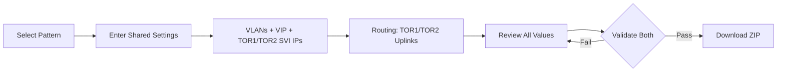
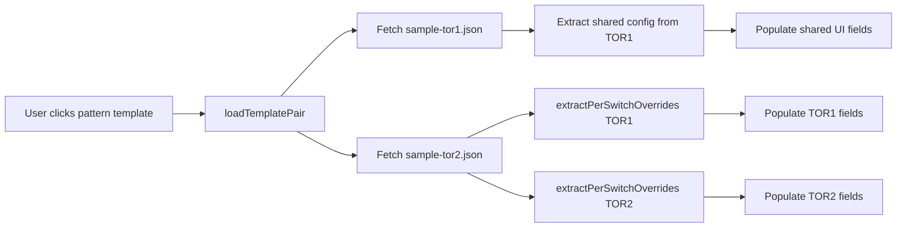

# Azure Local Physical Network Config Tool — Project Roadmap

**Version:** 31.0  
**Date:** February 4, 2026  
**Status:** v1 Implementation — Phase 13 (TOR Pair Generation) UI Refinement  
**Reference:** [Design Doc](AzureLocal_Physical_Network_Config_Tool_Design_Doc.md)

---

> [!IMPORTANT]
> **REFERENCE ONLY** — Generated configs are starting points, not production-ready. Customers validate and test.

---

## 🎯 Current Focus: Phase 13 — TOR Pair Generation (UI Refinement)

**Goal:** Transform the wizard to output a complete TOR pair (TOR1 + TOR2) in a single workflow using the **"Smart Defaults, Full Visibility, Always Editable"** design pattern.

### Design Philosophy

```
┌─────────────────────────────────────────────────────────────────────────────────┐
│  🎯 "Smart Defaults, Full Visibility, Always Editable"                          │
├─────────────────────────────────────────────────────────────────────────────────┤
│  1. User enters ONE value (e.g., VIP, Loopback)                                 │
│  2. TOR1 and TOR2 values AUTO-POPULATE (visible in UI)                          │
│  3. ALL fields VISIBLE and EDITABLE — user can override any auto-derived value  │
│  4. Uplinks are FULLY CONFIGURABLE — no hardcoded offsets                       │
└─────────────────────────────────────────────────────────────────────────────────┘
```

### Output Format

```
┌─────────────────────────────────────────────────────────────────────────────────┐
│  📦 OUTPUT: {hostname}_{pattern}_{timestamp}.zip                                │
│     ├── {hostname}-tor1-config.json                                             │
│     ├── {hostname}-tor2-config.json                                             │
│     ├── {hostname}-tor1.cfg                                                     │
│     └── {hostname}-tor2.cfg                                                     │
└─────────────────────────────────────────────────────────────────────────────────┘
```

### User Workflow



---

### Implementation Status

| Phase | Focus | Files | Status |
|-------|-------|-------|--------|
| **1** | State & Types | `types.ts`, `state.ts`, `app.ts` | ✅ Done |
| **2** | UI Updates (Basic) | `index.html`, `app.ts` (Switch A/B tabs) | ✅ Done |
| **3** | Validation & ZIP | `validator.ts`, `utils.ts`, add `jszip` | ✅ Done |
| **4** | E2E Tests | `wizard-e2e.spec.ts` | ✅ Done |
| **5** | UI Refinement | Full TOR1/TOR2 field visibility | 🔄 In Progress |

---

## Phase 13.5: UI Refinement — Detailed Implementation Plan

### 13.5.1 UI Changes Required

| Component | Current State | Target State | Priority |
|-----------|---------------|--------------|----------|
| TOR Pair Badge | Prominent badge in UI | Remove, use description text | High |
| Copy to Clipboard | Button exists | Remove entirely | High |
| Download Button | "Download TOR Pair ZIP" | "Download Switch Config" | High |
| Template Loading | Hostname not filled | Fix `updateBaseHostname()` | High |
| VLAN SVI IPs | Single IP field | VIP + TOR1 + TOR2 (all visible) | **Critical** |
| Uplink IPs | Single field per uplink | TOR1 + TOR2 side by side | **Critical** |
| iBGP PC IP | Not visible | TOR1 + TOR2 fields | High |
| Loopback IP | Single field | TOR1 + TOR2 with auto-derive | High |

### 13.5.2 Field Categorization

Based on UI audit, fields are categorized as **SHARED** (entered once) or **PER-TOR** (TOR1/TOR2 visible):

#### SHARED Fields (No Change Needed)

| Section | Fields |
|---------|--------|
| **Pattern & Hardware** | `deployment_pattern`, `vendor`, `model`, `firmware` |
| **VLAN Definition** | `vlan_id`, `vlan_name`, `purpose`, `cidr` |
| **Ports** | `trunk_ranges`, `qos_enabled`, `peer_link_members` |
| **MLAG** | `domain_id`, `peer_link_pc_id` |
| **BGP** | `asn`, `neighbors[]` (external) |
| **Static Routes** | All routes (shared) |

#### PER-TOR Fields (Require UI Update)

| Section | Field | Auto-Derivation Rule | Override |
|---------|-------|---------------------|----------|
| **Identity** | `hostname` | Base + `-tor1`/`-tor2` suffix | ✅ |
| **VLAN SVI** | `vip` (Gateway) | User enters | N/A |
| **VLAN SVI** | `tor1_svi_ip` | VIP + 1 | ✅ |
| **VLAN SVI** | `tor2_svi_ip` | VIP + 2 | ✅ |
| **Routing** | `tor1_loopback_ip` | User enters | N/A |
| **Routing** | `tor2_loopback_ip` | TOR1 + 1 | ✅ |
| **Routing** | `tor1_uplink1_ip` | User enters | N/A |
| **Routing** | `tor2_uplink1_ip` | User enters | N/A |
| **Routing** | `tor1_uplink2_ip` | User enters (if applicable) | N/A |
| **Routing** | `tor2_uplink2_ip` | User enters (if applicable) | N/A |
| **MLAG** | `tor1_keepalive_src` | User enters | N/A |
| **MLAG** | `tor1_keepalive_dst` | User enters | N/A |
| **MLAG** | `tor2_keepalive_src` | = TOR1 dst (swapped) | ✅ |
| **MLAG** | `tor2_keepalive_dst` | = TOR1 src (swapped) | ✅ |
| **iBGP** | `tor1_ibgp_pc_ip` | User enters | N/A |
| **iBGP** | `tor2_ibgp_pc_ip` | User enters | N/A |
| **Redundancy** | `tor1_hsrp_priority` | 150 (hardcoded) | ❌ |
| **Redundancy** | `tor2_hsrp_priority` | 140 (hardcoded) | ❌ |
| **Redundancy** | `tor1_vlt_priority` | 1 (hardcoded) | ❌ |
| **Redundancy** | `tor2_vlt_priority` | 2 (hardcoded) | ❌ |

### 13.5.3 UI Layout Specification

#### VLAN Section — SVI IPs (Per VLAN Row)

```
┌─────────────────────────────────────────────────────────────────────────────────┐
│  VLAN: 7 - Management                                                           │
├─────────────────────────────────────────────────────────────────────────────────┤
│  Gateway VIP             TOR1 SVI (Auto: VIP+1)    TOR2 SVI (Auto: VIP+2)       │
│  ┌───────────────┐       ┌───────────────┐         ┌───────────────┐            │
│  │ 10.0.0.1      │       │ 10.0.0.2      │         │ 10.0.0.3      │            │
│  └───────────────┘       └───────────────┘         └───────────────┘            │
└─────────────────────────────────────────────────────────────────────────────────┘
```

**Event Handler: `onVipChange(vlanId, newVip)`**
```typescript
function onVipChange(vlanId: number, newVip: string): void {
  // Parse IP
  const parts = newVip.split('.');
  const lastOctet = parseInt(parts[3]);
  
  // Auto-populate TOR1 = VIP + 1
  const tor1Ip = `${parts[0]}.${parts[1]}.${parts[2]}.${lastOctet + 1}`;
  document.querySelector(`#vlan-${vlanId}-tor1-svi`)!.value = tor1Ip;
  
  // Auto-populate TOR2 = VIP + 2
  const tor2Ip = `${parts[0]}.${parts[1]}.${parts[2]}.${lastOctet + 2}`;
  document.querySelector(`#vlan-${vlanId}-tor2-svi`)!.value = tor2Ip;
  
  // User can still edit TOR1/TOR2 fields manually
}
```

#### Routing Section — Uplinks (Side by Side)

```
┌─────────────────────────────────────────────────────────────────────────────────┐
│  Uplink 1                                                                       │
├─────────────────────────────────────────────────────────────────────────────────┤
│  TOR1 Uplink 1 IP                     TOR2 Uplink 1 IP                          │
│  ┌───────────────────────────┐        ┌───────────────────────────┐             │
│  │ 10.100.0.1/30             │        │ 10.100.0.5/30             │             │
│  └───────────────────────────┘        └───────────────────────────┘             │
├─────────────────────────────────────────────────────────────────────────────────┤
│  Uplink 2 (optional)                                                            │
├─────────────────────────────────────────────────────────────────────────────────┤
│  TOR1 Uplink 2 IP                     TOR2 Uplink 2 IP                          │
│  ┌───────────────────────────┐        ┌───────────────────────────┐             │
│  │ 10.100.0.9/30             │        │ 10.100.0.13/30            │             │
│  └───────────────────────────┘        └───────────────────────────┘             │
└─────────────────────────────────────────────────────────────────────────────────┘
```

> **Important:** Uplinks have NO auto-derivation. User enters all 4 values explicitly.

#### Routing Section — Loopback IPs

```
┌─────────────────────────────────────────────────────────────────────────────────┐
│  Loopback IPs (Router ID Source)                                                │
├─────────────────────────────────────────────────────────────────────────────────┤
│  TOR1 Loopback IP                     TOR2 Loopback IP (Auto: TOR1+1)           │
│  ┌───────────────────────────┐        ┌───────────────────────────┐             │
│  │ 10.255.0.1/32             │        │ 10.255.0.2/32             │             │
│  └───────────────────────────┘        └───────────────────────────┘             │
└─────────────────────────────────────────────────────────────────────────────────┘
```

**Event Handler: `onTor1LoopbackChange(newIp)`**
```typescript
function onTor1LoopbackChange(newIp: string): void {
  const parts = newIp.replace('/32', '').split('.');
  const lastOctet = parseInt(parts[3]);
  const tor2Ip = `${parts[0]}.${parts[1]}.${parts[2]}.${lastOctet + 1}/32`;
  document.querySelector('#tor2-loopback-ip')!.value = tor2Ip;
}
```

### 13.5.4 Types Update Required

Update `PerSwitchOverrides` in `types.ts`:

```typescript
export interface PerSwitchOverrides {
  hostname: string;
  loopback_ip?: string;
  
  /** SVI IPs for each VLAN - keyed by VLAN ID */
  svi_ips?: Record<number, string>;
  
  /** Uplink 1 IP (e.g., "10.100.0.1/30") */
  uplink1_ip?: string;
  
  /** Uplink 2 IP (if applicable) */
  uplink2_ip?: string;
  
  /** iBGP port-channel IP (peer-link point-to-point) */
  ibgp_pc_ip?: string;
  
  /** MLAG keepalive source IP */
  keepalive_source_ip?: string;
  
  /** MLAG keepalive destination IP */
  keepalive_dest_ip?: string;
  
  /** BGP router ID (typically same as loopback) */
  bgp_router_id?: string;
  
  /** iBGP peer IP (the other ToR's loopback) */
  ibgp_peer_ip?: string;
}
```

### 13.5.5 File Changes Summary

| File | Changes |
|------|---------|
| `frontend/index.html` | Add TOR1/TOR2 SVI fields per VLAN, add uplink fields, remove badge, remove copy button, rename download button, update template modal |
| `frontend/src/types.ts` | Add `uplink1_ip`, `uplink2_ip`, `ibgp_pc_ip` to `PerSwitchOverrides` |
| `frontend/src/app.ts` | Add `onVipChange()`, `onTor1LoopbackChange()`, add `loadTemplatePair()`, add `extractPerSwitchOverrides()` |
| `frontend/src/utils.ts` | Add `extractPerSwitchOverrides()`, update `buildTorConfig()` to use new fields |
| `frontend/odin-theme.css` | Style for TOR1/TOR2 side-by-side fields |

### 13.5.6 Template Loading Strategy

**Principle:** Template files stay as separate TOR1/TOR2 JSONs (clean data structure for backend CLI). UI loads BOTH templates automatically when user selects a pattern.

#### Template File Structure (Unchanged)

```
frontend/examples/
├── fully-converged/
│   ├── sample-tor1.json    # StandardConfig for TOR1
│   └── sample-tor2.json    # StandardConfig for TOR2
├── switched/
│   ├── sample-tor1.json
│   └── sample-tor2.json
└── switchless/
    ├── sample-tor1.json
    └── sample-tor2.json
```

#### Template Modal (Updated)

**Before:** Shows TOR1, TOR2 as separate options → confusing for TOR pair workflow

**After:** Shows pattern-level options → loads BOTH templates automatically

```
┌─────────────────────────────────────────────────────────────────────────────────┐
│  📁 Load Template                                                               │
├─────────────────────────────────────────────────────────────────────────────────┤
│  ┌─────────────────┐  ┌─────────────────┐  ┌─────────────────┐                  │
│  │ Fully Converged │  │    Switched     │  │   Switchless    │                  │
│  │  Dell S5248F    │  │  Dell S5248F    │  │  Dell S5248F    │                  │
│  │  (TOR Pair)     │  │  (TOR Pair)     │  │  (TOR Pair)     │                  │
│  └─────────────────┘  └─────────────────┘  └─────────────────┘                  │
└─────────────────────────────────────────────────────────────────────────────────┘
```

#### Loading Flow



#### `extractPerSwitchOverrides()` Function

Extracts per-switch IPs from a `StandardConfig` into `PerSwitchOverrides`:

```typescript
function extractPerSwitchOverrides(config: StandardConfig): PerSwitchOverrides {
  const loopback = config.interfaces?.find(i => i.intf_type === 'loopback');
  const uplinks = config.interfaces?.filter(i => 
    i.type === 'L3' && i.intf_type === 'Ethernet'
  );
  const ibgpPc = config.port_channels?.find(pc => 
    pc.type === 'L3' && !pc.vpc_peer_link
  );
  
  return {
    hostname: config.switch?.hostname || '',
    loopback_ip: loopback?.ipv4,
    uplink1_ip: uplinks?.[0]?.ipv4,
    uplink2_ip: uplinks?.[1]?.ipv4,
    ibgp_pc_ip: ibgpPc?.ipv4,
    keepalive_source_ip: config.mlag?.peer_keepalive?.source_ip,
    keepalive_dest_ip: config.mlag?.peer_keepalive?.destination_ip,
    bgp_router_id: config.bgp?.router_id,
    svi_ips: extractSviIps(config.vlans)
  };
}
```

#### Fallback: TOR2 Not Found

If only TOR1 template exists, auto-derive TOR2 using existing rules:
- Hostname: `{base}-tor2` 
- Loopback: TOR1 + 1
- Keepalive: Swapped from TOR1

### 13.5.7 Implementation Steps

| Step | Task | Estimated Time | Dependencies |
|------|------|----------------|--------------|
| 5.1 | Update `types.ts` with new fields | ✅ Done | None |
| 5.2 | Update `index.html` VLAN section (VIP + TOR1 + TOR2 SVI fields) | ✅ Done | 5.1 |
| 5.3 | Update `index.html` Per-switch section (Loopback, Uplinks, Keepalive) | ✅ Done | 5.1 |
| 5.4 | Update `index.html` iBGP section (TOR1/TOR2 PC IPs) | ✅ Done | 5.1 |
| 5.5 | Add CSS for side-by-side layout (`.tor-pair-row`) | ✅ Done | 5.2, 5.3 |
| 5.6 | Add `onVipChange()` auto-derivation in `app.ts` | ✅ Done | 5.2 |
| 5.7 | Add `onTor1LoopbackChange()` auto-derivation in `app.ts` | ✅ Done | 5.3 |
| 5.8 | Add keepalive swap logic in `app.ts` | ✅ Done | 5.4 |
| 5.9 | Move "generates -tor1, -tor2" into Base Hostname label | 5 min | None |
| 5.10 | Remove TOR pair badge, copy button, rename download | ✅ Done | None |
| 5.11 | Update template modal to show pattern-level options | 20 min | None |
| 5.12 | Add `extractPerSwitchOverrides()` in `utils.ts` | 30 min | 5.1 |
| 5.13 | Add `loadTemplatePair()` in `app.ts` | 45 min | 5.12 |
| 5.14 | Add Storage VLAN note for Switched pattern | 5 min | None |
| 5.15 | Update `buildTorConfig()` to consume new fields | ✅ Done | 5.1-5.8 |
| 5.16 | Update E2E tests for template pair loading | 30 min | 5.13 |
| 5.17 | Manual testing and validation | 30 min | 5.16 |

**Remaining Time: ~2.5 hours**

---

### Auto-Derivation Rules (Complete Reference)

Reference: [main branch test_cases](https://github.com/microsoft/Azure_Local_Physical_Network_Config_Tool/tree/main/tests/test_cases)

| Rule | TOR1 | TOR2 | Auto-Derived? | Editable? |
|------|------|------|---------------|-----------|
| Hostname | `{base}-tor1` | `{base}-tor2` | ✅ | ✅ |
| HSRP/VRRP priority | 150 (Active) | 140 (Standby) | ✅ | ❌ (hardcoded) |
| VLT primary priority | 1 | 2 | ✅ | ❌ (hardcoded) |
| SVI IP (per VLAN) | VIP + 1 | VIP + 2 | ✅ | ✅ |
| Loopback IP | User enters | TOR1 + 1 | ✅ | ✅ |
| Keepalive src/dst | User enters | Swapped | ✅ | ✅ |
| Uplink IPs | User enters | User enters | ❌ | ✅ |
| iBGP PC IP | User enters | User enters | ❌ | ✅ |
| Storage VLANs (Switched) | `S1` (711 only) | `S2` (712 only) | ✅ | ❌ (pattern-driven) |
| Storage VLANs (Converged) | Both S1+S2 | Both S1+S2 | ✅ | ❌ (pattern-driven) |
| Redundancy type | Cisco=HSRP | Dell=VRRP | ✅ | ❌ (vendor-driven) |

---

### Architecture for Extensibility

Phase 13 introduces modular components designed for reuse in Phase 14 (internal lab support):

```
┌─────────────────────────────────────────────────────────────────────────────────┐
│  Input Layer (Phase 13)                  │  Extension Point (Phase 14)         │
├──────────────────────────────────────────┼──────────────────────────────────────┤
│  UI Form → StandardConfig                │  Lab JSON → StandardConfig[]         │
│  (manual entry, customer workflow)       │  (auto-convert, internal workflow)   │
├──────────────────────────────────────────┴──────────────────────────────────────┤
│  Core Generation Pipeline (shared)                                              │
│  ├── buildTorConfig(shared, overrides, role) → StandardConfig                   │
│  ├── validateConfig(config) → ValidationResult                                  │
│  ├── renderConfig(config) → string (.cfg)                                       │
│  └── downloadZip(configs[]) → .zip file                                         │
└─────────────────────────────────────────────────────────────────────────────────┘
```

| Function | Phase 13 | Phase 14 |
|----------|----------|----------|
| `buildTorConfig()` | From UI state | From converted lab JSON |
| `validateConfig()` | Validate TOR1 + TOR2 | Validate TOR1 + TOR2 + BMC |
| `renderConfig()` | Render 2 configs | Render 3 configs |
| `downloadZip()` | 4 files (2 JSON + 2 CFG) | 6 files (3 JSON + 3 CFG) |

---

### Success Criteria

**Core Workflow**
- [x] Pattern selection shows "2 ToR switches" (no manual TOR1/TOR2 role selection)
- [x] Shared settings (VLANs, ports, MLAG, BGP ASN) entered once
- [ ] Per-switch overrides: hostname, loopback IP, SVI IPs, keepalive IPs, uplink IPs all visible

**UI Refinement (Phase 13.5)**
- [ ] VLAN section shows: VIP + TOR1 SVI + TOR2 SVI (all visible, TOR1/TOR2 editable)
- [ ] Routing section shows: TOR1/TOR2 uplinks side-by-side (both fully editable)
- [ ] Loopback shows: TOR1 + TOR2 (TOR2 auto-derived from TOR1+1, editable)
- [ ] Keepalive shows: TOR1 src/dst + TOR2 src/dst (TOR2 auto-swapped, editable)
- [ ] TOR pair badge removed — replaced with description text
- [ ] Copy to Clipboard button removed
- [ ] Download button renamed to "Download Switch Config"
- [ ] Template loading correctly populates base hostname

**Auto-Derivation** (per [test_cases](https://github.com/microsoft/Azure_Local_Physical_Network_Config_Tool/tree/main/tests/test_cases))
- [x] TOR1 HSRP/VRRP priority = 150; TOR2 = 140
- [x] TOR1 VLT priority = 1; TOR2 = 2
- [x] TOR2 iBGP peer IP = swapped TOR1 endpoints
- [x] Switched pattern: TOR1 gets `S1` VLANs (711); TOR2 gets `S2` VLANs (712)
- [x] Fully-converged: both ToRs get both storage VLANs
- [x] Cisco uses HSRP; Dell uses VRRP (vendor-driven)
- [ ] SVI IP auto-populate: TOR1 = VIP+1, TOR2 = VIP+2
- [ ] Loopback auto-populate: TOR2 = TOR1+1
- [ ] Keepalive auto-swap: TOR2.src = TOR1.dst, TOR2.dst = TOR1.src

**Output**
- [x] ZIP naming: `{hostname}_{pattern}_{timestamp}.zip`
- [x] ZIP contains 4 files: 2 JSON + 2 CFG
- [x] Each CFG renders correctly with role-specific values

**Testing**
- [x] E2E: Select pattern → fill shared → fill per-switch → download ZIP
- [x] E2E: Validation errors show per-switch (Switch A / Switch B)
- [ ] E2E: Verify auto-derivation populates TOR2 fields from TOR1 input
- [ ] E2E: Verify uplink fields are independent (no auto-derivation)
- [x] Unit: `buildTorConfig()` produces correct role-specific output
- [x] Unit: `validateConfig()` catches cross-reference errors

---

## Future Work

### Phase 12: CI Contract Tests (Deferred)

**Why deferred:** Not blocking v1 user experience. Can be added post-launch.

| Item | Purpose |
|------|---------|
| `backend-pytest.yml` | Run backend tests in GitHub Actions |
| Issue body parser | Parse GitHub Issue form output |
| Fixture secret scan | Block merges with credentials |

### Potential Enhancements

| Enhancement | Description | Priority |
|-------------|-------------|----------|
| Single-ToR import | Import existing single-switch JSON, generate pair | Medium |
| Additional vendors | Arista EOS, Juniper JunOS | Community |
| Config diff view | Compare TOR1 vs TOR2 before download | Low |
| Dark mode | UI preference toggle | Low |

---

## 🔬 Internal Lab Support (Phase 14)

> [!NOTE]
> **This section is for INTERNAL LAB USE ONLY.**
> 
> - Does NOT impact customer-facing UI or workflows
> - Enables internal team to deploy racks faster using existing lab JSON format
> - BMC switch support is lab-only (customers never use BMC switches)
> - Contributions from lab deployments feed back into template quality

### Purpose

Internal lab teams have an existing JSON format ("lab JSON") used to define rack deployments. Phase 14 adds **silent format detection** to the "Load JSON" function, enabling lab users to:

1. Load their existing lab JSON file
2. Auto-convert to StandardConfig (TOR1 + TOR2 + BMC)
3. Download ZIP with all switch configs
4. Deploy and contribute configs via issue template

### Separation Principle

```
┌─────────────────────────────────────────────────────────────────────────────────┐
│  PRODUCTION (Customers)              │  INTERNAL LAB (Microsoft Team)          │
├──────────────────────────────────────┼──────────────────────────────────────────┤
│  UI wizard: manual entry             │  Load JSON: auto-detect lab format      │
│  Outputs: TOR1 + TOR2 only           │  Outputs: TOR1 + TOR2 + BMC             │
│  No BMC in UI                        │  BMC generated silently                 │
│  Customer responsibility             │  Internal deployment acceleration       │
└──────────────────────────────────────┴──────────────────────────────────────────┘
```

### Lab JSON Format Detection

| Format | Detection | Action |
|--------|-----------|--------|
| **Standard JSON** | Has `switch`, `vlans`, `interfaces` | Load into UI (existing behavior) |
| **Lab JSON** | Has `Version`, `InputData`, `Switches`, `Supernets` | Convert → generate → ZIP |

### Lab JSON → Standard JSON Mapping

| Lab JSON Section | Extracted Switches |
|------------------|-------------------|
| `Switches[Type=TOR1]` | → StandardConfig for TOR1 |
| `Switches[Type=TOR2]` | → StandardConfig for TOR2 |
| `Switches[Type=BMC]` | → StandardConfig for BMC (lab only) |
| `Switches[Type=Border*]` | **IGNORED** |
| `Switches[Type=MUX]` | **IGNORED** |
| `WANSIM` section | **IGNORED** |

### VLAN Symbol Mapping

| Symbol | GroupName Match | Purpose |
|--------|-----------------|--------|
| `M` | `Infrastructure` | Management (VLAN 7) |
| `C` | `TENANT`, `HNVPA`, `L3FORWARD` | Compute (multiple VLANs) |
| `S` | `Storage` | Storage (both 711, 712) |
| `S1` | `Storage` where VLANID=711 | Storage_1 (TOR1 in switched) |
| `S2` | `Storage` where VLANID=712 | Storage_2 (TOR2 in switched) |
| `UNUSED` | `UNUSED_VLAN` | Parking VLAN 2 |
| `NATIVE` | `NativeVlan` | Native VLAN 99 |
| `BMC` | `BMC` | BMC management (VLAN 125) |

### Implementation Steps

| Step | Focus | Files |
|------|-------|-------|
| 14.1 | Format detection | `frontend/src/utils.ts`: `isLabFormat()` |
| 14.2 | Lab converter (backend) | `backend/src/lab_converter.py` |
| 14.3 | Lab converter (frontend) | `frontend/src/lab-converter.ts` |
| 14.4 | Enhanced import | `frontend/src/app.ts`: detect + convert |
| 14.5 | Unit tests | `backend/tests/test_lab_converter.py` |

### ZIP Output (Lab Format)

**Naming:** `{site}-{rack}_{pattern}_{timestamp}.zip`

**Example:** `b88-ra04_switched_2026-02-04T1430.zip`

**Contents:**
```
b88-ra04_switched_2026-02-04T1430.zip
├── b88-a04-93180hl-2-1a-config.json    # TOR1
├── b88-a04-93180hl-2-1b-config.json    # TOR2
├── b88-a04-9348bmc-2-1-config.json     # BMC (lab only)
├── b88-a04-93180hl-2-1a.cfg            # TOR1 config
├── b88-a04-93180hl-2-1b.cfg            # TOR2 config
└── b88-a04-9348bmc-2-1.cfg             # BMC config (if templates exist)
```

### Success Criteria

**Format Detection**
- [ ] `isLabFormat()` returns `true` for lab JSON (has `InputData.Switches`)
- [ ] `isLabFormat()` returns `false` for standard JSON (has `switch.vendor`)
- [ ] Standard JSON loads into UI form (existing behavior unchanged)

**Lab Conversion**
- [ ] Extracts TOR1, TOR2, BMC from `Switches[]` array
- [ ] Ignores Border, MUX, WANSIM sections without error
- [ ] Maps `DeploymentPattern` to `switch.deployment_pattern`
- [ ] Maps vendor: "Cisco" → "cisco", "Dell" → "dellemc"

**VLAN Mapping**
- [ ] `Infrastructure` → management (M)
- [ ] `TENANT`, `HNVPA`, `L3FORWARD` → compute (C)
- [ ] `Storage` VLANID=711 → storage_1 (S1)
- [ ] `Storage` VLANID=712 → storage_2 (S2)
- [ ] IP assignments extracted from `Supernets[].IPv4.Assignment`

**Output**
- [ ] ZIP naming: `{site}-{rack}_{pattern}_{timestamp}.zip`
- [ ] ZIP contains 6 files: 3 JSON + 3 CFG (TOR1, TOR2, BMC)
- [ ] BMC config has reduced sections (no BGP, no MLAG, no HSRP)

**Isolation**
- [ ] Customer UI unchanged (no BMC dropdown, no lab-specific fields)
- [ ] Lab workflow triggered only by Load JSON with lab format
- [ ] Error messages don't expose internal lab terminology to customers

**Testing**
- [ ] Unit: `convertLabToStandard()` with fixture from `b88ra04-sw4-definition.json`
- [ ] Unit: VLAN symbol mapping for all GroupName variants
- [ ] Integration: Load lab JSON → auto-convert → download ZIP

---

## Architecture Summary

```
┌─────────────────────────────────────────────────────────────────────────────────┐
│  SOURCE OF TRUTH: backend/templates/*.j2                                        │
│  ├── dellemc/os10/*.j2  (10 templates)                                          │
│  └── cisco/nxos/*.j2    (10 templates)                                          │
└─────────────────────────────────────────────────────────────────────────────────┘
                              │
              ┌───────────────┴───────────────┐
              │ BUILD TIME                    │ RUNTIME (CLI only)
              ▼                               ▼
┌─────────────────────────┐     ┌─────────────────────────┐
│  frontend/src/          │     │  backend/src/           │
│  templates.ts (bundled) │     │  renderer.py            │
│  Nunjucks (JS)          │     │  Jinja2 (Python)        │
│  GitHub Pages: ✅        │     │  Automation: ✅          │
└─────────────────────────┘     └─────────────────────────┘
```

### Key Decisions (ADRs)

| ADR | Decision | Rationale |
|-----|----------|-----------|
| ADR-006 | Pattern drives switch count | Azure Local always needs 2 ToRs; eliminates duplicate entry |
| ADR-007 | No backend server | GitHub Pages compatible; 100% client-side |
| ADR-004 | Nunjucks for browser | Jinja2-compatible; templates work in both environments |
| ADR-008 | Lab format as silent extension | Lab support doesn't change UI; auto-detected on Load JSON |

---

## Commands Reference

```bash
# Development
cd /workspace/frontend && npm run dev -- --port 3000

# Tests (always use timeouts)
cd /workspace && timeout 180 npx playwright test --reporter=line
cd /workspace/backend && python -m pytest

# Generate via CLI
cd /workspace/backend && python -m src.cli generate config.json
```

> [!WARNING]
> **NEVER** run `pkill -f node` or `pkill -f vite` — will crash dev container.

---

## Reference Links

| Resource | URL |
|----------|-----|
| Design Doc | [AzureLocal_Physical_Network_Config_Tool_Design_Doc.md](AzureLocal_Physical_Network_Config_Tool_Design_Doc.md) |
| Azure Patterns | [AzureLocal-Supportability](https://github.com/Azure/AzureLocal-Supportability) |
| MS Learn | [Network Patterns Overview](https://learn.microsoft.com/en-us/azure/azure-local/plan/network-patterns-overview) |

---

<details>
<summary><strong>📁 Completed Phases Archive (1-11)</strong></summary>

### Phase 1-6: E2E MVP ✅
- Frontend wizard with schema-aligned TypeScript types
- Backend CLI with Jinja2 rendering
- Dell OS10 templates (10/10), Cisco NX-OS templates (10/10)

### Phase 7: Client-Side Generation ✅
- Nunjucks template engine (Jinja2-compatible in browser)
- Templates bundled at build time via `bundle-templates.cjs`
- Works offline, no server needed

### Phase 8: Lab Workflow ✅
- `vendor_detector.py` — Auto-detect vendor from config syntax
- `config_sectioner.py` — Split config into logical sections
- `process.py` — Main processor orchestration

### Phase 8.5: Submission Validation ✅
- `metadata_validator.py` — Auto-fix typos (Dell EMC → dellemc, etc.)
- New vendors welcomed as contribution opportunities
- Timestamped logging for self-service debugging

### Phase 9: Script Migration ✅
- Lab scripts moved to `backend/src/` (permanent location)
- Full pytest coverage added
- Lab wrapper remains for local testing

### Phase 10: Copilot Submission Workflow ✅
- Issue template: `.github/ISSUE_TEMPLATE/config-submission.yml`
- Copilot instructions: `.github/instructions/process-submission.instructions.md`
- Human-in-loop: maintainer clicks "Code with agent mode" to process

### Phase 11: Doc Hardening ✅
- AzureLocal-Supportability as single source of truth for pattern rules
- Peer-link VLAN guidance: exclude storage VLANs (HSRP reference)
- Consistent terminology across all docs

### Additional ADRs (Historical)

| ADR | Decision |
|-----|----------|
| ADR-001 | Template include paths: `` |
| ADR-002 | Interface-level QoS: `qos: true` per interface |
| ADR-003 | Credentials: `$CREDENTIAL_PLACEHOLDER$` markers |
| ADR-005 | Processing scripts in `backend/src/` (not lab or .github) |

</details>
