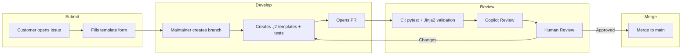

# Azure Local Physical Network Config Tool — Project Roadmap

**Version:** 17.0  
**Date:** February 2, 2026  
**Status:** E2E MVP Complete — UI Export Config Feature Next  
**Reference:** [Design Doc](AzureLocal_Physical_Network_Config_Tool_Design_Doc.md)

---

## Core Principle: Reference Only

> [!IMPORTANT]
> **This tool provides REFERENCE configurations only.**
> 
> | Aspect | This Repo's Responsibility | Customer's Responsibility |
> |--------|---------------------------|--------------------------|
> | **Purpose** | Help understand Azure Local network patterns | Validate for your specific environment |
> | **Configs** | Provide reference templates & examples | Test and modify for production use |
> | **Support** | Community-driven, best-effort | Your IT/Network team |
> | **Liability** | None — use at your own risk | Full responsibility for deployment |
> 
> **Generated configurations are starting points, not production-ready solutions.**

---

## Current Focus

```
┌─────────────────────────────────────────────────────────────────────────────────┐
│  ✅ E2E MVP COMPLETE (Phases 1-6)                                               │
│     • Frontend wizard: Schema-aligned, validated, 48 E2E tests                  │
│     • Backend: 67 unit tests, full schema validation                            │
│     • Dell EMC OS10: 10/10 templates                                            │
│     • Cisco NX-OS: 10/10 templates                                              │
│     • All 3 deployment patterns working (fully_converged, switched, switchless) │
├─────────────────────────────────────────────────────────────────────────────────┤
│  🔄 NEXT: Phase 7 — UI Export Config Feature                                    │
│     • Add "Export Config" button to generate final switch config in browser     │
│     • Users download ready-to-deploy config without CLI                         │
│     • Integrate backend renderer logic into frontend (WASM or API)              │
└─────────────────────────────────────────────────────────────────────────────────┘
```

---

## Progress Tracker

| Phase | Description | Status | Notes |
|-------|-------------|--------|-------|
| 1-6 | E2E MVP Implementation | ✅ **Complete** | See [Completed Phases Archive](#completed-phases-archive) |
| 7 | UI Export Config Feature | 🔄 **Next** | Generate final config in browser |
| 8 | Lab-Based Workflow Testing | 📋 **Planned** | Config-to-template workflow |
| 9 | GitHub Community Workflow | 📋 **Planned** | Issue templates + PR automation |

---

## Phase 7: UI Export Config Feature 🔄 NEXT

**Goal:** Allow users to download the final switch configuration directly from the wizard — no CLI required.

### Current State vs. Target

| Aspect | Current | Target |
|--------|---------|--------|
| Export button | Exports JSON | Exports final switch config |
| User workflow | Wizard → JSON → CLI → Config | Wizard → Config |
| CLI dependency | Required | Optional (for power users) |

### Implementation Options

| Option | Approach | Pros | Cons |
|--------|----------|------|------|
| **A: API Call** | Frontend calls backend API | Reuses existing renderer | Requires backend server |
| **B: WASM** | Compile Python renderer to WASM | Fully client-side | Complex build, larger bundle |
| **C: JS Port** | Rewrite renderer in TypeScript | Fast, no dependencies | Duplicated logic to maintain |
| **D: Bundled Templates** | Include templates in frontend, use JS Jinja2 lib | Client-side, moderate effort | Need Jinja2 JS library |

**Recommended: Option A (API Call)** for initial release — simplest to implement, keeps single source of truth for templates.

### Implementation Steps

| Step | Task | Description |
|------|------|-------------|
| 7.1 | Add backend API endpoint | `/api/generate` accepts JSON, returns config |
| 7.2 | Add UI "Export Config" button | Separate from "Export JSON" |
| 7.3 | Call API and download result | Fetch → blob → download |
| 7.4 | Add loading state | Show spinner while generating |
| 7.5 | Error handling | Display errors if generation fails |
| 7.6 | E2E tests | Test export flow |

### Success Criteria

- [ ] "Export Config" button visible in UI
- [ ] Click generates and downloads `.cfg` file
- [ ] Config is valid vendor syntax (Cisco/Dell)
- [ ] Works for all 3 deployment patterns
- [ ] E2E test validates export flow

---

## Phase 8: Lab-Based Workflow Testing 📋 PLANNED

**Goal:** Create an isolated lab environment to test the config-to-template workflow before implementing GitHub automation.

### Why Lab First?

| Approach | Speed | Risk | Debuggability |
|----------|-------|------|---------------|
| **Lab folder (isolated)** | Fast iteration | Zero | Easy - all local |
| GitHub Issues directly | Slower | Medium | Harder - round trips |

### Lab Structure

```
lab/
├── README.md                      # Lab usage guide
├── templates/                     # COPY of backend/templates/ (safe to modify)
│   ├── cisco/nxos/*.j2
│   └── dellemc/os10/*.j2
├── schema/                        # COPY of backend/schema/
│   └── standard.json
├── scripts/                       # Processing logic
│   ├── process.py                 # Main entry point
│   ├── vendor_detector.py         # Auto-detect vendor from config
│   ├── config_sectioner.py        # Split config into sections
│   └── template_updater.py        # Update/create .j2 templates
├── submissions/                   # Test inputs (customer submissions)
│   ├── example-cisco-tor1/
│   │   ├── metadata.yaml          # Vendor, model, role, pattern
│   │   └── config.txt             # Raw switch config
│   └── example-dell-tor1/
│       ├── metadata.yaml
│       └── config.txt
└── output/                        # Generated outputs (gitignored)
```

### Sample metadata.yaml

```yaml
# Customer fills this (maps to GitHub Issue form fields)
vendor: cisco
firmware: nxos
model: 93180YC-FX3
os_version: "10.2(3)"
role: TOR1
deployment_pattern: fully_converged
hostname: az-tor1-r01
```

### Implementation Steps

| Step | Task | Description |
|------|------|-------------|
| 8.1 | Create lab folder structure | Directories, README, .gitignore for output |
| 8.2 | Copy templates and schema | Mirror `backend/templates/` and `backend/schema/` |
| 8.3 | Create sample submissions | Use existing fixtures as examples |
| 8.4 | Build vendor detector | Auto-detect vendor/model from config patterns |
| 8.5 | Build config sectioner | Split full config into feature sections |
| 8.6 | Validate round-trip | Submit → process → render → compare to original |

### Success Criteria

- [ ] `lab/scripts/process.py` reads submission folder
- [ ] Vendor auto-detected from config content
- [ ] Config sectioned into system, vlan, interface, etc.
- [ ] Output JSON validates against schema
- [ ] Generated config renders correctly with existing templates

---

## Phase 9: GitHub Community Workflow 📋 PLANNED

**Goal:** Once lab workflow proven, implement GitHub Issue-based template submissions.

### Workflow Overview



### Components to Create

| Component | Location | Purpose |
|-----------|----------|---------|
| Issue Template | `.github/ISSUE_TEMPLATE/template-submission.yml` | Structured form for config submission |
| PR Template | `.github/PULL_REQUEST_TEMPLATE.md` | Checklist for template PRs |
| Contributing Guide | `CONTRIBUTING.md` | How to submit templates |
| Validation Workflow | `.github/workflows/validate-templates.yml` | CI for template PRs |

### Issue Template Fields

| Field | Type | Options | Required |
|-------|------|---------|----------|
| **Vendor** | dropdown | `cisco`, `dellemc`, `arista`, `juniper`, `Other` | ✅ |
| **Firmware/OS** | dropdown | `nxos`, `os10`, `eos`, `junos`, `Other` | ✅ |
| **Deployment Pattern** | checkboxes | fully_converged, switched, switchless | ✅ |
| **Switch Role** | dropdown | TOR1, TOR2, BMC | ✅ |
| **Model** | text | Free text (e.g., `S5248F-ON`) | ✅ |
| **OS Version** | text | Free text (e.g., `10.5.5.5`) | ✅ |
| **Config Paste** | textarea | Full switch config | ✅ |
| **Additional Context** | textarea | Notes, special features | ❌ |

---

## Completed Phases Archive

<details>
<summary><strong>Phases 1-6: E2E MVP Implementation (Click to expand)</strong></summary>

### Phase 1: Frontend Schema Sync & Validation ✅

- Synced `types.ts` with schema (StaticRoute, native_vlan, vpc_id, deployment_pattern required)
- Added peer-link storage VLAN validation for switched pattern
- Verified static routing UI works

### Phase 2: Backend Schema Extension ✅

- Removed global `qos` field (interface-level only)
- Removed `login` object (hardcoded in templates)
- Added `has_qos_interfaces` helper
- Added role helpers: `is_tor1`, `is_tor2`, `is_bmc`
- Added pattern helpers: `is_fully_converged`, `is_switched`, `is_switchless`
- Added VLAN filters: `storage_vlans`, `management_vlans`, `compute_vlans`

### Phase 3: Dell OS10 Template Completion ✅

- Created `qos.j2` with DCB/PFC for RDMA
- Created `static_route.j2` with route loop and guard
- Updated `full_config.j2` with QoS, static_route includes, and hardcoded login section

### Phase 3.5: E2E Test Refresh & Examples Update ✅

- Added `qos: true` to host/storage interfaces in examples
- Added `networks` array to BGP, `static_routes` array
- Added `_metadata` section to all examples
- 45 E2E tests passing

### Phase 4: Cisco NX-OS Templates ✅

All 10 templates created:
- `system.j2`, `vlan.j2`, `interface.j2`, `port_channel.j2`, `vpc.j2`
- `bgp.j2`, `prefix_list.j2`, `qos.j2`, `static_route.j2`, `full_config.j2`

### Phase 4.5: Type/Schema Sync Fix ✅

- Fixed `intf_type` and `af_ipv4_unicast` to be required in types.ts

### Phase 5: Integration Testing ✅

- Created Cisco test fixtures
- 38 renderer tests in `backend/tests/test_renderer.py`
- 67 total backend tests passing

### Phase 6: UI Polish ✅

- JSON preview min-height increased to 400px
- Placeholder contrast improved
- Start Over button styling fixed
- 48 total E2E tests passing

</details>

---

## E2E MVP Architecture

```
┌─────────────────────────────────────────────────────────────────────────────────┐
│                           FRONTEND (TypeScript/Vite)                            │
│  ┌─────────────┐    ┌─────────────┐    ┌─────────────┐    ┌─────────────┐      │
│  │   Wizard    │───▶│   State     │───▶│  Validator  │───▶│ JSON Export │      │
│  │     UI      │    │ Management  │    │   Rules     │    │  Standard   │      │
│  └─────────────┘    └─────────────┘    └─────────────┘    └──────┬──────┘      │
└──────────────────────────────────────────────────────────────────┼──────────────┘
                                                                   │
                                                          standard.json
                                                                   │
┌──────────────────────────────────────────────────────────────────┼──────────────┐
│                           BACKEND (Python)                       ▼              │
│  ┌─────────────┐    ┌─────────────┐    ┌─────────────┐    ┌─────────────┐      │
│  │     CLI     │───▶│  Validator  │───▶│ Transformer │───▶│  Renderer   │      │
│  │   Entry     │    │   Schema    │    │   Context   │    │   Jinja2    │      │
│  └─────────────┘    └─────────────┘    └─────────────┘    └──────┬──────┘      │
│                                                                  │              │
│  ┌───────────────────────────────────────────────────────────────┼────────────┐ │
│  │                        TEMPLATES                              ▼            │ │
│  │  ┌─────────────────────────┐    ┌─────────────────────────┐              │ │
│  │  │      Dell EMC OS10      │    │     Cisco NX-OS         │              │ │
│  │  │  ├─ full_config.j2  ✅  │    │  ├─ full_config.j2  ✅  │   ──▶ .cfg  │ │
│  │  │  ├─ system.j2       ✅  │    │  ├─ system.j2       ✅  │              │ │
│  │  │  ├─ vlan.j2         ✅  │    │  ├─ vlan.j2         ✅  │              │ │
│  │  │  ├─ interface.j2    ✅  │    │  ├─ interface.j2    ✅  │              │ │
│  │  │  ├─ port_channel.j2 ✅  │    │  ├─ port_channel.j2 ✅  │              │ │
│  │  │  ├─ bgp.j2          ✅  │    │  ├─ bgp.j2          ✅  │              │ │
│  │  │  ├─ prefix_list.j2  ✅  │    │  ├─ prefix_list.j2  ✅  │              │ │
│  │  │  ├─ qos.j2          ✅  │    │  ├─ qos.j2          ✅  │              │ │
│  │  │  ├─ mlag.j2         ✅  │    │  ├─ vpc.j2          ✅  │              │ │
│  │  │  └─ static_route.j2 ✅  │    │  └─ static_route.j2 ✅  │              │ │
│  │  └─────────────────────────┘    └─────────────────────────┘              │ │
│  └──────────────────────────────────────────────────────────────────────────┘ │
└─────────────────────────────────────────────────────────────────────────────────┘
```

---

## Architectural Decisions

<details>
<summary><strong>ADR-001 to ADR-003 (Click to expand)</strong></summary>

### ADR-001: Template Include Path Convention

**Decision:** Use vendor-prefixed paths for all template includes.

```jinja2
{# ✅ Current pattern (use this) #}


```

### ADR-002: Interface-Level QoS Architecture

**Decision:** QoS is configured per-interface, not globally. Templates render global QoS policies once if ANY interface has `qos: true`.

- **Schema:** `interfaces[].qos: boolean`
- **Context helper:** `has_qos_interfaces`

### ADR-003: Login/Credential Handling

**Decision:** Login configuration is hardcoded in `full_config.j2` templates with `$CREDENTIAL_PLACEHOLDER$` markers. No login data in JSON schema.

</details>

---

## Test Summary

| Category | Count | Status |
|----------|-------|--------|
| E2E Tests (Playwright) | 48 | ✅ All passing |
| Backend Tests (pytest) | 67 | ✅ All passing |
| **Total** | **115** | ✅ |

---

## ⚠️ Critical Development Rules

> [!WARNING]
> These rules are mandatory for all developers and AI agents working on this project.

### 1. NEVER Kill Node/Vite Processes

```bash
# ❌ FORBIDDEN - These commands will shut down the dev container
pkill -f node
pkill -f vite
pkill -9 node
kill $(pgrep -f vite)

# ✅ SAFE - Use Ctrl+C in the terminal running the server
# ✅ SAFE - Close the terminal tab running the server
# ✅ SAFE - Use VS Code's "Stop" button on the terminal
```

**Reason:** The development environment runs inside a container where Node.js processes are essential for the container's operation. Killing these processes will terminate the entire dev container, disconnecting your session.

### 2. ALWAYS Use Timeouts for Tests and Commands

```bash
# ❌ BAD - Can hang forever
npx playwright test
curl http://localhost:3000

# ✅ GOOD - Always use timeout
timeout 120 npx playwright test --reporter=line
timeout 10 curl -s http://localhost:3000
```

**Test Timeout Requirements:**

| Scope | Timeout | Purpose |
|-------|---------|---------|
| Global | 180s (3 min) | Maximum total test run |
| Per-test | 30s | Individual test timeout |
| Action | 10s | Single action (click, fill) |
| Expect | 5s | Assertion timeout |

**In test files:**
```typescript
// At file level
test.setTimeout(30000);

// Per action
await page.click('#button', { timeout: 10000 });
await expect(locator).toBeVisible({ timeout: 5000 });
```

**Reason:** Tests and network requests can hang indefinitely due to various issues (server not responding, network issues, race conditions). Timeouts ensure CI/CD pipelines don't get stuck and development sessions remain productive.

---

## Commands Reference

```bash
# Frontend development
cd /workspace/frontend && npm run dev -- --port 3000

# Type Check
cd /workspace/frontend && npm run typecheck

# Run Tests (with timeout)
cd /workspace && timeout 180 npx playwright test --reporter=line

# Backend tests
cd /workspace/backend && python -m pytest

# Generate config from JSON
cd /workspace/backend && python -m src.cli generate path/to/input.json

# Build
cd /workspace/frontend && npm run build

# Git
git add -A && git commit -m "message"
```

---

## Reference Links

| Resource | Path/URL |
|----------|----------|
| **Design Document** | [AzureLocal_Physical_Network_Config_Tool_Design_Doc.md](AzureLocal_Physical_Network_Config_Tool_Design_Doc.md) |
| JSON Schema | `backend/schema/standard.json` |
| Azure Patterns | [GitHub - AzureLocal-Supportability](https://github.com/Azure/AzureLocal-Supportability/blob/main/TSG/Networking/Top-Of-Rack-Switch/Overview-Azure-Local-Deployment-Pattern.md) |
| MS Learn - Network Patterns | [Azure Local Network Patterns](https://learn.microsoft.com/en-us/azure/azure-local/plan/network-patterns-overview) |
| Archived Cisco Templates | `archive/v1/templates_backup/cisco/nxos/` |
| Archived Dell Templates | `archive/v1/templates_backup/dellemc/os10/` |
