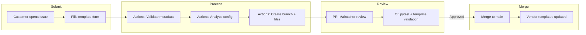

# Azure Local Physical Network Config Tool — Project Roadmap

**Version:** 23.0  
**Date:** February 2, 2026  
**Status:** Phase 9 Complete — GitHub Community Workflow Next  
**Reference:** [Design Doc](AzureLocal_Physical_Network_Config_Tool_Design_Doc.md)

---

## Core Principle: Reference Only

> [!IMPORTANT]
> **This tool provides REFERENCE configurations only.**
> 
> | Aspect | This Repo's Responsibility | Customer's Responsibility |
> |--------|---------------------------|--------------------------|
> | **Purpose** | Help understand Azure Local network patterns | Validate for your specific environment |
> | **Configs** | Provide reference templates & examples | Test and modify for production use |
> | **Support** | Community-driven, best-effort | Your IT/Network team |
> | **Liability** | None — use at your own risk | Full responsibility for deployment |
> 
> **Generated configurations are starting points, not production-ready solutions.**

---

## Current Focus

```
┌─────────────────────────────────────────────────────────────────────────────────┐
│  ✅ COMPLETE (Phases 1-9)                                                       │
│     • Frontend wizard: 51 E2E tests, client-side config generation              │
│     • Backend CLI: 162 unit tests, full schema validation                       │
│     • Templates: Dell OS10 (10/10), Cisco NX-OS (10/10)                         │
│     • Lab workflow: vendor detection, config sectioning, validation             │
│     • Script migration: All scripts in backend/src/ with unit tests             │
├─────────────────────────────────────────────────────────────────────────────────┤
│  📋 NEXT: Phase 10 — GitHub Community Workflow                                  │
│     • Issue templates for config submissions                                    │
│     • Automated processing via GitHub Actions                                   │
│     • CONTRIBUTING.md user guide (created)                                      │
└─────────────────────────────────────────────────────────────────────────────────┘
```

---

## Progress Tracker

| Phase | Description | Status | Notes |
|-------|-------------|--------|-------|
| 1-6 | E2E MVP Implementation | ✅ **Complete** | See [Archive](#completed-phases-archive) |
| 7 | Client-Side Config Generation | ✅ **Complete** | Nunjucks, no server needed |
| 8 | Lab Workflow Testing | ✅ **Complete** | Vendor detection, sectioning |
| 8.5 | Submission Validation Layer | ✅ **Complete** | Auto-fix typos, welcome new vendors |
| 9 | Script Migration + Unit Tests | ✅ **Complete** | 162 backend tests, 95 new tests |
| 10 | GitHub Community Workflow | 📋 **Planned** | Issue templates + Actions |

---

## Phase 9: Script Migration + Unit Tests ✅ COMPLETE

**Goal:** Move lab scripts to `backend/src/` (permanent location) with full unit test coverage. Ensures scripts are reusable for both CLI and GitHub Actions.

### Why Move to Backend?

| Location | Pros | Cons |
|----------|------|------|
| **`backend/src/`** ✅ | Existing Python home, pytest infrastructure, CLI integration | — |
| `lab/scripts/` | Quick iteration during development | Temporary, no tests, will be archived |
| `.github/scripts/` | Close to Actions | Isolated, no pytest |

### Final Folder Structure

```
backend/
├── src/
│   ├── __init__.py
│   ├── cli.py                      # Existing: Config generation CLI
│   ├── context.py                  # Existing: Template context builder
│   ├── renderer.py                 # Existing: Jinja2 renderer
│   ├── transformer.py              # Existing: Data enrichment
│   ├── validator.py                # Existing: JSON schema validation
│   ├── metadata_validator.py       # ✅ Submission metadata validation
│   ├── vendor_detector.py          # ✅ Auto-detect vendor from config
│   ├── config_sectioner.py         # ✅ Split config into sections
│   └── submission_processor.py     # ✅ Orchestrate submission processing
├── tests/
│   ├── test_cli.py                 # Existing (9 tests)
│   ├── test_transformer.py         # Existing (9 tests)
│   ├── test_validator.py           # Existing (10 tests)
│   ├── test_renderer.py            # Existing (30 tests)
│   ├── test_metadata_validator.py  # ✅ NEW (26 tests)
│   ├── test_vendor_detector.py     # ✅ NEW (21 tests)
│   ├── test_config_sectioner.py    # ✅ NEW (26 tests)
│   └── test_submission_processor.py # ✅ NEW (22 tests)
├── templates/                      # Jinja2 templates (unchanged)
└── schema/                         # JSON schema (unchanged)

lab/
├── README.md                       # Lab usage guide (stays)
├── submissions/                    # Test submissions (playground)
├── output/                         # Generated output (gitignored)
└── scripts/
    └── process.py                  # ✅ Thin wrapper → imports from backend/src/
```

### Test Coverage Summary

| Test File | Test Count | Coverage |
|-----------|------------|----------|
| `test_metadata_validator.py` | 26 tests | Auto-fix, new vendor, validation |
| `test_vendor_detector.py` | 21 tests | Dell/Cisco detection, patterns |
| `test_config_sectioner.py` | 26 tests | Section splitting, analysis |
| `test_submission_processor.py` | 22 tests | Orchestration, error handling |
| **New Tests Total** | **95 tests** | — |
| **Backend Total** | **162 tests** | — |
| **E2E Total** | **51 tests** | — |

### Success Criteria ✅

- [x] All 4 scripts in `backend/src/`
- [x] 4 new test files with 95 tests
- [x] Total backend tests: 162 (target was 80+)
- [x] Lab wrapper still works (`python lab/scripts/process.py`)
- [x] All E2E tests pass (51/51)
├── submissions/                    # Test submissions (stays as playground)
│   ├── example-dell-tor1/
│   ├── example-cisco-tor1/
│   ├── test-typos-dell/
│   ├── test-typos-cisco/
│   ├── test-new-vendor/
│   └── test-invalid-role/
├── output/                         # Generated output (gitignored)
└── scripts/
    └── process.py                  # Thin wrapper → imports from backend/src/
```

---

## Phase 10: GitHub Community Workflow 📋 PLANNED

**Goal:** Enable community contributions via GitHub Issues and automated processing.

### Testing Strategy

> **Key Insight:** GitHub Actions can only be fully tested on GitHub, not locally.

| Trigger | Purpose |
|---------|---------|
| `workflow_dispatch` | Manual testing from Actions tab (no cleanup needed) |
| `issues: [opened, labeled]` | Production trigger when testing complete |

### Phased Implementation & Validation

| Step | Deliverable | User Verification | Est. Time |
|------|-------------|-------------------|-----------|
| 10.1 | Issue template YAML | Open "New Issue" → form renders? | 2 min |
| 10.2 | Workflow (validate only) | Run manually → logs show validation? | 2 min |
| 10.3 | Workflow (create branch) | Run manually → branch created? | 2 min |
| 10.4 | Workflow (create PR) | Run manually → PR created? | 2 min |
| 10.5 | Full end-to-end test | Create real issue → PR auto-created? | 5 min |

### Workflow Overview



### Components to Create

| Component | Location | Purpose |
|-----------|----------|---------|
| Issue Template | `.github/ISSUE_TEMPLATE/template-submission.yml` | Structured form for submissions |
| Processing Workflow | `.github/workflows/process-submission.yml` | Auto-validate and create PR |
| Contributing Guide | `CONTRIBUTING.md` | How to submit templates ✅ Created |

### Issue Template Fields

| Field | Type | Required | Notes |
|-------|------|----------|-------|
| Vendor | text | ✅ | Auto-fixed: `Dell EMC` → `dellemc` |
| Firmware/OS | text | ✅ | Auto-fixed: `NX-OS` → `nxos` |
| Model | text | ✅ | Free text |
| Role | dropdown | ✅ | TOR1, TOR2, BMC |
| Deployment Pattern | dropdown | ✅ | fully_converged, switched, switchless |
| Config | textarea | ✅ | Full switch config paste |

> **Note:** Vendor and Firmware are free-text (not dropdowns) to welcome new vendor contributions.

### Success Criteria

- [ ] Issue template form renders correctly on GitHub
- [ ] Workflow runs successfully via `workflow_dispatch`
- [ ] Metadata validation logs appear in Actions
- [ ] Config analysis logs appear in Actions  
- [ ] Branch auto-created with submission files
- [ ] PR auto-created with analysis summary
- [ ] Real issue submission triggers full workflow

---

## Architecture Overview

### Template Flow (Single Source of Truth)

```
┌─────────────────────────────────────────────────────────────────────────────────┐
│  SOURCE OF TRUTH: backend/templates/*.j2                                        │
│  ├── dellemc/os10/*.j2  (10 templates)                                          │
│  └── cisco/nxos/*.j2    (10 templates)                                          │
└─────────────────────────────────────────────────────────────────────────────────┘
                              │
              ┌───────────────┴───────────────┐
              │ BUILD TIME                    │ RUNTIME
              ▼                               ▼
┌─────────────────────────┐     ┌─────────────────────────┐
│  frontend/src/          │     │  backend/src/           │
│  templates.ts           │     │  renderer.py            │
│  (auto-generated)       │     │                         │
│                         │     │                         │
│  Engine: Nunjucks (JS)  │     │  Engine: Jinja2 (Py)    │
│  Use: Browser wizard    │     │  Use: CLI, automation   │
└─────────────────────────┘     └─────────────────────────┘
```

### Component Responsibilities

| Component | Responsibility |
|-----------|----------------|
| `frontend/` | Web wizard UI, client-side validation, Nunjucks rendering |
| `backend/src/cli.py` | CLI entry point for config generation |
| `backend/src/validator.py` | JSON Schema validation |
| `backend/src/context.py` | Build template context with helpers |
| `backend/src/renderer.py` | Jinja2 template rendering |
| `backend/src/metadata_validator.py` | Submission metadata auto-fix |
| `backend/src/vendor_detector.py` | Detect vendor from config syntax |
| `backend/src/config_sectioner.py` | Split config into logical sections |

---

## Validation Layer

### Design Principles

| Principle | Implementation |
|-----------|----------------|
| **No blockers** | Validation guides, never blocks processing |
| **Auto-fix obvious mistakes** | Case, whitespace, common typos |
| **New vendors welcome** | Unknown vendor = contribution opportunity |
| **Self-service debugging** | Clear logs for user self-fix |

### Auto-Fix Rules

| Input | Auto-Fix To |
|-------|-------------|
| `Dell EMC`, `dell-emc`, `DELLEMC` | `dellemc` |
| `CISCO`, `Cisco Systems` | `cisco` |
| `NX-OS`, `nx-os`, `Nexus` | `nxos` |
| `OS-10`, `os 10` | `os10` |
| `tor1`, `Tor1` | `TOR1` |
| `fully-converged` | `fully_converged` |

### New Vendor Welcome Flow

```
┌─────────────────────────────────────────────────────────────┐
│  🎉 NEW VENDOR DETECTED: juniper                            │
├─────────────────────────────────────────────────────────────┤
│  This vendor isn't in our templates yet — that's OK!        │
│  Your submission helps us add support for new vendors.      │
│                                                             │
│  What happens next:                                         │
│  1. We'll analyze your config to understand the syntax      │
│  2. A maintainer will create templates for this vendor      │
│  3. Your config becomes a test case for the new templates   │
└─────────────────────────────────────────────────────────────┘
```

---

## Test Summary

| Category | Count | Status |
|----------|-------|--------|
| E2E Tests (Playwright) | 51 | ✅ Passing |
| Backend Tests (pytest) | 67 | ✅ Passing |
| **Total** | **118** | ✅ |

After Phase 9:
| Category | Expected |
|----------|----------|
| Backend Tests | 80+ |

---

## ⚠️ Critical Development Rules

> [!WARNING]
> Mandatory for all developers and AI agents.

### 1. NEVER Kill Node/Vite Processes

```bash
# ❌ FORBIDDEN - Will shut down dev container
pkill -f node
pkill -f vite

# ✅ SAFE - Use Ctrl+C or close terminal
```

### 2. ALWAYS Use Timeouts

```bash
# ❌ BAD
npx playwright test

# ✅ GOOD
timeout 180 npx playwright test --reporter=line
```

| Scope | Timeout |
|-------|---------|
| Global | 180s |
| Per-test | 30s |
| Action | 10s |
| Expect | 5s |

---

## Commands Reference

```bash
# Frontend development
cd /workspace/frontend && npm run dev -- --port 3000

# E2E tests
cd /workspace && timeout 180 npx playwright test --reporter=line

# Backend tests
cd /workspace/backend && python -m pytest

# Generate config via CLI
cd /workspace/backend && python -m src.cli generate path/to/input.json

# Lab workflow test
cd /workspace/lab && python scripts/process.py submissions/example-dell-tor1 -v
```

---

## Architectural Decisions

### ADR-001: Template Include Path Convention

Use vendor-prefixed paths: ``

### ADR-002: Interface-Level QoS

QoS configured per-interface with `qos: true`. Context helper: `has_qos_interfaces`.

### ADR-003: Login/Credential Handling

Hardcoded in `full_config.j2` with `$CREDENTIAL_PLACEHOLDER$` markers.

### ADR-004: Client-Side Config Generation

Render configs client-side using Nunjucks. Backend API removed.

### ADR-005: Submission Processing Location

Scripts in `backend/src/` (not lab or .github). Reusable for CLI, lab testing, and GitHub Actions.

---

## Completed Phases Archive

<details>
<summary><strong>Phases 1-8.5 (Click to expand)</strong></summary>

### Phase 1-6: E2E MVP ✅

- Frontend wizard with schema-aligned types
- Backend CLI with Jinja2 rendering
- Dell OS10 templates (10/10)
- Cisco NX-OS templates (10/10)
- 118 total tests passing

### Phase 7: Client-Side Generation ✅

- Nunjucks template engine (Jinja2-compatible)
- Templates bundled at build time via `bundle-templates.cjs`
- Backend API removed (unnecessary)
- Works offline, no server needed

### Phase 8: Lab Workflow ✅

- `lab/scripts/vendor_detector.py` — Auto-detect vendor from config
- `lab/scripts/config_sectioner.py` — Split config into sections
- `lab/scripts/process.py` — Main processor

### Phase 8.5: Validation Layer ✅

- `lab/scripts/metadata_validator.py` — Auto-fix typos, welcome new vendors
- 90% coverage of common input errors
- Detailed timestamped logging for self-service debugging
- Test submissions: typos-dell, typos-cisco, new-vendor, invalid-role

</details>

---

## Reference Links

| Resource | Path/URL |
|----------|----------|
| Design Document | [AzureLocal_Physical_Network_Config_Tool_Design_Doc.md](AzureLocal_Physical_Network_Config_Tool_Design_Doc.md) |
| JSON Schema | `backend/schema/standard.json` |
| Azure Patterns | [AzureLocal-Supportability](https://github.com/Azure/AzureLocal-Supportability) |
| MS Learn | [Azure Local Network Patterns](https://learn.microsoft.com/en-us/azure/azure-local/plan/network-patterns-overview) |
