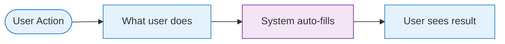
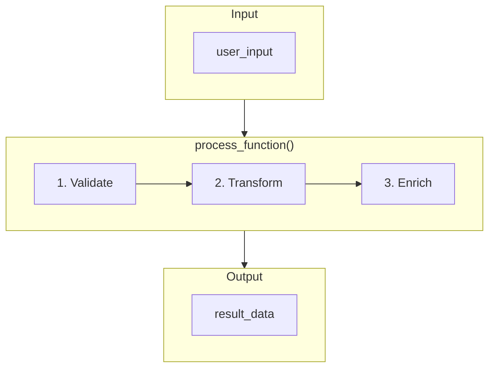
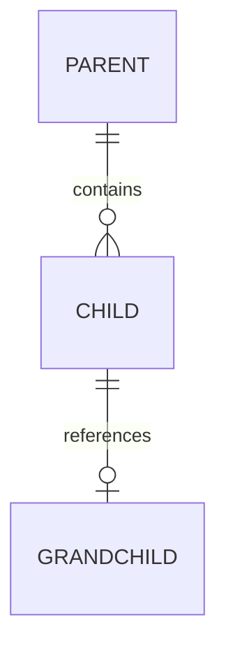

# AI Project Design Instructions

**Purpose:** Standard instructions for AI-assisted project design and documentation.  
**Version:** 1.0  
**Last Updated:** January 2026

---

## Core Design Philosophy

> **"Design for users first, implement for developers second."**

When designing any system, follow this priority order:
1. **User Experience** — How users think about the problem
2. **Data Structure** — What data is needed to solve it
3. **Function Logic** — How code transforms input to output
4. **Implementation** — Actual code and infrastructure

---

## Design Principles

### 1. User-Workflow Driven Design

Always start with how users mentally model the task, NOT how the system is technically structured.

**❌ Bad (System-driven):**
```
Step 1: Create VLANs
Step 2: Create Interfaces  
Step 3: Link VLANs to Interfaces
```

**✅ Good (User-driven):**
```
Step 1: Configure Network (VLANs + Ports together)
```

**Rule:** If a user thinks of two things as one concept, design the UI as one step — even if the backend separates them.

---

### 2. Dual Workflow Documentation

Every feature should document BOTH perspectives:

| Perspective | Audience | Shows |
|-------------|----------|-------|
| **User Workflow** | UI developers, UX designers | What user sees and does |
| **Function Workflow** | Backend developers | How code processes data |

```
┌─────────────────┐     ┌─────────────────┐     ┌─────────────────┐
│  User Workflow  │ ──► │  Data Structure │ ──► │Function Workflow│
│  (UI/UX View)   │     │  (JSON Schema)  │     │  (Code View)    │
└─────────────────┘     └─────────────────┘     └─────────────────┘
```

---

### 3. Smart Defaults with Override Capability

Design for the 90% case with smart defaults, allow 10% customization:

| User Type | Experience |
|-----------|------------|
| **90% Users** | Accept defaults, minimal input required |
| **10% Power Users** | Can override any default value |

**Pattern:**
```
User provides: Essential values only
System auto-fills: Derived values, sensible defaults
Power user can: Override anything via advanced options
```

---

### 4. Separation of Concerns

Keep these layers distinct:

| Layer | Responsibility | Changes When |
|-------|----------------|--------------|
| **UI Forms** | User input collection | UX requirements change |
| **Processing Functions** | Data transformation | Business logic changes |
| **Data Schema** | Structure definition | Data model changes |
| **Output Templates** | Final rendering | Output format changes |

---

## Documentation Standards

### Required Diagrams

For each major feature, include:

#### 1. User Workflow Diagram (Mermaid)


#### 2. Function Workflow Diagram (Mermaid)


#### 3. Data Relationship Diagram (for complex schemas)


---

### Required Tables

#### 1. User Input vs Auto-Generated
| Field | User Provides | Auto-Generated | Notes |
|-------|---------------|----------------|-------|
| name | ✅ | | Required |
| id | | ✅ From name | Derived |
| timestamp | | ✅ Current time | System |

#### 2. Function Reference
| Function | Input | Output | Description |
|----------|-------|--------|-------------|
| `process_x()` | user_input | result | Main processor |
| `validate_x()` | result | validated | Validation |

#### 3. Field Specification (for developers)
| Field | Required | Type | Default | Description |
|-------|:--------:|------|---------|-------------|
| `id` | ✅ | int | — | Unique identifier |
| `name` | ✅ | string | — | Display name |
| `enabled` | ❌ | boolean | `true` | Active status |

---

### Code Documentation Pattern

For each processing function, provide:

```python
def process_feature(input_data: dict, context: dict) -> dict:
    """
    Brief description of what this function does.
    
    Args:
        input_data: {field1, field2, ...} - What user provided
        context: {prev_step_data, config} - Data from previous steps
    
    Returns:
        {output_section} - JSON section(s) this produces
    
    Example:
        >>> process_feature({"name": "test"}, {})
        {"id": 1, "name": "test", "created": "2026-01-28"}
    """
    # 1. Step one description
    result = {}
    
    # 2. Step two description  
    result["derived_field"] = derive_value(input_data)
    
    # 3. Step three description
    return result
```

---

## Design Process Checklist

### Phase 1: User Analysis
- [ ] What is the user trying to accomplish?
- [ ] What is their mental model of the task?
- [ ] What do they call things? (Use their terminology)
- [ ] What's the minimum they need to provide?
- [ ] What can be auto-derived or defaulted?

### Phase 2: Data Structure
- [ ] What data is needed to solve the problem?
- [ ] What are the relationships between data?
- [ ] What's required vs optional?
- [ ] What are the validation rules?
- [ ] What's the processing order (dependencies)?

### Phase 3: Function Design
- [ ] What functions transform user input to output?
- [ ] What's the input/output of each function?
- [ ] What data flows between functions?
- [ ] What can fail and how to handle it?
- [ ] What are the key algorithms?

### Phase 4: Documentation
- [ ] User workflow diagram
- [ ] Function workflow diagram
- [ ] Input/output tables
- [ ] Field specifications
- [ ] Example JSON/code
- [ ] Data relationship diagram (if complex)

---

## UI Form Design Guidelines

### Form Layout Pattern
```
┌─────────────────────────────────────────────────────────┐
│ Section Title (Step X of Y)                             │
├─────────────────────────────────────────────────────────┤
│ 📋 SUBSECTION NAME                                      │
│   Field Label:    [Input Value        ]                 │
│   Field Label:    [Dropdown ▼]                          │
│   ☑️ Checkbox option                                     │
├─────────────────────────────────────────────────────────┤
│ 📋 ANOTHER SUBSECTION                                   │
│   Read-only:      [Auto-filled value] (derived)         │
├─────────────────────────────────────────────────────────┤
│                              [← Back]  [Continue →]     │
└─────────────────────────────────────────────────────────┘
```

### Field Types
| Type | When to Use | Example |
|------|-------------|---------|
| Dropdown | Fixed options, <20 items | Vendor selection |
| Text input | Free-form, validated | Hostname, IP address |
| Checkbox | Boolean toggle | Enable feature |
| Read-only | Derived/auto-filled | Calculated values |
| Number | Numeric with constraints | Port number |

---

## Review Questions

Before finalizing any design, ask:

### User Perspective
1. Can a non-expert complete this task?
2. Is the terminology familiar to users?
3. Are related concepts grouped together?
4. Is the step count minimal?
5. Are defaults sensible for 90% of cases?

### Developer Perspective
1. Is the data structure clean and normalized?
2. Are functions single-purpose?
3. Is the data flow clear?
4. Are edge cases handled?
5. Is the code testable?

### Maintenance Perspective
1. Can new features be added without restructuring?
2. Is the documentation sufficient for onboarding?
3. Are the diagrams up-to-date with code?
4. Is there a clear mapping: UI → Functions → Data?

---

## Example Structure

A well-designed feature document should have:

```markdown
## Feature Name

**Purpose:** One-sentence description

### User Workflow
[Mermaid diagram - what user does]
[UI form mockup]
[User input table]

### Function Workflow  
[Mermaid diagram - how code processes]
[Python pseudocode]
[Function reference table]

### Data Structure
[JSON schema/example]
[Field specification table]

### Validation Rules
[Cross-reference rules]
[Business logic rules]
```

---

## Quick Reference

### Mermaid Color Classes
```
classDef user fill:#e3f2fd,stroke:#1976d2      // Blue - User actions
classDef auto fill:#f3e5f5,stroke:#7b1fa2      // Purple - Auto-filled
classDef process fill:#fff3e0,stroke:#f57c00   // Orange - Processing
classDef result fill:#e8f5e9,stroke:#388e3c    // Green - Output
classDef error fill:#ffebee,stroke:#c62828     // Red - Errors
```

### Common Symbols
| Symbol | Meaning |
|--------|---------|
| ✅ | Required |
| ❌ | Optional |
| ⚠️ | Conditional |
| 📋 | Section |
| 🔗 | Link/Reference |
| 🔄 | Loop/Cycle |

---

**Remember:** Good design makes complex systems feel simple. If users need to understand the backend to use the UI, the design needs work.
