# Standard JSON Data Structure Design Document

**Version:** 1.0  
**Date:** January 28, 2026  
**Status:** Ready for Implementation  

---

## Table of Contents

1. [Purpose & Scope](#purpose--scope)
2. [Design Philosophy](#design-philosophy)
3. [User Workflow Overview](#user-workflow-overview)
4. [Function Workflow Overview](#function-workflow-overview)
5. [Schema Overview](#schema-overview)
6. [Schema Specification](#schema-specification)
7. [Validation Rules](#validation-rules)
8. [Complete Example](#complete-example)
9. [Roadmap & Future Enhancements](#roadmap--future-enhancements)
10. [Appendix: Design Decisions](#appendix-design-decisions)
11. [Appendix: Data Structure Relationships](#data-structure-relationships)

---

## Purpose & Scope

This document defines the **authoritative JSON schema** for network switch configurations in Azure Local deployments. It serves as:

- **UI Implementation Guide:** Defines user workflows and form layouts
- **Data Structure Reference:** Specifies the Standard JSON schema
- **Single Source of Truth:** Converts network requirements into vendor-specific switch configurations

**In Scope:** Switch-side configuration (VLANs, interfaces, BGP, QoS, MLAG/VPC)

**Out of Scope:** Server/cluster configurations, ACLs, NTP/Syslog/SNMP, AAA/RADIUS, VXLAN/EVPN

---

## Design Philosophy

**"Make the common case simple, the complex case possible."**

| Principle | Implementation |
|-----------|----------------|
| **UI-driven workflow** | User fills forms → UI generates Standard JSON → Backend creates vendor configs |
| **Smart defaults** | Templates pre-fill values based on model + deployment pattern |
| **90% coverage** | Minimal required fields cover most Azure Local scenarios |
| **Vendor neutral** | Same Standard JSON works for multivendors (Cisco, Dell, etc.) |
| **Fail early** | UI validates before generating JSON |

### What User Provides vs. What's Auto-generated

| UI Step | User Provides | Auto-generated | Backend JSON |
|---------|---------------|----------------|---------------|
| **Phase 1: Switch** | Vendor, model, role, hostname, pattern | Firmware (from vendor+model) | `switch` |
| **Phase 2: Network** | VLANs (IDs, IPs, gateways), port assignments, uplink IPs, MLAG keepalive IPs | Port ranges (from pattern), VLAN names, HSRP/VRRP, peer-link port-channels, MLAG domain | `vlans[]` + `interfaces[]` + `port_channels[]` + `mlag` |
| **Phase 3: Routing** | Routing type choice + (BGP: ASN, neighbors) or (Static: destinations, next-hops) | BGP: Router-id, prefix lists, networks | `static_routes[]` **or** `prefix_lists` + `bgp` |

---

## User Workflow Overview

The UI wizard guides users through configuration in 3 logical steps:

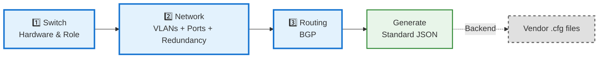

**User's Mental Model:** "I have ports, I assign VLANs to them" — not separate VLAN and interface steps.

**At each step:**
1. UI loads template defaults based on previous selections
2. User modifies values as needed
3. UI validates inputs before proceeding
4. Final step generates complete Standard JSON

---

## Function Workflow Overview

The backend processes user input through a pipeline of functions:

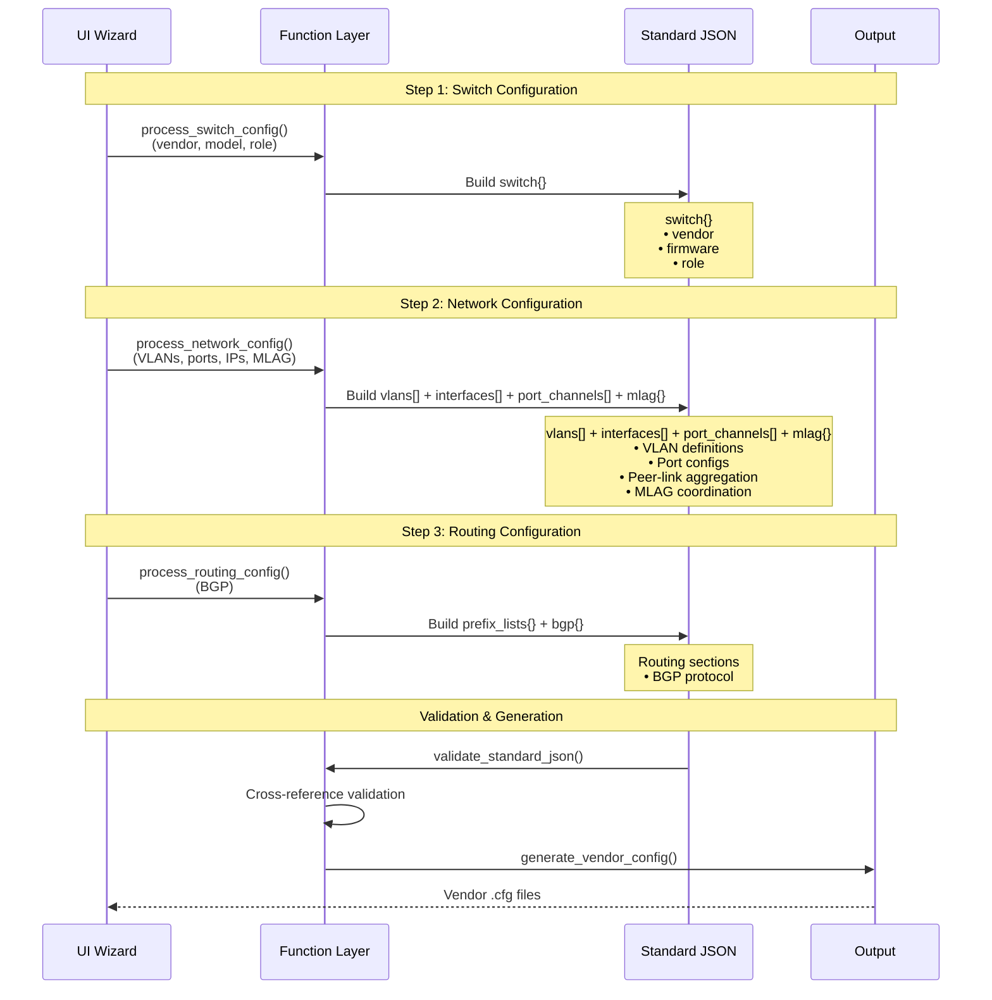

**Function Pipeline:**

| Step | Function | Input | Output | Description |
|:----:|----------|-------|--------|-------------|
| 1 | `process_switch_config()` | User selections | `switch{}` | Derives firmware, loads template |
| 2 | `process_network_config()` | Switch + User input | `vlans[]`, `interfaces[]`, `port_channels[]`, `mlag{}` | Generates network infrastructure and MLAG redundancy |
| 3 | `process_routing_config()` | Network + User | `prefix_lists{}`, `bgp{}` | Generates BGP routing protocol |
| 4 | `validate_standard_json()` | Complete JSON | Validated JSON | Cross-reference validation |
| 5 | `generate_vendor_config()` | Validated JSON | `.cfg` files | Renders Jinja2 templates |

**Data Flow Between Functions:**

```
process_switch_config()
    │
    ├── switch.vendor ──────────────┐
    ├── switch.role ────────────────┼──► process_network_config()
    ├── switch.deployment_pattern ──┘         │
    │                                         ├── interfaces[loopback].ipv4 ──┐
    │                                         ├── vlans[].vlan_id ────────────┼──► process_routing_config()
    │                                         └── peer_link_ports ────────────┘
    │
    └── switch.vendor ──► generate_vendor_config() (selects Jinja2 template folder)
```

---

## Schema Overview

### Standard JSON Structure

```json
{
  "switch": { },        // Phase 1: Hardware identification and role
  "vlans": [ ],         // Phase 2: Network - VLAN definitions
  "interfaces": [ ],    // Phase 2: Network - Port configurations  
  "port_channels": [ ], // Phase 2: Network - Port aggregation
  "mlag": { },          // Phase 2: Network - Redundancy coordination
  "static_routes": [ ], // Phase 3: Routing - Static routes (if not using BGP)
  "prefix_lists": { },  // Phase 3: Routing - BGP filtering (if using BGP)
  "bgp": { },           // Phase 3: Routing - BGP protocol (if using BGP)
  "_metadata": { }      // Auto-generated: Tracking information
}
```

> **Note:** Phase 2 builds complete network infrastructure (L2/L3 + redundancy). Phase 3 configures routing — either BGP (dynamic) or static routes (simple). Use one or the other, not both.

### Section Dependencies

UI steps map to backend JSON sections:

| UI Step | Backend Sections | Dependencies | Notes |
|:-------:|------------------|--------------|-------|
| 1️⃣ Switch | `switch` | — | Determines all defaults |
| 2️⃣ Network | `vlans[]`, `interfaces[]`, `port_channels[]`, `mlag` | switch | Complete network infrastructure including redundancy |
| 3️⃣ Routing | `static_routes[]` **OR** (`prefix_lists`, `bgp`) | interfaces (loopback for BGP) | Choose one: static or BGP |

**Backend processing order** (for validators/generators):

| Order | Section | Depends On | Why |
|:-----:|---------|------------|-----|
| 1 | `switch` | — | Determines templates and defaults |
| 2 | `vlans` | switch | VLAN purposes based on deployment pattern |
| 3 | `interfaces` | vlans | Trunk ports reference VLAN IDs |
| 4 | `port_channels` | interfaces | Members are physical ports |
| 5 | `mlag` | port_channels | Peer-link references port-channel |
| 6 | `bgp` | interfaces | Router-id from loopback IP |

### Derived Values (auto-calculated from `switch.role`)

| Value | TOR1 | TOR2 | BMC |
|-------|------|------|-----|
| HSRP/VRRP priority | 150 | 100 | N/A |
| MLAG role priority | 1 | 32667 | N/A |
| MST priority | 8192 | 16384 | 32768 |

> **Note:** User selects role; UI auto-calculates these values.

---

## Schema Specification

### Phase 1: Switch Configuration

**Purpose:** Identifies hardware and determines template selection for all subsequent phases.

#### User Workflow

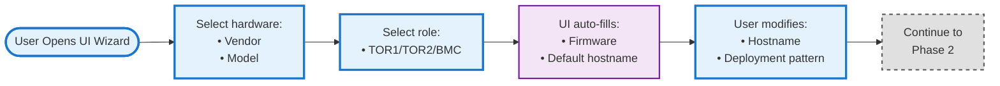

> **User Experience:** Select vendor/model → Choose role → UI auto-fills firmware and hostname → Modify as needed → Continue to Phase 2.

#### Function Workflow (Backend)

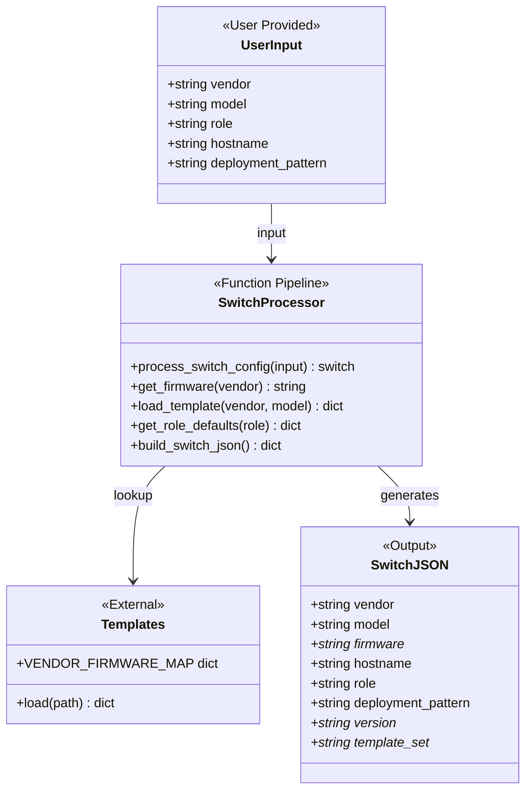

> **Note:** Processor derives firmware from vendor, loads model-specific templates, and calculates role-based defaults.

**Key Functions:**

| Function | Input | Output | Description |
|----------|-------|--------|-------------|
| `get_firmware(vendor)` | vendor string | firmware string | Maps vendor → firmware type |
| `load_template(vendor, model)` | vendor, model | template dict | Loads port layout template |
| `get_role_defaults(role)` | role string | defaults dict | Gets HSRP/MLAG/MST priorities |

**What user provides:**

| UI Field | User Action | Example |
|----------|-------------|----------|
| Vendor | Select from dropdown | Cisco, Dell EMC |
| Model | Select from dropdown | 93108TC-FX3P, s5248f-on |
| Role | Select from dropdown | TOR1, TOR2, BMC |
| Hostname | Modify pre-filled value | rr1-n25-r20-5248hl-23-1a |
| Deployment Pattern | Select from dropdown | Fully Converged, Switched, Switchless |

**What UI auto-fills (user doesn't see):**

| Field | Auto-filled Based On | Value |
|-------|---------------------|--------|
| `firmware` | Vendor + Model | `"nxos"` (Cisco) or `"os10"` (Dell) |
| `version` | Model detection | `"10.5.5.5"` |
| `template_set` | Default | `"default"` |

**Resulting JSON:**

```json
"switch": {
  "vendor": "dellemc",           // User selected
  "model": "s5248f-on",          // User selected
  "firmware": "os10",            // Auto-filled
  "hostname": "rr1-n25-...-1a",  // User modified
  "role": "TOR1",                // User selected
  "deployment_pattern": "fully_converged"  // User selected
}
```

---

### 2. Network Configuration (Phase 2 of Wizard)

**Purpose:** Define the networks (VLANs) first, then assign them to ports — building the foundation before the structure.

> **Design Rationale:** VLANs are the foundation. User must know their network definitions before assigning to ports. For Azure Local, VLAN purposes are fixed (management, compute, storage), but IPs/IDs vary per deployment.

#### User Workflow

Phase 2 is split into **three focused steps** for clarity:

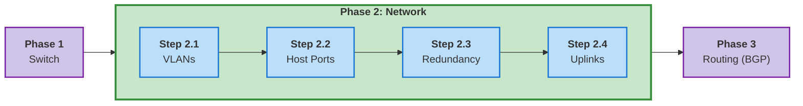

---

#### Step 2.1: Define VLANs

**Purpose:** Define which networks exist and their L3 configuration (if any).

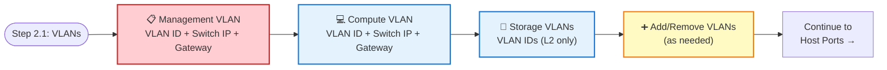

**UI Form (Step 2.1):**

```
┌─────────────────────────────────────────────────────────────────┐
│ Network Configuration - Step 2.1: Define VLANs                  │
├─────────────────────────────────────────────────────────────────┤
│ 📋 MANAGEMENT VLAN (required)                                   │
│   VLAN ID: [7  ]                                                │
│   Switch IP: [10.0.0.2/24]    Gateway: [10.0.0.1]              │
│   DHCP Relay: [100.71.85.107]                                   │
├─────────────────────────────────────────────────────────────────┤
│ 💻 COMPUTE VLAN                                                 │
│   VLAN ID: [201]                                                │
│   Switch IP: [10.1.0.2/24]    Gateway: [10.1.0.1]              │
├─────────────────────────────────────────────────────────────────┤
│ 💾 STORAGE VLANS (L2 only - no IP needed)                       │
│   Storage 1 VLAN ID: [711]                                      │
│   Storage 2 VLAN ID: [712]                                      │
├─────────────────────────────────────────────────────────────────┤
│ [+ Add VLAN]  [🗑️ Remove Selected]                             │
├─────────────────────────────────────────────────────────────────┤
│                              [← Back]  [Continue to Host Ports] │
└─────────────────────────────────────────────────────────────────┘
```

> **Tip:** For Azure Local, these 4 VLANs cover 90% of deployments. Users can add/remove VLANs as needed for custom scenarios (e.g., additional storage networks, DMZ, guest access). L3 VLANs need IPs for HSRP/VRRP gateway redundancy.

---

#### Step 2.2: Host Port Assignment

**Purpose:** Assign the VLANs to host-facing ports. Port ranges are pre-filled from deployment pattern.

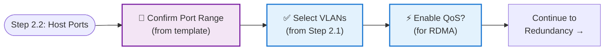

**UI Form (Step 2.2):**

```
┌─────────────────────────────────────────────────────────────────┐
│ Network Configuration - Step 2.2: Host Port Assignment          │
├─────────────────────────────────────────────────────────────────┤
│ 🖥️ HOST-FACING TRUNK PORTS                                      │
│   Port Range: [1/1/1] to [1/1/16]  (from fully_converged)      │
│                                                                 │
│   VLANs on these ports:                                         │
│   ☑️ Management (VLAN 7) - Native                               │
│   ☑️ Compute (VLAN 201)                                         │
│   ☑️ Storage 1 (VLAN 711)                                       │
│   ☑️ Storage 2 (VLAN 712)                                       │
│                                                                 │
│   ☑️ Enable QoS (for RDMA/RoCE traffic)                         │
├─────────────────────────────────────────────────────────────────┤
│ 🔗 PEER-LINK PORTS (auto-configured for MLAG)                   │
│   Ports: 1/1/49, 1/1/50  ✓ Auto-detected from model            │
├─────────────────────────────────────────────────────────────────┤
│                              [← Back]  [Continue to Uplinks →]  │
└─────────────────────────────────────────────────────────────────┘
```

> **Note:** Port ranges are pre-filled based on deployment pattern selected in Phase 1. Peer-link ports are auto-detected and will be configured as Port-Channel in next step.

---

#### Step 2.3: Redundancy (MLAG/VPC)

**Purpose:** Configure switch redundancy for high availability (TOR pairs only).

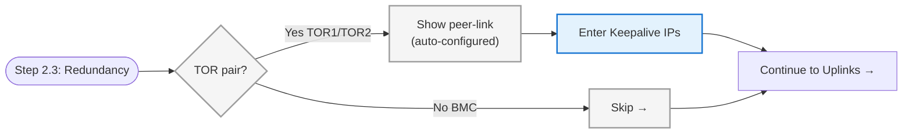

**UI Form (Step 2.3):**

```
┌─────────────────────────────────────────────────────────────────┐
│ Network Configuration - Step 2.3: Redundancy                    │
├─────────────────────────────────────────────────────────────────┤
│ 🔗 SWITCH REDUNDANCY (High Availability)                        │
│                                                                 │
│   Switch Role: TOR1  (from Phase 1)                             │
│                                                                 │
│   📦 Peer-Link Port-Channel (auto-configured):                  │
│      Port-Channel 101                                           │
│      Members: 1/1/49, 1/1/50                                    │
│      ✓ Ready for redundancy                                     │
│                                                                 │
│   💓 Keepalive Link (for health monitoring):                    │
│      Source IP:      [100.71.85.17]    (this switch)            │
│      Destination IP: [100.71.85.18]    (peer TOR2 switch)       │
│                                                                 │
│   Domain ID: [1]  (default, rarely changed)                     │
├─────────────────────────────────────────────────────────────────┤
│                              [← Back]  [Continue to Uplinks →]  │
└─────────────────────────────────────────────────────────────────┘
```

> **Note:** BMC switches skip this step automatically. Redundancy requires TOR1/TOR2 pair.

---

#### Step 2.4: Uplink Configuration

**Purpose:** Configure L3 interfaces for border connectivity and BGP.

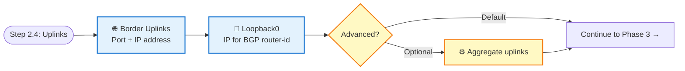

**UI Form (Step 2.4):**

```
┌─────────────────────────────────────────────────────────────────┐
│ Network Configuration - Step 2.4: Uplink Configuration         │
├─────────────────────────────────────────────────────────────────┤
│ 🌐 BORDER UPLINK PORTS (L3)                                     │
│   Uplink 1: Port [1/1/51]  IP: [100.71.39.130/30]              │
│   Uplink 2: Port [1/1/52]  IP: [100.71.39.134/30]              │
│                                                                 │
│   ⚙️ Advanced (optional):                                       │
│   ☐ Aggregate uplinks into Port-Channel for redundancy         │
│       Port-Channel ID: [10]                                     │
├─────────────────────────────────────────────────────────────────┤
│ 🔄 LOOPBACK INTERFACE                                           │
│   Loopback0 IP: [100.71.39.149/32]                             │
│   (Used as BGP router-id in Phase 3)                            │
├─────────────────────────────────────────────────────────────────┤
│                              [← Back]  [Continue to Routing →]  │
└─────────────────────────────────────────────────────────────────┘
```

> **Note:** 
> - **Peer-link port-channel** was configured in Step 2.3
> - **Uplink port-channel** is optional - only enable if you need link aggregation
> - Loopback IP will be used as BGP router-id in Phase 3

---

#### Why This Flow Works for Azure Local

| Aspect | Benefit |
|--------|---------|
| **VLANs first** | User defines the "what" before the "where" |
| **Template-driven ports** | 90% of port config is auto-filled from pattern |
| **Focused steps** | Each step has a single purpose (3-5 fields max) |
| **Redundancy before uplinks** | Internal infrastructure before external connectivity |
| **Clear data flow** | VLANs → Host Ports → Redundancy → Uplinks → Routing (logical sequence) |

> **User Experience:** Define VLANs (what networks?) → Assign to host ports (where?) → Enable redundancy (high availability) → Configure uplinks (border connectivity) → Configure BGP (routing).

#### Function Workflow (Backend)

Phase 2 maps to the backend through a coordinated pipeline:

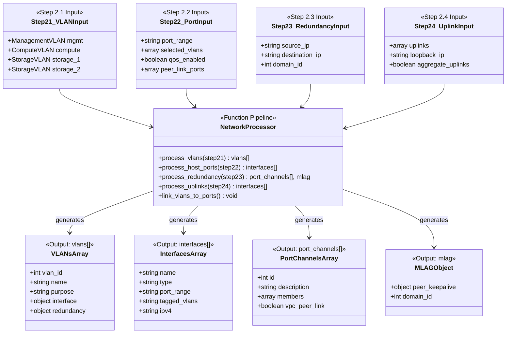

> **Note:** Four UI steps consolidate into four backend arrays (vlans[], interfaces[], port_channels[], mlag{}) for complete network infrastructure.

**Key Functions:**

| Function | Step | Input | Output | Description |
|----------|:----:|-------|--------|-------------|
| `process_vlans()` | 2.1 | VLAN definitions | vlans[] | Creates VLAN entries with L3/redundancy config |
| `process_host_ports()` | 2.2 | Port range + VLANs | interfaces[] | Creates trunk interfaces with VLAN assignment |
| `process_redundancy()` | 2.3 | Keepalive IPs + peer ports | port_channels[], mlag{} | Creates peer-link port-channel and MLAG config |
| `process_uplinks()` | 2.4 | Uplink IPs + Loopback | interfaces[] | Creates L3 interfaces for routing |
| `generate_redundancy()` | 2.1 | role, vendor, vlan | redundancy{} | Creates HSRP/VRRP config per VLAN |
| `link_vlans_to_ports()` | 2.2 | vlans[], interfaces[] | interfaces[] | Populates tagged_vlans and native_vlan |

**Template Integration:**

Templates pre-fill defaults based on Phase 1 selections:

```json
// /input/switch_interface_templates/cisco/nxos/93108TC-FX3P.json
{
  "deployment_patterns": {
    "fully_converged": {
      "host_facing": { "port_range": "1/1/1-1/1/16" },
      "peer_link": { "ports": ["1/1/49", "1/1/50"] },
      "uplinks": { "ports": ["1/1/51", "1/1/52"] }
    }
  },
  "defaults": {
    "loopback_ip": "100.71.39.149/32",
    "vlan_ids": { "management": 7, "storage_1": 711 }
  }
}
```

> **UI Design Note:** Template defaults are **starting points only**. Users MUST review and adjust all pre-filled values (IPs, VLAN IDs, port ranges) to match their environment. UI should:
> - Highlight pre-filled fields (e.g., light yellow background)
> - Show tooltips: "Default value - verify for your environment"
> - Require explicit confirmation before proceeding to next step
> - Never auto-submit without user review

**Backend Output Example:**

Four UI steps (2.1 → 2.2 → 2.3 → 2.4) consolidate into four JSON sections:

```json
{
  "vlans": [
    {
      "vlan_id": 7,                    // Step 2.1: User entered
      "name": "Mgmt_7",                // Auto-generated
      "purpose": "management",
      "interface": {
        "ip": "10.0.0.2", "cidr": 24,
        "redundancy": { "virtual_ip": "10.0.0.1" }  // HSRP/VRRP auto-added
      }
    },
    { "vlan_id": 201, "purpose": "compute", "interface": {...} },
    { "vlan_id": 711, "purpose": "storage_1" },  // L2 only - no interface
    { "vlan_id": 712, "purpose": "storage_2" }
  ],
  "interfaces": [
    {
      "name": "Host_Facing",
      "start_intf": "1/1/1", "end_intf": "1/1/16",  // Step 2.2: From template
      "type": "Trunk",
      "native_vlan": "7",
      "tagged_vlans": "7,201,711,712",              // Step 2.2: User selected VLANs
      "qos": true                                    // Step 2.2: User toggled
    },
    {
      "name": "Border_Uplink_1",                    // Step 2.4: User configured
      "intf": "1/1/51",
      "type": "L3",
      "ipv4": "100.71.39.130/30"
    },
    {
      "name": "Loopback0",                          // Step 2.4: For BGP router-id
      "intf": "loopback0",
      "type": "L3",
      "ipv4": "100.71.39.149/32"
    }
  ],
  "port_channels": [
    {
      "id": 101,                                    // Step 2.3: Auto-created
      "description": "MLAG_Peer_Link",
      "type": "Trunk",
      "native_vlan": "99",
      "tagged_vlans": "7,125",
      "vpc_peer_link": true,
      "members": ["1/1/49", "1/1/50"]              // Step 2.3: From template
    }
  ],
  "mlag": {
    "peer_keepalive": {
      "source_ip": "100.71.85.17",                  // Step 2.3: User entered
      "destination_ip": "100.71.85.18"              // Step 2.3: User entered
    }
  }
}
```

---

#### Phase 2 Field Reference

This section defines all JSON fields generated by Phase 2 steps (VLANs, Host Ports, Redundancy, Uplinks).

**`vlans[]` array (Step 2.1):**

| Field | Required | Type | Description |
|-------|:--------:|------|-------------|
| `vlan_id` | ✅ | int | 2-4094 (avoid VLAN 1) |
| `name` | ✅ | string | Max 32 chars (auto-generated from ID) |
| `purpose` | ❌ | enum | `"management"`, `"compute"`, `"storage_1"`, `"storage_2"` |
| `shutdown` | ❌ | boolean | Default: `false` |
| `interface` | ❌ | object | Omit for L2-only VLANs |
| `interface.ip` | ⚠️ | string | IPv4 without CIDR (e.g., "10.0.0.2") |
| `interface.cidr` | ⚠️ | int | Prefix length (e.g., 24) |
| `interface.mtu` | ❌ | int | Default: 9216 |
| `interface.dhcp_relay` | ❌ | array | DHCP helper IPs |
| `redundancy.type` | ❌ | enum | Auto: Cisco=HSRP, Dell=VRRP |
| `redundancy.virtual_ip` | ⚠️ | string | Gateway IP for hosts (e.g., "10.0.0.1") |
| `redundancy.preempt` | ❌ | boolean | Default: `true` |

**`interfaces[]` array (Steps 2.2, 2.4):**

| Field | Required | Type | Description |
|-------|:--------:|------|-------------|
| `name` | ✅ | string | Human-readable description |
| `type` | ✅ | enum | `"Access"`, `"Trunk"`, `"L3"` |
| `intf_type` | ✅ | enum | `"Ethernet"`, `"loopback"` |
| `intf` | ⚠️ | string | Single port (e.g., `"1/1/48"`) |
| `start_intf` / `end_intf` | ⚠️ | string | Port range (e.g., `"1/1/1"` to `"1/1/16"`) |
| `shutdown` | ❌ | boolean | Default: `false` |
| `mtu` | ❌ | int | Default: 9216 |
| `qos` | ❌ | boolean | Enable RDMA QoS (default: `false`, Step 2.2) |

**Type-specific interface fields:**

| Type | Additional Required Fields | Example |
|------|---------------------------|---------|
| `Access` | `access_vlan` | `"access_vlan": "7"` |
| `Trunk` | `native_vlan`, `tagged_vlans` | `"native_vlan": "7", "tagged_vlans": "7,201,711,712"` |
| `L3` | `ipv4` (CIDR notation) | `"ipv4": "100.71.39.149/32"` |

**`port_channels[]` array (Steps 2.3, 2.4 optional):**

| Field | Required | Type | Description |
|-------|:--------:|------|-------------|
| `id` | ✅ | int | Port-channel ID (1-4096) |
| `description` | ✅ | string | Human-readable purpose |
| `type` | ✅ | enum | `"Trunk"`, `"L3"`, `"Access"` |
| `members` | ✅ | array | Physical port names |
| `vpc_peer_link` | ❌ | boolean | `true` for MLAG peer-link (auto-created Step 2.3) |
| `vpc_id` | ❌ | int | For host-facing vPC (rarely used) |
| `native_vlan` | ⚠️ | string | Required for Trunk type |
| `tagged_vlans` | ⚠️ | string | Required for Trunk type |
| `ipv4` | ⚠️ | string | Required for L3 type (CIDR notation) |

**`mlag{}` object (Step 2.3):**

| Field | Required | Type | Default | Description |
|-------|:--------:|------|---------|-------------|
| `domain_id` | ❌ | int | `1` | MLAG domain identifier |
| `peer_keepalive.source_ip` | ✅ | string | — | Local keepalive IP |
| `peer_keepalive.destination_ip` | ✅ | string | — | Peer switch keepalive IP |
| `peer_keepalive.vrf` | ❌ | string | `"default"` | VRF for keepalive |
| `delay_restore` | ❌ | int | `150` | Restore delay (seconds) |
| `peer_gateway` | ❌ | boolean | `true` | Enable peer-gateway |
| `auto_recovery` | ❌ | boolean | `true` | Enable auto-recovery |

> **Legend:**  
> ✅ = Always required  
> ❌ = Optional  
> ⚠️ = Required if parent object exists or for specific types  
> 
> **Note:** BMC switches omit the entire `mlag{}` section (standalone operation).

---

#### Implementation Summary

**Phase 2 Output Mapping:**
- Step 2.1 → `vlans[]` (with HSRP/VRRP auto-added)
- Step 2.2 → `interfaces[]` (host ports only)
- Step 2.3 → `port_channels[]` + `mlag{}` (peer-link auto-created)
- Step 2.4 → `interfaces[]` (uplinks + loopback)

**Port-Channel Auto-Creation:**
- ✅ **Peer-link** (Step 2.3): Always created automatically for TOR pairs using template-defined ports
- ⚙️ **Uplinks** (Step 2.4): Optional - user enables via checkbox if link aggregation needed
- ❌ **Host-facing**: Not supported in wizard (manual JSON edit only)

> **Developer Note:** See [Key Functions](#function-workflow-backend) table above for detailed function signatures and processing logic.

---

### Phase 3: Routing Configuration

**Purpose:** Configure routing for network reachability — either dynamic (BGP) or static routes.

> **Design Rationale:** Most Azure Local deployments use BGP for dynamic routing to border switches. However, smaller deployments or lab environments may prefer static routes for simplicity. Phase 3 supports both options.

#### User Workflow

Phase 3 offers two routing options based on deployment complexity:

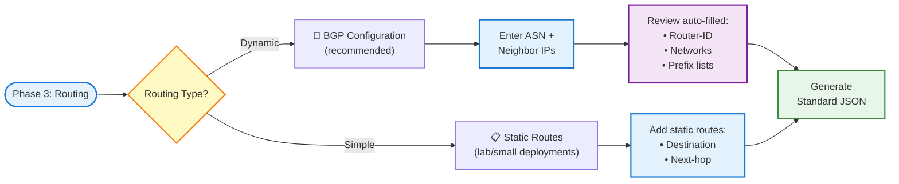

> **User Experience:**  
> - **BGP (90% case):** Select BGP → Enter ASN and neighbors → Review auto-filled config → Generate  
> - **Static (10% case):** Select Static → Add destination/next-hop pairs → Generate

---

#### Option A: BGP Configuration (Recommended)

**When to use:** Production deployments with border/spine switches that support BGP.

**UI Form (BGP):**

```
┌─────────────────────────────────────────────────────────────────┐
│ Routing Configuration - Phase 3                                 │
├─────────────────────────────────────────────────────────────────┤
│ 🔀 ROUTING TYPE                                                 │
│   ◉ BGP (Dynamic Routing) - Recommended                        │
│   ○ Static Routes                                               │
├─────────────────────────────────────────────────────────────────┤
│ 📡 BGP CONFIGURATION                                            │
│                                                                 │
│   Local ASN:    [4200003501]                                    │
│   Router ID:    [100.71.39.149] (from Loopback - read only)     │
│                                                                 │
│   BGP Neighbors:                                                │
│   ┌─────────────────────────────────────────────────────────┐   │
│   │ #1 Border:   IP [100.71.39.129]  Remote ASN [64811]     │   │
│   │ #2 Border:   IP [100.71.39.133]  Remote ASN [64811]     │   │
│   │ #3 iBGP:     IP [100.71.39.146]  Remote ASN [4200003501]│   │
│   │ [+ Add Neighbor]                                         │   │
│   └─────────────────────────────────────────────────────────┘   │
│                                                                 │
│   ⚙️ Auto-configured (review only):                             │
│   • Networks to advertise: 100.71.39.149/32, 100.71.39.130/30  │
│   • Prefix list: DefaultRoute (permit 0.0.0.0/0)               │
├─────────────────────────────────────────────────────────────────┤
│                              [← Back]  [Generate Configuration] │
└─────────────────────────────────────────────────────────────────┘
```

---

#### Option B: Static Routes (Simple Deployments)

**When to use:** Lab environments, small deployments, or when border switches don't support BGP.

**UI Form (Static Routes):**

```
┌─────────────────────────────────────────────────────────────────┐
│ Routing Configuration - Phase 3                                 │
├─────────────────────────────────────────────────────────────────┤
│ 🔀 ROUTING TYPE                                                 │
│   ○ BGP (Dynamic Routing) - Recommended                        │
│   ◉ Static Routes                                               │
├─────────────────────────────────────────────────────────────────┤
│ 📋 STATIC ROUTES                                                │
│                                                                 │
│   Default Route:                                                │
│   ☑️ Add default route (0.0.0.0/0)                              │
│      Next-hop: [100.71.39.1]                                    │
│                                                                 │
│   Additional Routes (optional):                                 │
│   ┌─────────────────────────────────────────────────────────┐   │
│   │ Destination        Next-hop         Name                │   │
│   │ [10.0.0.0/8    ]   [100.71.39.1]   [Corporate_Network] │   │
│   │ [172.16.0.0/12 ]   [100.71.39.1]   [Private_Range   ]  │   │
│   │ [+ Add Route]                                            │   │
│   └─────────────────────────────────────────────────────────┘   │
├─────────────────────────────────────────────────────────────────┤
│                              [← Back]  [Generate Configuration] │
└─────────────────────────────────────────────────────────────────┘
```

> **Tip:** Static routes are simpler but don't adapt to network changes. Use BGP for production deployments where failover and path optimization matter.

---

#### Function Workflow (Backend)

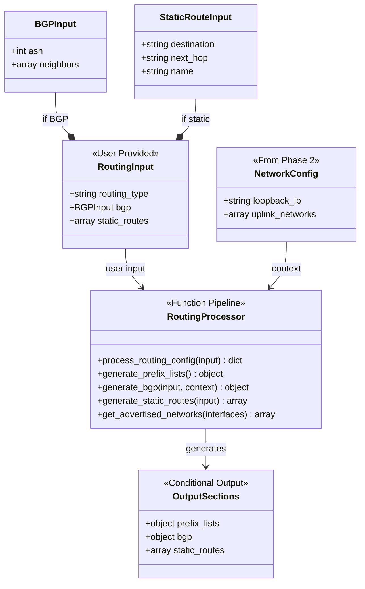

**Key Functions:**

| Function | Input | Output | Description |
|----------|-------|--------|-------------|
| `process_routing_config()` | RoutingInput + NetworkConfig | Routing sections | Main orchestrator - routes to BGP or static |
| `generate_bgp()` | ASN, neighbors, loopback | bgp{} | Creates BGP config with auto-filled router-id |
| `generate_prefix_lists()` | — | prefix_lists{} | Creates default route filtering (BGP only) |
| `generate_static_routes()` | routes[] | static_routes[] | Creates static route entries |
| `get_advertised_networks()` | interfaces[] | networks[] | Extracts loopback + uplink subnets for BGP |
| `get_loopback_ip()` | interfaces[] | IP string | Gets router-id from Phase 2 loopback |

**Processing Logic:**

```
process_routing_config(input, network_config)
    │
    ├── IF input.routing_type == "bgp":
    │   ├── loopback_ip = get_loopback_ip(network_config.interfaces)
    │   ├── networks = get_advertised_networks(network_config.interfaces)
    │   ├── prefix_lists = generate_prefix_lists()
    │   └── bgp = generate_bgp(input.bgp, loopback_ip, networks)
    │       └── RETURN { prefix_lists, bgp }
    │
    └── IF input.routing_type == "static":
        └── static_routes = generate_static_routes(input.static_routes)
            └── RETURN { static_routes }
```

---

#### What User Provides vs. Auto-filled

| Routing Type | User Provides | Auto-filled |
|--------------|---------------|-------------|
| **BGP** | ASN, neighbor IPs, remote ASNs | Router-ID (from loopback), networks to advertise, prefix lists |
| **Static** | Destination networks, next-hop IPs | Route names (optional) |

---

#### Phase 3 Field Reference

**`static_routes[]` array (if static routing selected):**

```json
"static_routes": [
  {
    "destination": "0.0.0.0/0",
    "next_hop": "100.71.39.1",
    "name": "Default_Route"
  },
  {
    "destination": "10.0.0.0/8",
    "next_hop": "100.71.39.1",
    "name": "Corporate_Network"
  }
]
```

| Field | Required | Type | Description |
|-------|:--------:|------|-------------|
| `destination` | ✅ | string | Target network in CIDR (e.g., "0.0.0.0/0") |
| `next_hop` | ✅ | string | Gateway IP address |
| `name` | ❌ | string | Human-readable description |
| `admin_distance` | ❌ | int | Default: 1 (prefer over dynamic routes) |

> **Note:** If `static_routes[]` exists, `bgp{}` and `prefix_lists{}` are typically omitted (mutually exclusive).

---

**`prefix_lists{}` object (BGP only):**

**Purpose:** BGP route filtering.

```json
"prefix_lists": {
  "DefaultRoute": [
    { "seq": 10, "action": "permit", "prefix": "0.0.0.0/0" },
    { "seq": 50, "action": "deny", "prefix": "0.0.0.0/0", "prefix_filter": "le 32" }
  ]
}
```

| Field | Required | Type | Description |
|-------|:--------:|------|-------------|
| `seq` | ✅ | int | Sequence number |
| `action` | ✅ | enum | `"permit"`, `"deny"` |
| `prefix` | ✅ | string | IP prefix in CIDR |
| `prefix_filter` | ❌ | string | e.g., `"le 24"`, `"ge 16 le 24"` |

---

**BGP (`bgp`):**

**Purpose:** Dynamic routing configuration.

```json
"bgp": {
  "asn": 4200003501,
  "router_id": "100.71.39.149",
  "networks": ["100.71.39.149/32"],
  "neighbors": [
    {
      "ip": "100.71.39.129",
      "description": "TO_Border1",
      "remote_as": 64811,
      "af_ipv4_unicast": { "prefix_list_in": "DefaultRoute" }
    }
  ]
}
```

| Field | Required | Type | Description |
|-------|:--------:|------|-------------|
| `asn` | ✅ | int | Local AS number |
| `router_id` | ✅ | string | Must match Loopback0 IP |
| `networks` | ❌ | array | Networks to advertise |
| `neighbors` | ✅ | array | BGP peer configurations |

**Neighbor fields:**

| Field | Required | Type | Description |
|-------|:--------:|------|-------------|
| `ip` | ✅ | string | Peer IP or subnet |
| `description` | ✅ | string | Peer identifier |
| `remote_as` | ✅ | int | Peer's AS number |
| `af_ipv4_unicast` | ✅ | object | Address family config |
| `update_source` | ❌ | string | Source interface |
| `ebgp_multihop` | ❌ | int | TTL for multihop |

---

**Metadata (`_metadata`) - Optional:**

```json
"_metadata": {
  "schema_version": "1.0",
  "generated_by": "azure-local-network-config-wizard",
  "generated_at": "2026-01-28T10:00:00Z"
}
```

---

## Validation Rules

### Cross-Reference Validation

| From | Field | To | Rule |
|------|-------|----|------|
| interfaces | `native_vlan`, `access_vlan` | vlans | VLAN ID must exist |
| interfaces | `tagged_vlans` | vlans | All VLAN IDs must exist |
| port_channels | `native_vlan`, `tagged_vlans` | vlans | VLAN IDs must exist |
| mlag | (implicit) | port_channels | One port_channel must have `vpc_peer_link: true` |
| bgp | `router_id` | interfaces | Must match loopback0 IP |
| bgp | `prefix_list_in/out` | prefix_lists | Prefix list must exist |
| static_routes | `next_hop` | — | Must be reachable via uplink subnet |

### Business Logic Rules

| Rule | Description |
|------|-------------|
| VLAN 1 reserved | Should not be used |
| Parking VLAN | VLAN 2 should exist with `shutdown: true` |
| Loopback0 | Must exist if BGP is configured (not required for static routes) |
| iBGP | Same-ASN neighbors should not use `ebgp_multihop` |
| MLAG role | If `mlag` exists, role must be TOR1 or TOR2 |
| Routing exclusivity | Use `bgp` OR `static_routes`, not both |

### Common Errors & Solutions

| Error | Solution |
|-------|----------|
| "VLAN not found" | Add VLAN to `vlans[]` before referencing |
| "BGP router_id mismatch" | Ensure `bgp.router_id` matches `interfaces[loopback0].ipv4` |
| "No MLAG peer-link" | Add `vpc_peer_link: true` to one port_channel |
| "Prefix list not found" | Add prefix list to `prefix_lists{}` |
| "No default route" | Add `0.0.0.0/0` to static_routes or configure BGP |
| "Mixed routing" | Remove either `bgp` or `static_routes` — choose one |

---

## Complete Example

```json
{
  "switch": {
    "vendor": "dellemc",
    "model": "s5248f-on",
    "firmware": "os10",
    "hostname": "rr1-n25-r20-5248hl-23-1a",
    "role": "TOR1",
    "version": "10.5.5.5",
    "deployment_pattern": "fully_converged"
  },
  "vlans": [
    { "vlan_id": 2, "name": "UNUSED_VLAN", "shutdown": true },
    {
      "vlan_id": 7,
      "name": "Infra_7",
      "purpose": "management",
      "interface": {
        "ip": "100.69.176.2",
        "cidr": 24,
        "dhcp_relay": ["100.71.85.107", "100.71.85.108"],
        "redundancy": { 
          "virtual_ip": "100.69.176.1",
          "preempt": true
        }
      }
    },
    { "vlan_id": 201, "name": "Compute_201", "purpose": "compute" },
    { "vlan_id": 711, "name": "Storage1_711", "purpose": "storage_1" },
    { "vlan_id": 712, "name": "Storage2_712", "purpose": "storage_2" }
  ],
  "interfaces": [
    {
      "name": "Unused_Ports",
      "type": "Access",
      "intf_type": "Ethernet",
      "start_intf": "1/1/1",
      "end_intf": "1/1/56",
      "access_vlan": "2",
      "shutdown": true
    },
    {
      "name": "HyperConverged_To_Hosts",
      "type": "Trunk",
      "intf_type": "Ethernet",
      "start_intf": "1/1/1",
      "end_intf": "1/1/18",
      "native_vlan": "7",
      "tagged_vlans": "7,201,711,712",
      "qos": true
    },
    {
      "name": "Loopback0",
      "type": "L3",
      "intf_type": "loopback",
      "intf": "loopback0",
      "ipv4": "100.71.39.149/32"
    },
    {
      "name": "P2P_Border1",
      "type": "L3",
      "intf_type": "Ethernet",
      "intf": "1/1/48",
      "ipv4": "100.71.39.130/30"
    }
  ],
  "port_channels": [
    {
      "id": 50,
      "description": "iBGP_Peer_Link_To_TOR2",
      "type": "L3",
      "ipv4": "100.71.39.145/30",
      "members": ["1/1/39", "1/1/40"]
    },
    {
      "id": 101,
      "description": "MLAG_Peer_Link_To_TOR2",
      "type": "Trunk",
      "native_vlan": "99",
      "tagged_vlans": "7,125",
      "vpc_peer_link": true,
      "members": ["1/1/49", "1/1/50", "1/1/51", "1/1/52"]
    }
  ],
  "mlag": {
    "peer_keepalive": {
      "source_ip": "100.71.39.145",
      "destination_ip": "100.71.39.146"
    }
  },
  "prefix_lists": {
    "DefaultRoute": [
      { "seq": 10, "action": "permit", "prefix": "0.0.0.0/0" },
      { "seq": 50, "action": "deny", "prefix": "0.0.0.0/0", "prefix_filter": "le 32" }
    ]
  },
  "bgp": {
    "asn": 4200003501,
    "router_id": "100.71.39.149",
    "networks": ["100.71.39.130/30", "100.71.39.149/32"],
    "neighbors": [
      {
        "ip": "100.71.39.129",
        "description": "TO_Border1",
        "remote_as": 64811,
        "af_ipv4_unicast": { "prefix_list_in": "DefaultRoute" }
      },
      {
        "ip": "100.71.39.146",
        "description": "iBGP_To_TOR2",
        "remote_as": 4200003501,
        "af_ipv4_unicast": {}
      }
    ]
  }
}
```

---

### Future: AI-Powered Vendor Onboarding

**Vision:** Instead of manually maintaining templates for each vendor, leverage AI to automatically generate templates from customer-submitted golden configs.

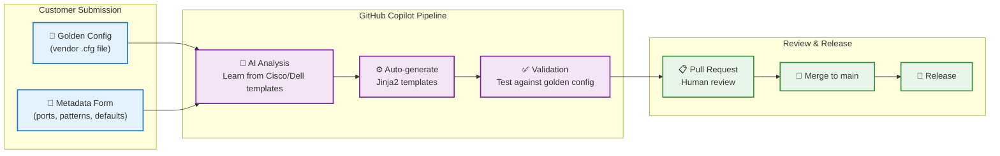

**How It Works:**

| Step | Actor | Action |
|:----:|-------|--------|
| 1 | Customer | Submits golden config file + fills metadata form (port layouts, VLAN patterns, vendor CLI syntax) |
| 2 | AI Pipeline | Analyzes existing Cisco/Dell templates as reference framework |
| 3 | AI Pipeline | Auto-generates Jinja2 templates matching the golden config structure |
| 4 | AI Pipeline | Validates generated templates produce output matching golden config |
| 5 | Human | Reviews PR for quality, security, and correctness |
| 6 | Maintainer | Merges to main branch and releases |

**Benefits:**
- 🚀 **Scalable:** Support new vendors without dedicated engineering effort
- 🎯 **Customer-driven:** Customers bring their own validated configs
- 🔄 **Consistent:** AI learns from established template patterns
- ✅ **Quality-gated:** Human review ensures production readiness

**Customer Submission Form (Future UI):**

| Field | Description | Example |
|-------|-------------|---------|
| Vendor Name | Switch manufacturer | "Arista", "Juniper" |
| Model | Switch model identifier | "7050X3" |
| Firmware Type | OS family | "eos", "junos" |
| Golden Config | Working production config file | `.cfg` upload |
| Port Layout | JSON mapping of port purposes | `{ "host_facing": "1-48", "uplinks": "49-52" }` |
| CLI Patterns | Vendor-specific syntax notes | "Uses 'switchport' vs 'interface mode'" |

> **Note:** This approach transforms vendor support from a maintenance burden into a community-driven, AI-assisted process. Existing Cisco NXOS and Dell OS10 templates serve as the "training examples" for the AI to learn proper template structure.

---

### Schema Extension Guidelines

When extending the schema (manually or via AI-generated templates):

| Guideline | Rule |
|-----------|------|
| **Additive only** | Never remove/rename required fields |
| **Optional first** | New fields must have sensible defaults |
| **Backward compatible** | Old configs must work with new tooling |
| **Vendor-specific** | Use `_vendor` prefix (e.g., `"_arista": {...}`) |

---

## Appendix: Design Decisions

### Technology Choices

**Frontend: TypeScript with Vite**

| Factor | Justification |
|--------|---------------|
| **Complex schema** | Deeply nested structures (`vlans[]`, `interfaces[]`, `bgp.neighbors[]`) — TS interfaces catch shape errors at compile time |
| **Cross-reference validation** | Validating that `interfaces.tagged_vlans` references existing `vlans[].vlan_id` benefits from typed lookups |
| **Form state management** | Multi-step wizard with Phase 1 → 2 → 3 dependencies — types prevent passing wrong data between steps |
| **Auto-completion** | Network engineers filling forms benefit from IDE hints for valid field values |
| **Self-documenting** | Interfaces serve as living documentation matching the schema spec |

**Example interface definitions:**
```typescript
interface VLAN {
  vlan_id: number;
  name: string;
  purpose?: 'management' | 'compute' | 'storage_1' | 'storage_2';
  interface?: { ip: string; cidr: number; dhcp_relay?: string[]; };
  redundancy?: HSRPConfig | VRRPConfig;
}

type Role = 'TOR1' | 'TOR2' | 'BMC';
type Vendor = 'cisco' | 'dellemc';

interface StandardConfig {
  switch: SwitchConfig;
  vlans: VLAN[];
  interfaces: Interface[];
  port_channels?: PortChannel[];
  mlag?: MLAGConfig;
  bgp?: BGPConfig;
  prefix_lists?: Record<string, PrefixListEntry[]>;
}
```

**Backend: Python**
- Jinja2 templating for vendor configs
- jsonschema for validation
- Click CLI framework
- Established ecosystem for network automation

---

### Key Architectural Choices

**Flat JSON Structure**  
Root-level sections instead of nested wrappers for simpler validation and Jinja2 template compatibility.

**Minimal Required Fields**  
- MLAG: Only keepalive IPs required (domain ID defaults to 1, role priority derived from `switch.role`)
- BGP: Router-ID auto-filled from Loopback0
- QoS: Per-interface boolean instead of global policy references

**Stable Primary Keys**  
Reference by `vlan_id` not `vlan_name` — IDs are stable, names can change.

**Template Hierarchy**  
Three-tier approach (`firmware` → `template_set` → `version`) avoids duplication. Two template sets support entire fleet instead of 3+ folders.

**Pattern-Based Defaults with Override**  
- **90% case:** `deployment_pattern` auto-generates port ranges from templates
- **10% case:** Explicit `interfaces[]` overrides pattern for custom/lab scenarios
- **Result:** Wizard simplicity + power-user flexibility

**Explicit Dependencies**  
Documented processing order (switch → vlans → interfaces → port_channels → mlag → bgp) instead of variable substitution for clearer validation and error messages.

---

### Data Structure Relationships

This diagram shows how sections reference each other - critical for understanding validation order and avoiding circular dependencies:

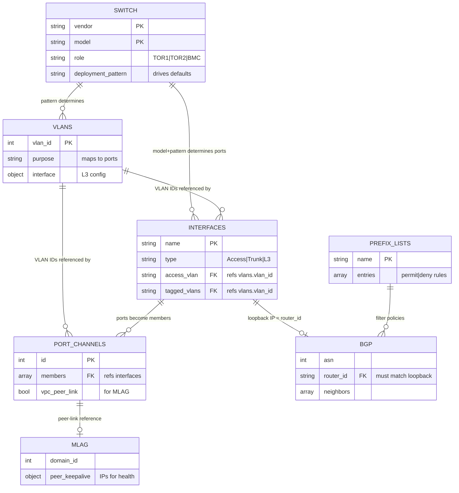

**Key Relationships:**

| From | To | Relationship | Validation |
|------|----|--------------|------------|
| `interfaces.access_vlan` | `vlans.vlan_id` | FK reference | VLAN must exist |
| `interfaces.tagged_vlans` | `vlans.vlan_id` | FK reference (many) | All VLANs must exist |
| `port_channels.members` | `interfaces.intf` | FK reference (many) | Ports must exist |
| `bgp.router_id` | `interfaces[loopback].ipv4` | Must match | Equality check |
| `bgp.neighbors[].af_ipv4_unicast.prefix_list_*` | `prefix_lists.name` | FK reference | Prefix list must exist |
| `mlag` | `port_channels[vpc_peer_link=true]` | Implicit | At least one peer-link required |

**Processing Order (for generators/validators):**

```
1. switch       → Loads templates, sets defaults
2. vlans        → Creates VLAN definitions
3. interfaces   → References VLANs, creates ports
4. port_channels → References interface ports
5. mlag         → References port_channel peer-link
6. prefix_lists → Standalone (no dependencies)
7. bgp          → References loopback IP, prefix_lists
```

> **Developer Note:** Always validate in this order to catch missing references early.

---

**Document Status:** Ready for Stakeholder Review  
**Next Action:** Engineering team review and approval  
**Target Date:** Phase 1 completion by Week 2
