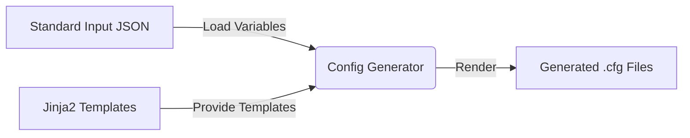
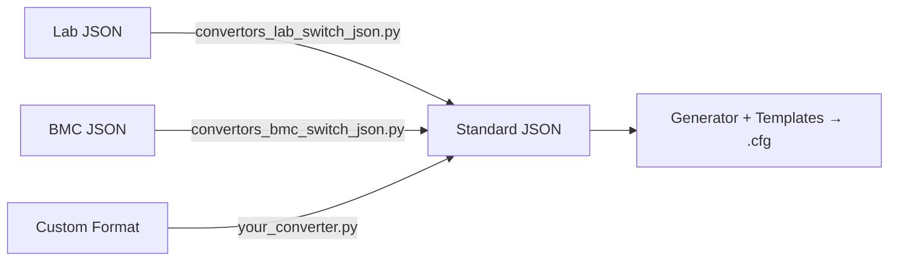

# Network Configuration Generation Tool

## Overview

This tool generates vendor-specific network switch configurations (e.g., Cisco NX-OS, Dell OS10) using JSON input and Jinja2 templates. It supports both Python source usage and standalone executables.

**Documentation:**

- [Template Guide](docs/TEMPLATE_GUIDE.md) — Jinja2 templates and switch interface templates
- [Converter Guide](docs/CONVERTOR_GUIDE.md) — Writing custom input format converters
- [Troubleshooting](docs/TROUBLESHOOTING.md) — Common issues and solutions

---

## Quick Start

### Option A: Standalone Executable (No Python Required)

Download from [Releases](../../releases), then:

```bash
# See all options
./network_config_generator -h

# Generate configs from standard-format JSON
./network_config_generator --input_json input/standard_input.json --output_folder output/

# Generate from lab-format JSON (auto-converts)
./network_config_generator --input_json my_lab_input.json --output_folder configs/ --convertor lab
```

### Option B: Python Source

```bash
# Install dependencies
pip install -r requirements.txt

# Generate from standard-format JSON
python src/main.py --input_json input/standard_input.json --output_folder output/

# Generate from lab-format JSON with auto-conversion
python src/main.py --input_json my_lab_input.json --output_folder configs/ --convertor lab

# Run tests
python -m pytest tests/ -v
```

### Output

The tool produces individual section configs plus a merged full config:

```
output/
├── generated_system.cfg
├── generated_vlan.cfg
├── generated_interface.cfg
├── generated_port_channel.cfg
├── generated_bgp.cfg
├── generated_prefix_list.cfg
├── generated_qos.cfg
├── generated_login.cfg
└── generated_full_config.cfg
```

---

## Architecture

### Pipeline



### Converter Support

Non-standard inputs (lab JSON, CSV, YAML, etc.) are transformed to standard format via pluggable converters:



> [!NOTE]
> The standard JSON format must match the variables used in Jinja2 templates. You can safely update values but the structure must stay fixed.

---

## Directory Structure

```
├── docs/                               # Documentation
│   ├── TEMPLATE_GUIDE.md               # Jinja2 + switch interface template guide
│   ├── CONVERTOR_GUIDE.md              # Custom converter guide
│   └── TROUBLESHOOTING.md              # Common issues and solutions
├── input/
│   ├── standard_input.json             # Standard format example
│   ├── jinja2_templates/               # Jinja2 config templates
│   │   ├── cisco/nxos/                 # 10 templates (bgp, vlan, interface, …)
│   │   └── dellemc/os10/              # 11 templates (+ vlt.j2)
│   └── switch_interface_templates/     # Switch model definitions
│       ├── cisco/                      # 93108TC-FX3P, 93180YC-FX, 93180YC-FX3,
│       │                               # 9348GC-FXP (BMC), 9348GC-FX3 (BMC)
│       └── dellemc/                    # N3248TE-ON (BMC), S5248F-ON
├── src/
│   ├── main.py                         # CLI entry point
│   ├── generator.py                    # Jinja2 rendering engine
│   ├── loader.py                       # Input file loading and parsing
│   ├── constants.py                    # Shared constants (VLAN maps, templates)
│   ├── utils.py                        # Helpers (infer_firmware, classify_vlan)
│   └── convertors/
│       ├── convertors_lab_switch_json.py  # Lab → Standard JSON (TOR switches)
│       └── convertors_bmc_switch_json.py  # Lab → Standard JSON (BMC switches)
├── tests/
│   ├── conftest.py                     # Shared fixtures and helpers
│   ├── test_unit.py                    # Unit tests (StandardJSONBuilder, utils, etc.)
│   ├── test_convertors.py             # Golden-file tests for converters
│   ├── test_generator.py              # Golden-file tests for Jinja2 generation
│   └── test_cases/                     # Test data (6 converter + 3 generator cases)
├── tools/                              # Utility scripts (IP mgmt, port mapping)
└── requirements.txt                    # Python dependencies
```

---

## Input & Output Examples

### Standard Input JSON
```json
{
  "switch": {
    "hostname": "tor-switch-1",
    "make": "cisco",
    "firmware": "nxos"
  },
  "vlans": [
    { "vlan_id": 711, "name": "Compute" }
  ],
  "interfaces": [
    { "name": "Ethernet1/1", "vlan": 711, "description": "Compute1" }
  ],
  "bgp": {
    "asn": 65001,
    "router_id": "192.168.0.1"
  }
}
```

### Sample Template (Jinja2)
```jinja2
router bgp {{ bgp.asn }}
  router-id {{ bgp.router_id }}
```

See [docs/TEMPLATE_GUIDE.md](docs/TEMPLATE_GUIDE.md) for complete template reference.
