# Azure Local Physical Network Config Tool

A **reference tool** to help understand Azure Local physical network patterns and generate sample switch configurations.

> [!IMPORTANT]
> **Reference Configurations Only**
> 
> This tool provides **reference configurations**, not production-ready solutions.
> 
> **You are responsible for:**
> - Validating all configurations for your specific environment
> - Testing in non-production before deployment
> - Ensuring compliance with your organization's security policies
> 
> **This repository does NOT provide production support.**

**Supported Vendors:** Cisco NX-OS, Dell EMC OS10 (more coming soon)

---

## How It Works

```mermaid
flowchart LR
    subgraph "You Provide"
        A[🖥️ Switch Info]
        B[🏷️ VLANs]
        C[🔌 Interfaces]
        D[🌐 Routing]
    end
    
    subgraph "Tool Generates"
        E[📄 Reference Config]
    end
    
    A --> E
    B --> E
    C --> E
    D --> E
    
    E --> F[🔍 Review & Validate]
```

---

## Quick Start

```mermaid
flowchart LR
    A[🌐 Open Wizard] --> B[📝 Fill Details]
    B --> C[👁️ Review]
    C --> D[⬇️ Download Config]
    D --> E[🚀 Apply to Switch]
    
    style A fill:#e1f5fe
    style D fill:#c8e6c9
    style E fill:#fff9c4
```

1. **Open the Wizard** — Visit **[GitHub Pages — Coming Soon]**
2. **Fill in Details** — Switch info, VLANs, interfaces, routing
3. **Review** — Preview your reference configuration
4. **Download** — Get your reference config file
5. **Validate & Test** — Review, modify for your environment, test in non-production
6. **Deploy** — Replace `$CREDENTIAL_PLACEHOLDER$` and apply to switch

> [!WARNING]
> Generated configs are **references only**. Always validate for your specific environment before production use.

---

## Deployment Patterns

| Pattern | Description | Best For |
|---------|-------------|----------|
| **Fully Converged** | All traffic on shared TOR switches | Most deployments, simplified cabling |
| **Switched** | Dedicated storage network | High-performance storage requirements |
| **Switchless** | Direct node-to-node storage | Small clusters (2-3 nodes) |

> [!TIP]
> Learn more: [Azure Local Network Patterns (Microsoft Docs)](https://learn.microsoft.com/en-us/azure/azure-local/plan/network-patterns-overview)

---

## Want to Contribute?

Have a working config for a vendor we don't support yet? Help the community!

```mermaid
flowchart LR
    subgraph "You"
        A[📋 Open GitHub Issue] --> B[📝 Fill Template]
        B --> C[📎 Paste Config]
    end
    
    subgraph "We Review"
        C --> D[🔍 Review]
        D --> E[🔧 Create Templates]
        E --> F[✅ Merge]
    end
    
    subgraph "Everyone Benefits"
        F --> G[🎉 New Vendor Supported!]
    end
    
    style A fill:#e1f5fe
    style F fill:#c8e6c9
    style G fill:#fff9c4
```

**What to include in your submission:**
- Switch vendor, model, OS version
- Deployment pattern (Fully Converged, Switched, or Switchless)
- Your working switch configuration (sanitize credentials!)

See [Contributing Guide](docs/CONTRIBUTING.md) for details.

---

## Documentation

| Guide | Description |
|-------|-------------|
| [Wizard User Guide](docs/WIZARD_GUIDE.md) | Detailed wizard walkthrough |
| [CLI & JSON Guide](docs/CLI_GUIDE.md) | For power users: direct JSON/CLI usage |
| [Template Development](docs/TEMPLATE_GUIDE.md) | Creating or modifying Jinja2 templates |
| [Contributing](docs/CONTRIBUTING.md) | How to submit new vendor support |
| [Troubleshooting](docs/TROUBLESHOOTING.md) | Common issues and solutions |

---

## Examples

| Pattern | Examples |
|---------|----------|
| Fully Converged | [TOR1](frontend/examples/fully-converged/sample-tor1.json), [TOR2](frontend/examples/fully-converged/sample-tor2.json) |
| Switched | [TOR1](frontend/examples/switched/sample-tor1.json), [TOR2](frontend/examples/switched/sample-tor2.json) |
| Switchless | [TOR1](frontend/examples/switchless/sample-tor1.json), [TOR2](frontend/examples/switchless/sample-tor2.json) |

---

## Links

- [Project Roadmap](.github/docs/Project_Roadmap.md)
- [Design Document](.github/docs/AzureLocal_Physical_Network_Config_Tool_Design_Doc.md)
- [Azure Local Network Patterns (Microsoft)](https://learn.microsoft.com/en-us/azure/azure-local/plan/network-patterns-overview)

---

## License

MIT License — see [LICENSE](LICENSE) for details.
