# Lab: Config-to-Template Workflow Testing

This lab environment allows you to test the workflow for processing switch configurations and generating/updating Jinja2 templates.

> [!IMPORTANT]
> This is a **testing environment**. Changes here don't affect production templates in `backend/templates/`.

---

## Purpose

Test the workflow that will eventually power GitHub Issue submissions:

```mermaid
flowchart LR
    subgraph "Input"
        A[Raw Switch Config] --> B[metadata.yaml]
    end
    
    subgraph "Processing"
        B --> C[Vendor Detection]
        C --> D[Config Sectioning]
        D --> E[JSON Generation]
    end
    
    subgraph "Output"
        E --> F[standard.json]
        F --> G[Rendered .cfg]
    end
    
    subgraph "Validation"
        G --> H{Compare to Original}
        H -->|Match| I[✅ Success]
        H -->|Differ| J[🔧 Adjust Templates]
    end
```



---

## Folder Structure

```
lab/
├── README.md              # This file
├── submissions/           # Test inputs (your configs go here)
│   ├── example-dell-tor1/
│   │   ├── metadata.yaml  # Switch info
│   │   └── config.txt     # Raw config
│   └── example-cisco-tor1/
│       ├── metadata.yaml
│       └── config.txt
├── scripts/               # Processing scripts
│   ├── process.py         # Main entry point
│   ├── vendor_detector.py # Auto-detect vendor
│   └── config_sectioner.py# Split config into sections
├── output/                # Generated files (gitignored)
└── .gitignore
```

---

## Quick Start

### 1. Create a Submission

```bash
mkdir -p lab/submissions/my-switch
```

Create `metadata.yaml`:
```yaml
vendor: dellemc           # or 'cisco'
firmware: os10            # or 'nxos'
model: S5248F-ON
os_version: "10.5.5.5"
role: TOR1                # TOR1, TOR2, or BMC
deployment_pattern: fully_converged
hostname: my-tor1
```

Copy your switch config to `config.txt`.

### 2. Run Processing

```bash
cd lab
python scripts/process.py submissions/my-switch -v
```

The `-v` (verbose) flag shows detailed validation logs.

### 3. Check Output

```bash
ls output/my-switch/
# analysis.json   - Metadata, sections, analysis, validation info
# sections/       - Config split into logical sections
```

---

## Validation Layer

The processor includes smart validation that auto-fixes common mistakes and welcomes new vendor contributions.

### Design Principles

| Principle | Behavior |
|-----------|----------|
| **No blockers** | Validation guides, never blocks processing |
| **Auto-fix obvious mistakes** | Case, whitespace, common typos → auto-corrected |
| **New vendors welcome** | Unknown vendor = contribution opportunity, not error |
| **Self-service debugging** | Detailed logs let users fix issues themselves |

### Auto-Fix Examples

| Your Input | Auto-Fixed To |
|------------|---------------|
| `Dell EMC`, `DELLEMC`, `dell-emc` | `dellemc` |
| `CISCO`, `Cisco Systems` | `cisco` |
| `NX-OS`, `nx-os`, `Nexus` | `nxos` |
| `OS-10`, `os 10` | `os10` |
| `tor1`, `Tor1`, `TOR 1` | `TOR1` |
| `fully-converged`, `converged` | `fully_converged` |

### Validation Output Examples

**✅ Sunny Day (All Good):**
```
[2026-02-02 10:30:15] Processing: my-switch
[2026-02-02 10:30:15] ├─ Reading metadata.yaml
[2026-02-02 10:30:15] ├─ Validating fields...
[2026-02-02 10:30:15] │  ✅ vendor: dellemc
[2026-02-02 10:30:15] │  ✅ firmware: os10
[2026-02-02 10:30:15] │  ✅ role: TOR1
[2026-02-02 10:30:15] │  ✅ deployment_pattern: fully_converged
[2026-02-02 10:30:15] │  ✅ hostname: my-tor1
[2026-02-02 10:30:15] └─ Continuing to config analysis...
```

**⚠️ Rainy Day (Auto-Fixed):**
```
[2026-02-02 10:30:15] Processing: my-switch
[2026-02-02 10:30:15] ├─ Reading metadata.yaml
[2026-02-02 10:30:15] ├─ Validating fields...
[2026-02-02 10:30:15] │  ⚠️  vendor: 'Dell EMC'
[2026-02-02 10:30:15] │     └─ ✅ Auto-fixed to 'dellemc' (matched known variation)
[2026-02-02 10:30:15] │  ⚠️  role: 'tor1'
[2026-02-02 10:30:15] │     └─ ✅ Auto-fixed to 'TOR1' (case normalized)
[2026-02-02 10:30:15] │  ✅ firmware: os10
[2026-02-02 10:30:15] │  ✅ deployment_pattern: fully_converged
[2026-02-02 10:30:15] ├─ 2 field(s) auto-corrected
[2026-02-02 10:30:15] └─ Continuing to config analysis...
```

**🎉 New Vendor (Welcome Flow):**
```
┌─────────────────────────────────────────────────────────────┐
│  🎉 NEW VENDOR DETECTED: juniper                            │
├─────────────────────────────────────────────────────────────┤
│  This vendor isn't in our templates yet — that's OK!        │
│  Your submission helps us add support for new vendors.      │
│                                                             │
│  What happens next:                                         │
│  1. We'll analyze your config to understand the syntax      │
│  2. A maintainer will create templates for this vendor      │
│  3. Your config becomes a test case for the new templates   │
│                                                             │
│  Continuing with validation of other fields...              │
└─────────────────────────────────────────────────────────────┘
```

**❓ Needs Attention (Clear Guidance):**
```
[2026-02-02 10:30:15] │  ❓ Unknown role: 'spine'
[2026-02-02 10:30:15] │     └─ Azure Local uses these roles:
[2026-02-02 10:30:15] │     └─   TOR1 = First Top-of-Rack switch
[2026-02-02 10:30:15] │     └─   TOR2 = Second Top-of-Rack switch (MLAG pair)
[2026-02-02 10:30:15] │     └─   BMC  = Baseboard Management Controller switch
[2026-02-02 10:30:15] │     └─ Please update metadata.yaml with one of: TOR1, TOR2, BMC
```

---

## metadata.yaml Reference

| Field | Required | Values | Description |
|-------|----------|--------|-------------|
| `vendor` | ✅ | `cisco`, `dellemc`, or **new** | Switch vendor (auto-fixes common typos) |
| `firmware` | ✅ | `nxos`, `os10`, or **new** | Operating system (auto-fixes common typos) |
| `model` | ✅ | String | Switch model (e.g., `S5248F-ON`) |
| `os_version` | ❌ | String | OS version for reference |
| `role` | ✅ | `TOR1`, `TOR2`, `BMC` | Switch role in deployment (Azure Local concept) |
| `deployment_pattern` | ✅ | `fully_converged`, `switched`, `switchless` | Azure Local pattern |
| `hostname` | ✅ | String | Switch hostname (spaces auto-replaced with dashes) |

> **Note:** New vendors and firmware are welcomed! If your vendor isn't listed, submit anyway — your config helps us expand support.

---

## Scripts Reference

### process.py

Main entry point. Orchestrates validation, detection, sectioning, and output.

```bash
# Basic usage
python scripts/process.py submissions/my-switch

# Verbose mode (shows validation logs)
python scripts/process.py submissions/my-switch -v

# JSON output
python scripts/process.py submissions/my-switch --json

# Custom output folder
python scripts/process.py submissions/my-switch --output output/custom-name
```

### metadata_validator.py

Smart validation with auto-correction. Used internally by process.py.

```python
from metadata_validator import validate_metadata

result = validate_metadata(metadata_dict, "submission-name")
# result.is_valid           - Whether validation passed
# result.is_new_vendor      - Whether a new vendor was detected
# result.field_results      - Detailed results per field
# result.log_lines          - Formatted log output
# result.get_corrected_metadata(original)  - Apply auto-fixes
```

### vendor_detector.py

Auto-detects vendor from config content.

```python
from vendor_detector import detect_vendor

vendor, firmware = detect_vendor(config_text)
# ('dellemc', 'os10') or ('cisco', 'nxos')
```

### config_sectioner.py

Splits config into logical sections.

```python
from config_sectioner import section_config

sections = section_config(config_text, vendor, firmware)
# {'system': '...', 'vlans': '...', 'interfaces': '...', ...}
```

---

## Validation

The workflow validates:

1. **Schema compliance** — Generated JSON must validate against `backend/schema/standard.json`
2. **Round-trip accuracy** — Rendered config should closely match original input
3. **Section coverage** — All config sections should be captured

---

## Troubleshooting

| Issue | Solution |
|-------|----------|
| Vendor not detected | Check config format, or provide in metadata.yaml |
| "Unknown role" warning | Use TOR1, TOR2, or BMC (Azure Local roles) |
| "Unknown pattern" warning | Use fully_converged, switched, or switchless |
| Section missing | Update `config_sectioner.py` with new patterns |
| New vendor submission | Great! Submit anyway — we'll create templates |

### Common Typo Fixes

The validator auto-fixes these common mistakes:

| Wrong | Fixed To |
|-------|----------|
| `Dell EMC`, `DELLEMC` | `dellemc` |
| `CISCO`, `Cisco` | `cisco` |
| `NX-OS`, `nx-os` | `nxos` |
| `OS-10`, `os 10` | `os10` |
| `tor1`, `Tor1` | `TOR1` |
| `fully-converged` | `fully_converged` |

---

## Test Submissions

The lab includes test submissions for validation scenarios:

| Folder | Tests |
|--------|-------|
| `example-dell-tor1/` | ✅ Sunny day - Dell OS10 |
| `example-cisco-tor1/` | ✅ Sunny day - Cisco NX-OS |
| `test-typos-dell/` | ⚠️ Auto-fix - Dell typos |
| `test-typos-cisco/` | ⚠️ Auto-fix - Cisco typos |
| `test-new-vendor/` | 🎉 New vendor - Juniper |
| `test-invalid-role/` | ❓ Needs attention - invalid role |

Run all tests:
```bash
cd lab
for dir in submissions/*/; do
    echo "=== Testing $dir ==="
    python scripts/process.py "$dir"
done
```

---

## Next Steps

Once validated in this lab:
1. Logic moves to GitHub Actions workflow
2. Customers submit via GitHub Issues
3. Automated processing creates draft PRs
