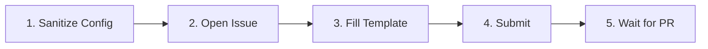

# Config Submissions Guide

Welcome! This guide helps you submit your switch configuration to the community repository.

> [!IMPORTANT]
> **Reference Only:** All configurations are community-contributed examples.
> You are responsible for validating and testing in your own environment.

---

## Quick Start (TL;DR)



1. **Sanitize secrets** in your config (replace with `$CREDENTIAL_PLACEHOLDER$`)
2. **Go to Issues** → **New Issue** → **Config Submission**
3. **Fill in the form** (vendor, model, role, config)
4. **Submit** — a maintainer processes it with Copilot (human-in-loop)

---

## How It Works

### The Complete Flow

```mermaid
flowchart TD
    subgraph YOU ["👤 You"]
        A[Create Issue with Config]
    end
    
    subgraph AUTO ["🤖 Assisted Processing"]
        B[Validate Fields]
        C[Sanitization Check (CI + review)]
        D[Analyze Config]
        E[Create PR with Sanitized Fixtures]
    end
    
    subgraph REVIEW ["👨‍💻 Maintainer"]
        F[Review PR]
        G[Merge to Repository]
    end
    
    A --> B
    B -->|Valid| C
    B -->|Invalid| H[❌ Request More Info]
    C -->|Clean| D
    C -->|Found Secrets| I[⚠️ Ask to Sanitize]
    D --> E
    E --> F
    F -->|Approved| G
    F -->|Changes Needed| J[📝 Request Changes]
    
    G --> K[✅ Config Available in Repo]
```

### What Gets Created

When your submission is processed, these files are created:

```
backend/tests/fixtures/submissions/
└── dellemc-s5248f-on-tor1-fully_converged-issue123/
    ├── metadata.yaml    ← Normalized submission info
    ├── config.txt       ← Sanitized config (no secrets)
    ├── analysis.json    ← Auto-extracted VLANs, interfaces, etc.
    └── README.md        ← Human-readable summary
```

> [!NOTE]
> Storing sanitized configs as test fixtures keeps the repo **robust**: every change is exercised by pytest in CI.

---

## Step-by-Step Instructions

### Step 1: Prepare Your Config

#### Get Your Running Config

```bash
# Dell OS10
show running-configuration

# Cisco NX-OS
show running-config

# Arista EOS
show running-config
```

#### Sanitize Credentials (REQUIRED)

> [!WARNING]
> **You MUST remove all passwords and secrets before submitting!**

| Find This | Replace With |
|-----------|--------------|
| Passwords/secrets | `$CREDENTIAL_PLACEHOLDER$` |
| SNMP communities / SNMPv3 keys | `$CREDENTIAL_PLACEHOLDER$` |
| RADIUS/TACACS keys | `$CREDENTIAL_PLACEHOLDER$` |
| API keys/tokens | `$CREDENTIAL_PLACEHOLDER$` |

**Example:**

```diff
- username admin password MyS3cr3tP@ss role sysadmin
+ username admin password $CREDENTIAL_PLACEHOLDER$ role sysadmin

- snmp-server community MyPubl1cStr1ng ro
+ snmp-server community $CREDENTIAL_PLACEHOLDER$ ro
```

> [!TIP]
> Also consider replacing real hostnames and IPs with placeholders (e.g., `$HOSTNAME$`, `$MGMT_IP$`) or RFC5737 test-net ranges.

---

### Step 2: Open a New Issue

1. Go to the repository's **Issues** tab
2. Click **New Issue**
3. Select **Config Submission** template

---

### Step 3: Fill in the Template

| Field | Required | What to Enter |
|-------|:--------:|---------------|
| **Switch Vendor** | ✅ | `dellemc`, `cisco`, `arista`, `juniper` |
| **Firmware/OS** | ✅ | `os10`, `os9`, `nxos`, `ios-xe`, `eos`, `junos` |
| **Switch Model** | ✅ | Hardware model (e.g., `S5248F-ON`, `N9K-C93180YC-FX`) |
| **Switch Role** | ✅ | `TOR1`, `TOR2`, `BMC`, `SPINE` |
| **Deployment Pattern** | ✅ | `switchless`, `switched`, `fully_converged` |
| **Switch Configuration** | ✅ | Full sanitized `show running-config` output |
| **Switch Hostname** | ❌ | Optional hostname (e.g., `$HOSTNAME$`) |
| **Additional Notes** | ❌ | Optional context (cluster size, special requirements) |

> 📖 For deployment pattern details, see [Azure Local Deployment Pattern Overview](https://github.com/Azure/AzureLocal-Supportability/blob/main/TSG/Networking/Top-Of-Rack-Switch/Overview-Azure-Local-Deployment-Pattern.md)

---

### Step 4: Submit and Wait

After submitting:

| Stage | What Happens | Time |
|-------|--------------|------|
| 🔍 Validation | System checks required fields | 1-2 min |
| 🤖 Processing | Copilot analyzes and creates PR | 2-5 min |
| 👨‍💻 Review | Maintainer reviews and merges | 24-48 hrs |

You'll receive GitHub notifications at each step.

---

## Complete Example

**Issue Title:** `Config Submission: Dell S5248F-ON TOR1 for Fully Converged`

**Issue Body:**

```yaml
### Switch Vendor
dellemc

### Firmware/OS Version
os10

### Switch Model
S5248F-ON

### Switch Role
TOR1

### Deployment Pattern
fully_converged

### Switch Hostname
$HOSTNAME$

### Switch Configuration
! Dell EMC Networking OS10
! Version: 10.5.4.0
!
hostname $HOSTNAME$
!
username admin password $CREDENTIAL_PLACEHOLDER$ role sysadmin
!
interface vlan2
 description Management_VLAN
 ip address 192.0.2.1/24
 no shutdown
!
interface vlan7
 description Storage1_VLAN
 ip address 198.51.100.1/24
 mtu 9216
 no shutdown
!
interface vlan8
 description Storage2_VLAN
 ip address 203.0.113.1/24
 mtu 9216
 no shutdown
!
interface vlan711
 description Compute_Management
 ip address 192.0.2.71/24
 no shutdown
!
interface vlan712
 description Compute_Migration
 ip address 192.0.2.72/24
 no shutdown
!
interface ethernet1/1/1
 description "Node1-Port1"
 switchport mode trunk
 switchport trunk allowed vlan 2,7,8,711,712
 mtu 9216
 flowcontrol receive on
 flowcontrol transmit off
 priority-flow-control mode on
 no shutdown
!
interface port-channel101
 description "MLAG-Peer-Link"
 switchport mode trunk
 switchport trunk allowed vlan 2,7,8
 no shutdown

### Additional Notes
2-node Azure Local cluster with fully converged networking.
In this example, the peer-link VLAN allowlist excludes the storage VLANs.
Peer-link VLAN membership is vendor-specific, but AzureLocal-Supportability provides a concrete peer-link reference in the HSRP peer-link section:
https://github.com/Azure/AzureLocal-Supportability/blob/main/TSG/Networking/Top-Of-Rack-Switch/Reference-TOR-Disaggregated-Switched-Storage.md#hsrp-peer-link

Guidance: Storage VLANs should **NOT** be allowed on the peer-link between ToRs.
```

---

## FAQ

### ❓ What if I don't know my deployment pattern?

See the official [Azure Local Deployment Pattern Overview](https://github.com/Azure/AzureLocal-Supportability/blob/main/TSG/Networking/Top-Of-Rack-Switch/Overview-Azure-Local-Deployment-Pattern.md) or check with your network architect.

### ❓ What if my vendor isn't listed?

Submit anyway! New vendors are welcome. The system will flag it as a new vendor contribution.

### ❓ What if I made a typo in vendor/firmware name?

The system can auto-correct common variations, but for best results use the exact values from the [Input Format table](#vendor--firmware-input-format) above.

### ❓ What if I accidentally included a password?

The system will detect it and ask you to edit your submission. Your issue will be labeled `needs-sanitization`.

### ❓ Can I update my submission?

Yes! Edit your issue before the PR is merged. If already merged, open a new issue.

---

## Troubleshooting

| Problem | Label You'll See | Solution |
|---------|------------------|----------|
| Missing required fields | `needs-info` | Edit your issue to add missing fields |
| Credentials detected | `needs-sanitization` | Replace passwords with `$CREDENTIAL_PLACEHOLDER$` |
| Attached file instead of pasting | `needs-maintainer` | Paste config text directly in the issue |
| Something else wrong | `needs-review` | Check PR comments for details |

---

## Need Help?

- 💬 **Ask a question:** Open an issue with the `question` label
- 📖 **Read more:** See [SUPPORT.md](SUPPORT.md)
- 🔍 **Browse examples:** Check existing folders in `backend/tests/fixtures/submissions/`
