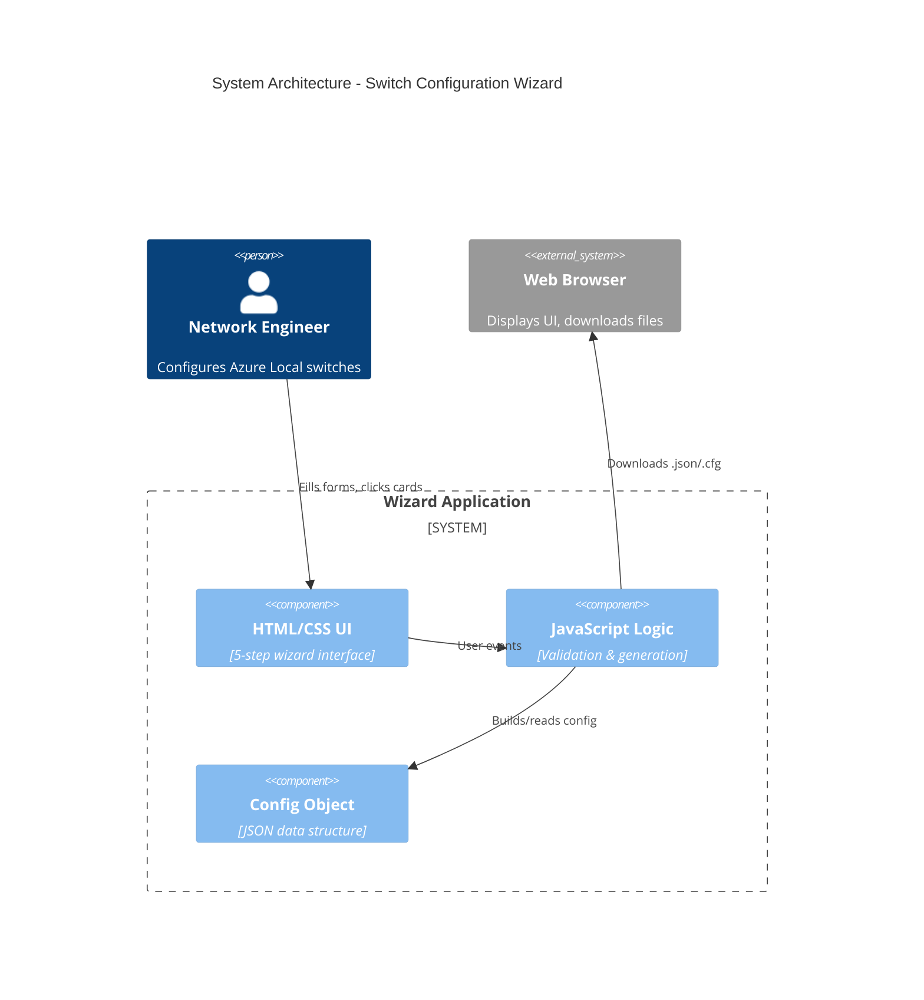
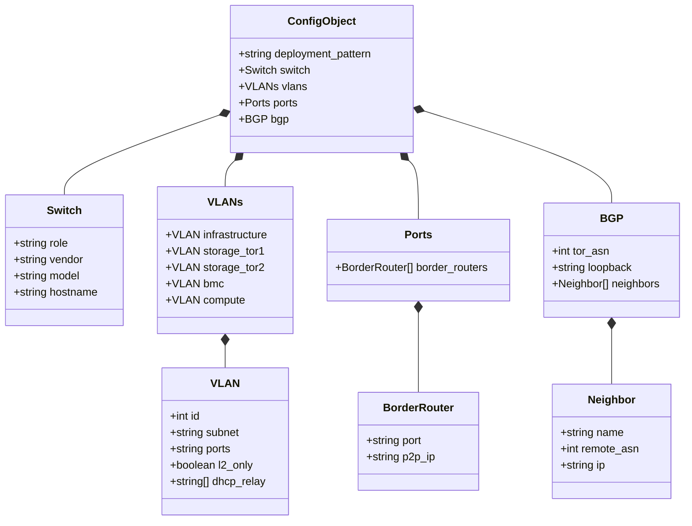
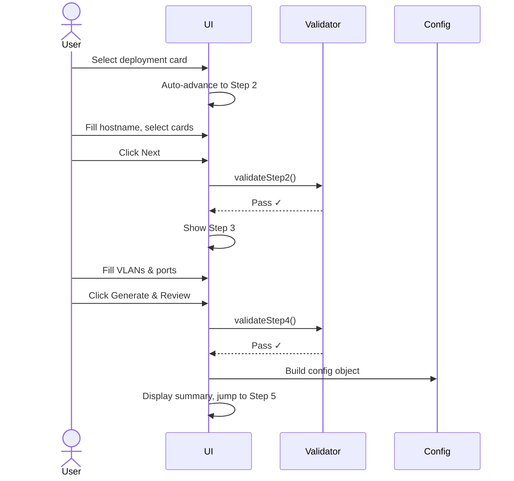
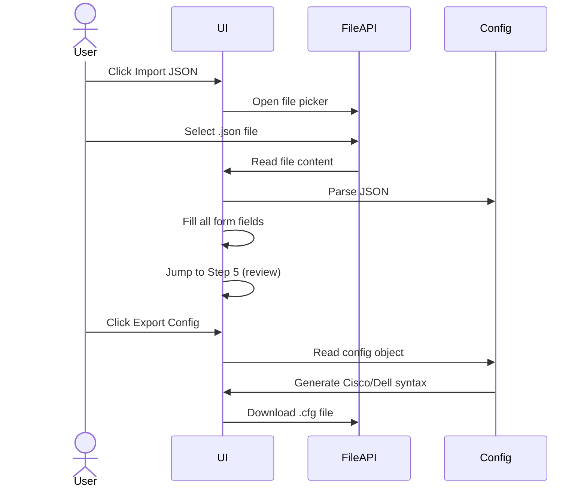

# Azure Local Switch Configuration Wizard - MVP

**Professional reference configuration tool for Azure Local deployments. Generates critical switch configurations - please review and validate before applying to production.**

---

## 🚀 Quick Start

```bash
cd /workspace/_test/wizard-mvp
python3 -m http.server 8001
```

**Open:** http://localhost:8001/

### Demo Workflow
1. **Import Example** - Load `standard-config-example.json` (Dell) or `cisco-config-example.json` (Cisco)
2. **Auto-filled** - All fields pre-populated, jumps to review page
3. **Export** - Download JSON (reusable) or .cfg file (ready to apply)

### Manual Workflow
1. **Step 1:** Click deployment pattern card (auto-advances)
2. **Step 2:** Fill hostname, select role/vendor/model cards
3. **Step 3:** Configure VLANs with port assignments
4. **Step 4:** Set border router connections & BGP
5. **Step 5:** Review summary & export

---

## 🏗️ Architecture & Design

### Standalone MVP (No Backend Dependencies)

**Yes, you're correct!** This wizard is a **100% client-side, self-contained demo**:

- **HTML + CSS** = Presenter layer (UI structure + styling)
- **JavaScript** = Business logic (validation, config generation, all processing)
- **No backend calls** = Zero dependencies on main repo Python code
- **No imports** = No external libraries, no modules from `/workspace/src/`

```
┌─────────────────────────────────────────────────┐
│ This MVP (_test/wizard-mvp/)                    │
│                                                 │
│  HTML ────► Display forms, cards, buttons      │
│  CSS  ────► Style cards, modals, animations    │
│  JS   ────► Validate, build config, export     │
│            (Everything happens in browser)      │
└─────────────────────────────────────────────────┘
              ↕ NO CONNECTION ↕
┌─────────────────────────────────────────────────┐
│ Main Repo (/workspace/src/)                    │
│                                                 │
│  Python generators, Jinja2 templates           │
│  (Not used by MVP wizard)                       │
└─────────────────────────────────────────────────┘
```

**What this means:**
- MVP can run anywhere (just open index.html in browser)
- No Python installation needed for the wizard
- Main repo's Python code generates configs differently
- This is a **proof-of-concept** for the UI/UX approach
- Future integration could call main repo's generators via API

### High-Level System Overview



### Core Data Structure



### Key User Flows

**1. Manual Configuration Flow**


**2. Import & Export Flow**


### Core Component Interactions

**UI Components (index.html)**
```
┌─────────────────────────────────────┐
│ Header: Title + Import Button      │
├─────────────────────────────────────┤
│ Top Nav: [Step1] [Step2] ... [Step5]│
├─────────────────────────────────────┤
│ Error Banner (hidden by default)   │
├─────────────────────────────────────┤
│ Main Container:                     │
│  ┌─ Step 1: Cards (3 patterns)     │
│  ├─ Step 2: Input + Cards           │
│  ├─ Step 3: Form fields (VLANs)     │
│  ├─ Step 4: Form fields (BGP)       │
│  └─ Step 5: Summary + Export btns   │
├─────────────────────────────────────┤
│ Modal Overlay (Promise-based)       │
└─────────────────────────────────────┘
```

**JavaScript Core Functions (app.js)**
```
User Actions          Validators          Config Builders
────────────          ──────────          ───────────────
selectCard()    ──→   validateStep2()     generateAndReview()
goToStep()      ──→   validateStep3()     generateCiscoConfig()
importJSON()    ──→   validateStep4()     generateDellConfig()
startOver()                               displaySummary()
customConfirm()
```

**CSS Styling Patterns (style.css)**
- `.card` → Hover effects, selection states
- `.modal-overlay` → Backdrop + animations
- `.btn-confirm` → Purple gradient (matches theme)
- `.summary-grid` → Auto-fit 4-column layout

---

## 🎯 Design Patterns Explained

### 1. Card Selection (Visual Feedback)
```javascript
// Remove all selected states in group
document.querySelectorAll('.card').forEach(c => c.classList.remove('selected'));
// Add selected to clicked card
cardElement.classList.add('selected');
// CSS applies purple gradient automatically
```

### 2. Progressive Validation (Prevent Incomplete Config)
```javascript
function goToStep(target) {
    if (!validateCurrentStep()) {
        showValidationError("Please fill required fields");
        return; // Block navigation
    }
    // Validation passed, show next step
}
```

### 3. Promise-Based Modal (Clean Async/Await)
```javascript
async function startOver() {
    const confirmed = await customConfirm('Start Over?', 'Lose all data?');
    if (confirmed) clearAllFields();
}

function customConfirm(title, msg) {
    return new Promise(resolve => {
        modalResolve = resolve; // Store resolver
        showModal();
    });
}
```

### Architecture Summary

| Component | Technology | Role | Dependencies |
|-----------|-----------|------|--------------|
| **index.html** | HTML5 | UI structure, forms, cards | None |
| **style.css** | CSS3 | Styling, animations, responsive | None |
| **app.js** | Vanilla JavaScript | All logic, validation, config gen | **Zero** - No imports, no backend |
| **Main Repo** | Python + Jinja2 | Config generation (separate) | **Not used by MVP** |

**Key Point:** The JavaScript in `app.js` generates config syntax (Cisco/Dell) **entirely in the browser** using string templates. It does NOT call the Python generators from `/workspace/src/generator.py` or use Jinja2 templates from `/workspace/input/jinja2_templates/`. This is intentional for the MVP to be a standalone demo.

---

## 📋 Key Features

### ✅ What's Included

**UI/UX:**
- **Top navigation bar** - Visual progress through 5 steps
- **Card-based selection** - Click to select (deployment, role, vendor, model)
- **Validation with errors** - Cannot proceed without required fields
- **Styled confirm dialogs** - Custom modal matching page design
- **Pre-filled demo values** - No typing needed for quick demos

**Configuration:**
- **Per-VLAN port assignment** - Each VLAN gets its own port configuration
- **BMC optional** - Marked clearly, not required for validation
- **Merged Border & BGP** - Logically grouped in Step 4
- **Professional messaging** - Clear guidance about validation needed

**Import/Export:**
- **Import JSON** - Auto-fills all fields, jumps to review page
- **Export JSON** - Reusable configuration
- **Export .cfg** - Cisco NX-OS or Dell OS10 ready-to-apply configs

**Examples:**
- `standard-config-example.json` - Dell s5248f-on, TOR1, ports 1/1/x
- `cisco-config-example.json` - Cisco 93180YC-FX3, TOR2, ports Eth1/x

---

## 🎯 Configuration Areas

### 1. Deployment Pattern
- **Fully Converged** (1-4 nodes)
- **Storage Switched** ⭐ (5-16 nodes, recommended)
- **Switchless** (1-4 nodes)

### 2. Switch Identity
- Hostname (site name embedded)
- Role: TOR1 (priority 150), TOR2 (priority 140), BMC
- Vendor: Cisco NX-OS, Dell OS10
- Model: Validated for Azure Local

### 3. VLANs & Port Assignments
Each VLAN configured with:
- VLAN ID
- Subnet (if L3)
- Port range (specific to each VLAN)

**VLAN Types:**
- **Infrastructure** (default 7): Management, DHCP relay
- **Storage TOR1/TOR2** (default 711/712): L2 only, no BGP
- **BMC** (default 125): Optional, server management
- **Compute** (default 201): Tenant workloads

**Auto-generated:**
- SVI IPs: TOR1=`.2`, TOR2=`.3`
- HSRP/VRRP: VIP=`.1`, priority 150/140
- MTU: 9216 (data), 1500 (management)
- QoS: RDMA CoS 3, 50% BW for storage

### 4. Border Router & BGP
**Border Routers:**
- Port assignments (e.g., 1/1/47, 1/1/48)
- P2P IPs for L3 connections

**BGP:**
- ToR ASN & loopback
- Border router neighbors (ASN, IPs)
- Network controller (ASN, IP)

**Auto-advertised:** Infrastructure, Compute, BMC subnets  
**NOT advertised:** Storage VLANs (L2 only)

---

## 📊 Input vs Auto-Generated

| **What You Provide (~23 inputs)** | **What Tool Auto-Generates (~150+ lines)** |
|-----------------------------------|---------------------------------------------|
| Hostname | `hostname <value>` |
| Role (TOR1/TOR2) | HSRP/VRRP priority (150/140) |
| Vendor + Model | Feature enablement (bgp, hsrp, lacp, dhcp) |
| VLAN IDs (4-5 VLANs) | VLAN creation with names |
| Subnets (3-4 subnets) | SVI interfaces with correct IPs |
| Port ranges (per VLAN) | Interface configs (mode, native VLAN, allowed VLANs, MTU, spanning-tree) |
| DHCP relay IPs (optional) | `ip dhcp relay address` or `ip helper-address` |
| Border router ports/IPs | L3 routed interfaces, MTU 9216 |
| ToR ASN, loopback | BGP router config, router-id |
| Border ASNs, IPs | BGP neighbor configs with address-family |
| NC ASN, IP | BGP peering to network controller |

**Total:** ~23 user inputs → ~150+ config lines

---

## 🔧 Generated Config Formats

### Cisco NX-OS Format
```
hostname rr1-n25-r20-nx9k-01
feature bgp
feature hsrp
system jumbomtu 9216

vlan 7
  name Infra_7

interface Vlan7
  ip address 100.69.176.2/24
  hsrp 7
    priority 150
    ip 100.69.176.1

interface Eth1/1-18
  switchport mode trunk
  switchport trunk native vlan 7
  mtu 9216
  spanning-tree port type edge trunk

router bgp 65001
  router-id 100.71.39.149
  address-family ipv4 unicast
    network 100.69.176.0/24
```

### Dell OS10 Format
```
hostname rr1-n25-r20-5248hl-23-1a
system mtu 9216

interface vlan7
  ip address 100.69.176.2/24
  vrrp-group 7
    priority 150
    virtual-address 100.69.176.1

interface range 1/1/1-1/1/18
  switchport mode trunk
  switchport access vlan 7
  mtu 9216
  spanning-tree port type edge

router bgp 65001
  router-id 100.71.39.149
  address-family ipv4 unicast
    network 100.69.176.0/24
```

---

## ✨ Success Criteria

### Primary Goals ✅
- **90% accurate configs** - Critical settings correct (VLANs, IPs, BGP)
- **Time savings** - 5-8 days → 1 hour for new vendor
- **Template reduction** - Card-based UI replaces 8+ templates
- **Vendor expansion** - Easy to add new switch models

### Quality Metrics ✅
- No syntax errors in generated .cfg
- VLAN IDs, subnets, ports match customer intent
- BGP advertises correct networks (infra, compute, BMC), NOT storage
- HSRP/VRRP priority correct per role (TOR1=150, TOR2=140)
- MTU 9216 for data VLANs, 1500 for management
- QoS configured for RDMA storage traffic

### UX Goals ✅
- Professional reference messaging
- Validation with clear error messages
- Styled confirm dialogs (not browser default)
- Pre-filled demo values
- Import auto-fills and jumps to review
- Top navigation shows progress
- BMC clearly marked as optional

---

## 🎨 Design Rationale

### Why Card-Based UI?
- **Visual clarity** - See all options at once (no dropdown guessing)
- **Better UX** - Click to select, instant visual feedback
- **Odin-inspired** - Modern, professional design language
- **Reduced errors** - Can't select invalid combinations

### Why Validation?
- **Prevents incomplete configs** - Must fill required fields
- **Clear guidance** - Red banner shows what's missing
- **Progressive workflow** - Can't skip ahead without completing step

### Why Per-VLAN Ports?
- **Real-world flexibility** - Different ports for different VLANs
- **Matches actual deployments** - Storage may use different ports than compute
- **BMC separation** - Management ports separate from data

---

## 📁 Files

**Core:**
- `index.html` - 5-step wizard UI with styled modal
- `app.js` - Validation, card selection, config generation, custom confirm
- `style.css` - Odin-style cards, modal styling, responsive design

**Examples:**
- `standard-config-example.json` - Dell TOR1 reference
- `cisco-config-example.json` - Cisco TOR2 reference

---

## 🚦 Latest Updates (Jan 22, 2026)

### UI Improvements
- ✅ Custom styled confirm modal (matches page design)
- ✅ Pre-filled sample values for demo
- ✅ Import jumps to review page
- ✅ Start Over properly clears all fields
- ✅ Top navigation bar with progress indicators

### Configuration Updates
- ✅ Standard example updated with ports in VLAN structure
- ✅ Cisco example added (different vendor/values)
- ✅ BMC optional handling
- ✅ Per-VLAN port configuration
- ✅ Merged Border Router & BGP in Step 4

### Code Cleanup
- ✅ Removed duplicate files
- ✅ Consolidated documentation
- ✅ Single source of truth

---

**Status:** ✅ Production-ready MVP for demos  
**Server:** http://localhost:8001/
